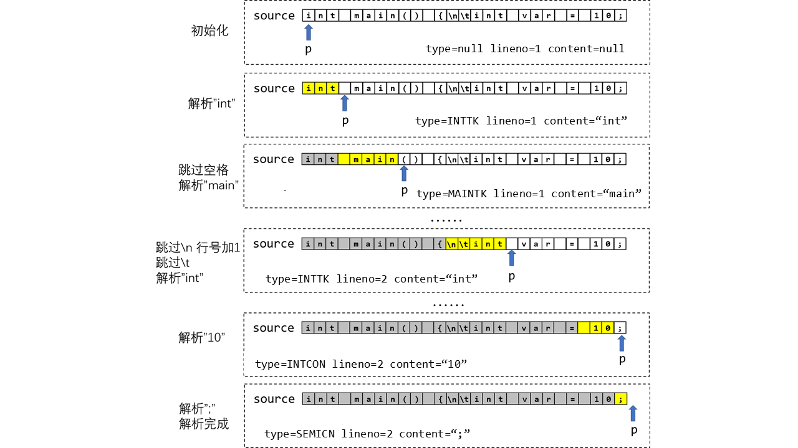

# 词法分析

不论是从标准输入中读取还是从文件中解析，我们的源程序总是以**字符流**的形式存在。例如，对于下面这个简单的源程序：

```c
int main() {
    int var = 8 + 2;
    if (var != 10) {
        printf("error!");
    } else {
        printf("correct!");
    }
    return 0;
}
```

尽管从我们的视角来看，源程序是结构化的，包含了顺序、分支、循环等多种结构；同时通过空格、换行等方法，我们还可以将程序中的各个成分清晰地区分开来。但是从编译器的角度看，源程序不带有任何结构，只是由字符组成的序列（字符串）：
```text
int main() {\n\tint var = 8+2;\n\tif (var != 10) {\n\t\tprintf(“error!”);\n\t}\n\telse {\n\t\tprintf(“correct!”);\n\t}\n\treturn 0;\n}
```

这导致了一个问题，虽然字符是构成字符串的基本单元，却每个字符自身却不一定具备特定的含义。这些字符需要组成一个单词才能传达出对于程序来说有意义的信息。因此，实现编译器的第一步就是要把这样的线性字符串分割成一个个单词，便于后续分析。在编译器中，这一阶段被称为**词法分析**。

## 一、词法分析作用

词法分析器作为编译器的第一部分，承担的任务就是通过扫描输入的源程序字符串，将其分割成一个个**单词**。如图所示，经过词法分析器的处理，我们将字符序列转换为单词序列。对于每个单词，我们至少应当记录单词的**取值**及其**类别信息**。另外，编译器在词法分析阶段也可能记录单词在源代码中的**位置信息**，例如源文件路径、行号、列号等等。这些额外信息对于编译器的错误处理十分重要。得当的错误定位能够为代码的编写者提供极大便利。

在源程序中，还有一些字符并不会影响程序的语法语义，如换行符 `\n`、注释等，这些符号自然也不会被词法分析器解析为单词，但词法分析器也需对这些符号进行适当处理，如忽略跳过、记录行号列号等等。


## 二、词法分析器的接口

在上一小节中，我们了解了词法分析阶段的主要作用，在本小节中，我们将基于此介绍词法分析器（Lexer）。

首先，词法分析的输出是单词序列，因而我们需要定义单词的数据结构。在 tolangc 中，我们所实现的 `Token` 类包括三个字段：`type`、`content` 和 `lineno`，分别对应了单词的类型、取值和位置。

```cpp
struct Token {
    enum TokenType {
#define X(a, b) a,
        TOKEN_TYPE
#undef X
    } type;
    std::string content;
    int lineno;

    Token() = default;

    Token(TokenType type, std::string content, int lineno)
        : type(type), content(content), lineno(lineno) {}
};
```

对于单词类型，除了文法定义中出现的类型外，我们还额外定义了 `TK_EOF` 类型。这一类型用于表示我们已经读到了输入字符串的末尾。

> 尽管本课程不是 C 语言的语法课，但还是有必要解释一下 `TokenType` 中的可疑代码。这是被称为 X-Macro 的技术，用于处理为枚举附加额外属性的问题。由于 C++ 中的枚举只是一个数值，所以无法像 Java 一样为枚举值添加额外属性。例如，我们可以在 Java 中为 TokenType 枚举定义 `toString` 方法：
> ```java
> public enum TokenType {
>     IDNET("identifier"),
>     NUMBER("number"),
>     // ...
>     EOF("eof");
> 
>     private String value;
> 
>     TokenType(String value) {
>         this.value = value;
>     }
> 
>     @Override
>     public String toString() {
>         return value;
>     }
> }
> ```
> 但 C++ 无法做到。因此在 C++ 中实现类似的 `toString` 方法（tolangc 中的 `token_type_to_string`）就需要另外的方法。这里碍于篇幅，就不再详述。

接着，我们考虑词法分析器 `Lexer` 类的输入。请注意在本章节一开始我们将源程序视为**字符流**而非字符串，这一点十分重要。因为据此我们可以实现一个**惰性**的词法分析器，该分析器词法分析器只在我们需要单词时才会进行单词的解析。

为此，我们需要在 `Lexer` 初始化时传入输入流 `std::istream` 作为参数。

```cpp
class Lexer {
public:
    // ...
    Lexer(std::istream &in) : _input(in) {}
};
```

同时，我们还需定义 `next` 方法，每次调用该方法都将返回下一个单词。这样我们就实现了字符流到单词流的转换。

```cpp
class Lexer {
public:
    // ...
    void next(Token &token);
};
```

## 三、词法分析器的工作过程

### （1）基本流程

在 C++ 中，输入流 `std::istream` 具有 `get` 和 `unget` 两个方法，分别实现了**从流中读取下一个符号**和**将上一个读取的符号推回流中**的功能。通过这两个函数，我们能够实现对字符流的操作。

接下来我们举例演示词法分析器的工作过程。为方便解释，我们用 source 表示输入编译器的源程序字符流，用位置指针 p 指示尚处于流中的第一个字符。此时 `istream::get` 对应的操作为**取出 p 所指向的字符，并将 p 向右移动一格**；`istream::unget` 对应的操作则为**将 p 向左移动一格**。



对于如图所示的输入流，解析的主要流程如下：

1. 初始化时，`p` 指向字符流 `source` 的开头，并设置当前行号 `lineno = 1`。其余部分为空。
2. 调用 `next`，不断读入符号，直到**识别**单词 `int`，此时设置对应的单词类型和行号，并将本次解析读入的所有符号作为单词的内容。
3. 调用 `next`，首先**识别**空格字符并**跳过**，随后按照与步骤 2 相同的方式解析第二个单词 `main`。
4. 经过若干步后，识别到 `\n`，此时行号自增 `lineno++`。**跳过**该字符，随后按与步骤 3 相同的方式解析得到单词 `int`。
5. 按此方法继续解析后续的 `var`、`=`、`10`。

上面的步骤十分概要，忽略了许多细节。比如说，我们要如何识别不同类型的单词？当识别到空白字符或注释时我们又要如何跳过？接下来我们解释这些问题。

### （2）手搓有穷自动机

在理论课上，我们会学习正则文法与有穷自动机的相关知识。有穷自动机是处理形式化语言的重要工具，常常用于**识别**特定模式的字符串。有穷自动机内部包含一个当前状态 $q$ 和转移函数 $\sigma$ ，对于一个输入的字符 $a$，有穷自动机将根据当前状态 $q$ 和字符 $a$ 转移到下一个状态 $p$，即有 $p = \sigma(q, a)$。


上图是一个用于识别 "hello" 和 "here" 两个单词的有穷自动机，初始时处于起始状态 $q_0$，后续每读入一个字符 $a$，都将根据当前状态和 $a$ 进行一次状态转移（即沿着图中的对应边进入下一个状态），在到达 $q_5$ 或 $q_7$ 后，FSA就成功识别了一个 "hello" 或 "here" 单词。需要注意的是，在读入 "he" 时，我们不能判断当前这个单词是 "hello" 还是 "here"，需要根据读入的下一个字符进行判断并转移到不同的状态分支（对应图中的 $q_2$）。需要额外说明的是，这个例子并没有考虑异常情况，如读入字符 “z”。一般来说，我们可以设定一死状态，并设定当读入异常字符时，转移到该状态。

对于任意单词类型，我们都可以根据其正则表达式给出对应的有穷自动机。例如对于标识符（`[a-zA-Z_][0-9a-zA-Z_]*`），其所对应的有穷自动机如下所示：


我们当然可以通过模拟状态及状态转移的方式实现有穷自动机，例如使用 C++ 和 Java 的正则库，然而在实验中**我们并不希望同学们使用这种方法**。一方面，对于词法分析这种规则相对固定的情况，此方法并不高效；另一方面，亲自使用代码实现（手搓）有穷自动机的逻辑更能够加深各位对有穷自动机和词法分析相关知识的理解。

当使用代码模拟有穷自动机时，一段顺序代码段便对应了有穷自动机的某一状态，而分支、循环则意味着状态的转移。我们还以对标识符为例。标识符的有穷自动机等价于如下代码：

```cpp
char ch;
// state q0
ch = _input.get();
if (isalpha(ch) || ch == '_') {
    // state q1
    ch = _input.get();
    while (isalpha(ch) || ch == '_') {
        // state q2
        ch = _input.get();
    }
    // state q3

    // _input.unget();
    // match ident
}
```

当我们到达 `state q3` 所在的代码段时，我们就完成了对标识符的识别。这里我们为了判断标识符的终止，额外读取了下一个单词的第一个字符，因此此处需要将该字符重新推回流中。在 `_input.unget()` 之后，我们可以返回解析完成的单词。

关于为什么会额外读取一个字符，一个解释是我们在词法分析中采用了**贪婪匹配**，这意味着**在保证匹配某一单词类型的情况下，匹配尽可能多的字符**。在这种情况下，我们需要不断读入新的符号，直到新读入的符号无法让自动机进行合法的状态转移。这时，最后读入的符号便必然不属于当前单词，需要重新推入流中。贪婪匹配十分重要，因为文法中很可能存在两个不同的单词类型，其中一个是另一个的前缀。例如 `<` 和 `<=`。若不采用贪婪匹配，则 `<=` 将总会被识别为 `<`。而选择读入下一个符号则可以解决此问题，例如下面的代码：

```cpp
ch = _intput.get();
if (ch == '<') {
    ch = _input.get();
    if (ch == '=') {
        // ...
    } else {
        _input.unget();
        // ...
    }
}
```

### （3）跳过无用字符

一般的无用字符包括注释和空白符号（包括特殊的换行符）。我们希望识别这些符号，但并不返回单词，而是跳过它们并输出下一个单词。

在调用 `next` 时，我们依旧可以将无用字符当成单词来识别，只不过当识别到该 “无用单词” 后，我们并不返回该单词，而是再度调用 `next` 继续解析后续的字符。例如我们在 tolangc 中对注释 `#` 的处理：

```cpp
void Lexer::next(Token &token) {
    // ...
    else if (ch == '#') { // comment
        while (ch != '\n' && ch != EOF) {
            ch = _input.get();
        }
        _input.unget();
        next(token);
    }
    // ...
}
```

需要注意的是，这里对 `next` 的调用是**尾递归的**，这意味着此处的递归可以被优化为循环。且相较于循环，此处使用递归处理更加简洁。
