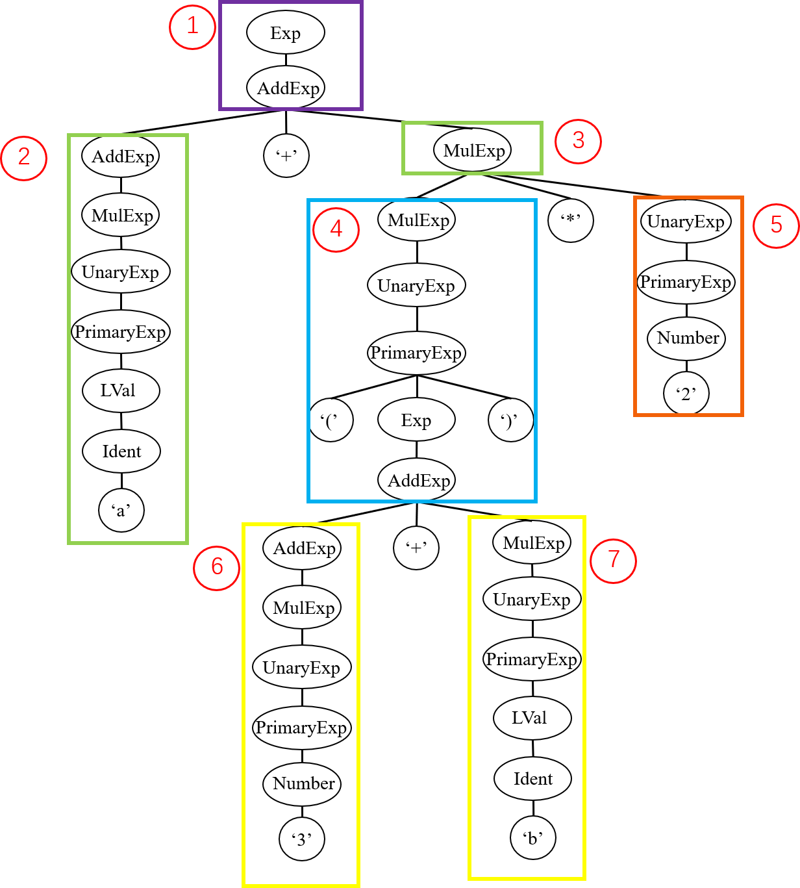
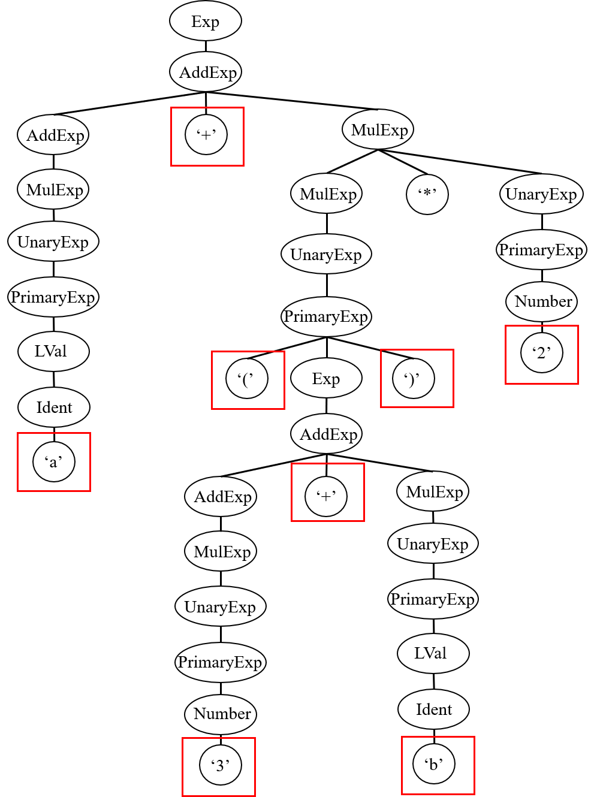

# 语法分析

在词法分析阶段，我们将输入的源程序解析为一个个单词；而在语法分析部分，我们将依照文法对单词序列进行进一步的分析，从而构建结构化的抽象语法树。

## 一、语法分析的作用

进行语法分析的必要性在于，句子是线性结构，不包含相应的语法结构信息。因此直接对线性的句子进行处理非常困难。而语法树的层次化结构能够表现语法结构以及语法成分之间的关系，且方便利用递归等方法来进行处理。

例如，对于上表达式

```c
a + (3 + b) * 2
```

对于人来说，可以很容易地确定表达式的运算顺序。但是，从计算机角度而言，要编写一个程序仅仅根据这个线性字符串来确定运算的顺序是比较困难的，尤其是当表达式更为复杂的时候。如果我们建立了语法树，则可以很轻松地利用递归等方法来进行计算。

> 实际上，我们人类确定表达式运算顺序的方法，或许也在一定程度上与语法分析所采用的方法类似。这一点将在下一章节中说明。

还举上面的表达式为例。我们给定文法，并给出表达式在该文法上的语法树

```text
LVal: Ident

PrimaryExp:
    '(' Exp ')'
    | LVal
    | Number

UnaryExp:
    PrimaryExp
    | Ident '(' [FuncRParams] ')'
    | UnaryOp UnaryExp

UnaryOp:
    '+'
    | '-'
    | '!'

MulExp:
    UnaryExp
    | MulExp ('*' | '/' | '%') UnaryExp

AddExp:
    MulExp
    | AddExp ('+' | '-') MulExp

Exp: AddExp
```



在上面的例子中，我们要求表达式 Exp 的值（图中序号1），那么我们只需要求出 AddExp（序号2）和 MulExp（序号3）的值并将它们相加即可。要求 MulExp（序号3）的值，我们只需要求出 MulExp（序号4）和 UnaryExp（序号5）的值并将它们相乘即可。同样地，要求 MulExp（序号4）的值，我们只需要求出 AddExp（序号6）和 MulExp（序号7）的值并将它们相乘即可。对于每种语法成分的处理，如 AddExp 和 MulExp 的计算求值，我们都可以采用递归的方法很方便地实现，而且**语法树的层次结构自然保证了计算顺序的正确性**。

事实上，就像上面介绍的表达式计算，后续的编译过程也是基于语法树，利用递归等方法来进行的。因此，**语法分析的作用就是根据词法分析器解析出来的一个个单词，生成这样一棵具有层次化结构的语法树**，方便后续的编译。

## 二、语法树的生成

在上一章节中，我们讲述了如何根据文法在程序中定义语法树的数据结构。而在本小节中，让我们再次回忆一下语法树的相关概念。

语法树是按照给定的文法，将一个句子转化为有结构层次的树结构。树中的每个节点都代表一个**语法成分**，而其子节点则代表**组成该语法成分的子语法成分**。根节点为开始符号，代表整个句子；叶节点为终结符，代表组成句子的基本单词。我们以上文中的语法树为例：



以不同的视角看待语法树的生成，我们能够得到不同的语法分析方法。这些不同的方法，也一定程度上反映了我们人类处理语言的方式。

假设我们从图中标记的**叶节点**出发，生成整棵语法树，我们得到的便是**自底向上**的**归约**方法，反映的是**语言的理解过程**。在这种情况下，我们按顺序从左到右读入一个个单词，并将一部分单词识别为更加高级的语法成分。例如在最开始我们读入 `a`，将其最终识别为 AddExp；当我们读入 `( 3 + b )` 时，我们将其最终识别为 MulExp，等等。这一方法对应了语法分析中的 LR 分析法。

而另一方面，假设我们从图中的**开始节点**出发，生成整棵语法树，我们得到的便是**自顶向下**的**推导**方法，反映的是**语言的生成过程**。这种情况类似于在我们的脑海中已经产生了 `a + ( 3 + b ) * 2` 所对应的概念，而现在我们希望将这一概念言说出来。即按顺序生成一系列单词。在最开始我们将 Exp 推导为 AddExp，而后又推导 AddExp 的左运算数，生成第一个单词 `a`。随后继续推导，依次生成 `+ ( 3` 等等单词。从语言处理的角度看，推导的过程就是将某一概念拆分为不同成分，从而最终生成句子并表达出来的过程。

这一方法对应了语法分析中的 LL 分析法。LL 分析法的基本理念是，从开始符号进行推导，使得最终产生的单词序列与给定的句子相同。接下来我们介绍一种最为简单的 LL 分析法的代码实现方法，即**递归下降子程序法**。

## 三、递归下降子程序法的实现

### （1）基本框架

在 LL 分析法中，我们面对的问题是，对于当前句型中处于**最左侧**的非终结符，要选择哪一条规则进行推导，使得我们能够最终推导出的句子和给定句子相同。例如，假设目前我们从 Exp 所推导出的句型为 `a + MulExp`，那么我们应当选择 MulExp 对应的其中一条规则进行推导，使得最终能够推导出 `a + ( 3 + b ) * 2`。

通过对比目前的句型和目标句子，我们很容易发现，关键在于 MulExp 和 `(` 的关系。我们所选择的规则应当能够保证，其所推出的子句的**首个终结符**应当为 `(`。

```text
a + MulExp
a + ( 3 + b ) * 2
```

在理论课上，我们已经学习了 FIRST 集的概念。因此对于 MulExp 的规则的选择，我们可以用如下的伪代码表示：

```py
def parse_mul_exp():
    if curr_tok in FIRST[规则1]:
        按规则1推导
    elif curr_tok in FIRST[规则2]:
        按规则2推导
    # ...
    else:
        错误处理
```

这就是递归下降子程序法的基本原理。其主要思路是，为每一个**非终结符**编写一个子程序，在子程序中通过 FIRST 集选择不同的规则。而对于规则内部，则采取如下规则：如果遇到终结符，则判断当前符号是否与其匹配；如果遇到非终结符，则调用该非终结符对应的子程序进行处理。很明显，这一过程是递归的。

让我们用 tolangc 举例。例如对于 tolang 中的文法：

```text
FuncDef: 'fn' Ident '(' [FuncFParams] ')' '=>' Exp ';'
```

我们便可以为非终结符 FuncDef 定义对应的子程序 `_parse_func_def`：

```cpp
std::unique_ptr<FuncDef> Parser::_parse_func_def() {
    // ...
    _match(_token, Token::TK_FN); 
 
    _match(_token, Token::TK_LPARENT); 

    if (_token.type != Token::TK_RPARENT) {
        _parse_func_f_params();
    }

    _match(_token, Token::TK_RPARENT);

    _match(_token, Token::TK_RARROW);

    _parse_exp();

    _match(_token, Token::TK_SEMINCN);
    // ...
}
```

在该子程序中，对于规则中的终结符，如 `fn`、`(`、`)` 等，我们调用 `_match` 函数判断当前单词类型是否与规则匹配。而对于非终结符，如 `FuncFParams` 和 `Exp`，我们则调用对应的子程序 `_parse_func_f_params` 和 `_parse_exp` 进行解析。

这里需要注意的是，`_match` 函数在成功匹配当前单词后会读入下一个单词。这意味着 `_match` 函数的前置条件和后置条件分别是 “当前单词未被解析” 和 “读入下一个单词作为当前单词”。而又由于非终结符的解析子程序总是由其他子程序以及 `_match` 函数组成，所以这些子程序的前置条件和后置条件也与 `_match` 函数相同。

### （2）与词法分析的配合

上一小节中基本框架还不完整，因为我们还未考虑何时从词法分析器中读入单词。由于递归下降子程序的代码由一系列递归调用的函数组成，所以我们需要格外注意函数调用时的前置条件和后置条件，保证解析过程的一致性。具体来说，我们应当在编写子程序时保证如下约束条件：

- 前置条件：一个子程序在被调用前，该子程序需要解析的第一个单词应当已被读取。
- 后置条件：一个子程序在返回前，应当预先读取下一个需要解析的单词。

满足这一条件后，我们便能够保证不论以何种顺序调用各子程序，都能够对正确的单词进行解析。

在 tolangc 中，实现上述条件的关键在于 `_match` 函数。在 `Parser` 中我们使用 `_token` 字段保存读入的单词。而 `_match` 方法在成功匹配当前单词后，还会读入下一个单词。这就意味着对于终结符的解析，我们遵循了和终结符相同的约束条件。由于非终结符的解析子程序总是由其他子程序以及 `_match` 函数组成，所以这些子程序也满足同样的约束条件。

```cpp
void Parser::_match(const Token &token, Token::TokenType expected) {
    if (token.type != expected) {
        ErrorReporter::error(_token.lineno,
                             "expect '" + token_type_to_string(expected) + "'");
    } else {
        _next_token();
    }
}
```

另外，我们在语法分析时的同时还会进行**语法错误**的处理。当我们在当前位置需要匹配一个语法成分时，语法分析器会 “试探性” 地去解析该语法成分，如果解析失败，则报错；并 “假装” 这个语法成分解析正确，继续进行语法分析。从而实现错误处理的局部化，使编译器能够一次性发现尽可能多的错误，方便使用者修正程序错误。

### （3）EBNF 范式的处理

tolang 的文法以及实验文法由 EBNF 范式定义。这意味着文法中能够出现可选 `[]` 和循环 `{}` 结构，扩充了文法的表达能力。然而这一扩充并未增加语法分析的难度，反而为语法分析的实现提供了更多的便利。

这一便利源自于程序的表达能力。我们所使用的程序设计语言本就提供了分支和循环的语法结构，这使得我们能够用简洁的代码表达 EBNF 范式中的可选和循环。而不必像 BNF 范式一样总是用递归的方式表达。

具体来说，对于可选结构，我们应当考察当前单词是否是可选部分之后的单词。还举上面我们用到过的例子：

```text
FuncDef: 'fn' Ident '(' [FuncFParams] ')' '=>' Exp ';'
```

在其中，FuncFParams 是可选的。因此我们需要查看当前符号是否为 `')'`，从而判断是否应当进行 FuncFParams 的解析。

```cpp
std::unique_ptr<FuncDef> Parser::() {
    // ...
    if (_token.type != Token::TK_RPARENT) {
        _parse_func_f_params();
    }
    // ...
}
```

而对于文法中的循环结构，我们也需要使用循环进行处理。例如对于下面的文法

```text
FuncFParams: Ident { ',' Ident }
```

在 tolangc 中我们在循环条件里判断当前符号是否为 `','`，从而解析重复的语法成分。

```cpp
void Parser::_parse_func_f_params() {
    // ...
    _parse_ident();
    while (_token.type == Token::TK_COMMA) {
        _next_token();
        _parse_ident();
        // ...
    }
}
```

在使用 LL 分析法的时候，我们还需要注意处理左递归的问题。例如 tolang 文法中的 AddExp、MulExp。

```text
AddExp:
    MulExp
    | AddExp ('+' | '-') MulExp

MulExp:
    UnaryExp
    | MulExp ('*' | '/') UnaryExp
```

在理论课上我们学到，对于这一问题有两种处理方式。一是使用 EBNF 范式将规则转化为循环，如下所示：

```text
AddExp: MulExp { ('+' | '-') MulExp }
MulExp: UnaryExp { ('*' | '/') UnaryExp }
```

而另一种方法则是将文法转化为右递归，如下所示

```text
AddExp:
    MulExp
    | MulExp ('+' | '-') AddExp

MulExp:
    UnaryExp
    | UnaryExp ('*' | '/') MulExp
```

然而，这两种方法其实并没有本质的区别。基于这两种文法编写的代码不过是同一逻辑的不同表示罢了。接下来我们进行演示：

首先是使用 ENBF 范式的方法。此时我们可以按照刚才提到的方式，使用循环实现解析。为了方便，这里只对加法进行解析。

```cpp
void parse_add_exp() {
    parse_mul_exp();
    while (curr_token == '+') {
        next_token();
        parse_mul_exp();
    }
}
```

而使用右递归的方法，代码有些许不同。这里需要观察到两条规则的第一个符号相同，因此可以首先统一进行解析，而后再进行区分。
```cpp
void parse_add_exp() {
    parse_mul_exp();
    if (curr_token == '+') {
        next_token();
        parse_add_exp();
    }
}
```

可以注意到，第二种方法实现的代码是**尾递归**的。这意味着我们可以将其转换为循环。同时可以观察到循环终止条件为 `curr_token != '+'`，循环体为 `next_token(); parse_mul_exp();`，且循环外同样具有一条 `parse_mul_exp();`。这意味着此尾递归代码和上面的循环代码在逻辑上等价。

### （4）歧义的消除

如果一个非终结符只有一条规则，那么其解析方法就是唯一确定的。其所对应的子程序是完全的顺序流程。然而，更多的情况是非终结符可能存在多条规则，这时按前面所说，我们需要根据 FIRST 集选择不同的规则进行推导。

然而问题是，不同规则的 FIRST 集的交集可能不为空。这意味着我们无法只通过 FIRST 集判断应当选择哪一条规则。

> 当然，tolang 的文法经过了设计，使得任意非终结符的不同规则的 FIRST 集都不相交。这使得 tolangc 中可以直接通过 `switch` 来选择不同规则
> ```cpp
> std::unique_ptr<Stmt> Parser::_parse_stmt() {
>     switch (_token.type) {
>     case Token::TK_GET: {
>         GetStmt get_stmt;
>         // parse get_stmt
>     }
>     case Token::TK_PUT: {
>         PutStmt put_stmt;
>         // parse put_stmt
>     }
>     // ...
>     }
> }
> ```
> 而实现这一点的方法其实很简单，那就是使用不同的关键字作为语法成分的前缀。一些程序设计语言的文法也被设计成易于解析，例如 go。

这时，我们所要做的就是**提前读取**当前符号之后的更多符号，直到我们能够区分此时应当选择哪一个规则。

为了实现提前读，我们需要在 `Parser` 中额外增加一个数据结构，将其作为 `Lexer` 和 `Parser` 之间的缓冲区。当提前读之后，我们将提前读取的单词放入该缓冲区，以待后续再次读取。该数据结构应当满足：

1. 顺序存储
2. 能够从开头取出元素
3. 能够向末尾添加元素
4. 能够访问其中第 n 个元素（因为提前读的元素可能已经从 `Lexer` 中读出）

C++ 中提供了一个很好的容器称为 `std::deque`。对该容器的头尾插入、删除以及下标访问均是 $O(1)$ 的时间复杂度。当然，我们的实验并不考察实现是否高效，因此也可以选择其他数据结构。

### （5）在语法分析中构造语法树

在最后，我们还要考虑语法树的构造方法。由于在递归下降子程序法中，语法树父节点和子节点的关系已经蕴藏在了子程序之中，所以此处语法树的构造方法实际上十分简单。只需要对于每个非终结符对应的子程序，使其返回该非终结符所对应的语法树节点即可。例如 tolangc 中的 `_parse_*` 函数。

```cpp
class Parser {
    // ...
private:
    // ...
    std::unique_ptr<VarDecl> _parse_var_decl();
    std::unique_ptr<Stmt> _parse_stmt();
    std::unique_ptr<Exp> _parse_exp();
    std::unique_ptr<Exp> _parse_add_exp();
    std::unique_ptr<Exp> _parse_mul_exp();
    std::unique_ptr<Exp> _parse_unary_exp();
    std::unique_ptr<Exp> _parse_primary_exp();
    // ...
};
```

但还有一些需要注意的地方。例如，我们在代码中定义的是**抽象语法树**而非语法树。这使得有一些节点并不存在。这时对应的子程序便不再返回语法树节点，而是会返回其他抽象语法树所需要的信息。例如 tolangc 中对 FuncFParams 和 FuncRParams 的解析：

```cpp
void _parse_func_f_params(std::vector<std::unique_ptr<Ident>> &func_f_params);
void _parse_func_r_params(std::vector<std::unique_ptr<Exp>> &func_r_params);
```

> 此处非 `const` 引用作为返回值。

另外还有节点存在，但定义与文法并不相符的情况。例如对 AddExp 的解析。在 tolangc 中，我们采用根据 EBNF 范式定义进行解析，而在抽象语法树中，我们则将其抽象为了 `BinaryExp`，单一节点只有 `lhs` 和 `rhs` 左右两个运算数。这就要求我们在构造语法树时进行一定转换。在循环中不断更新语法树节点。
