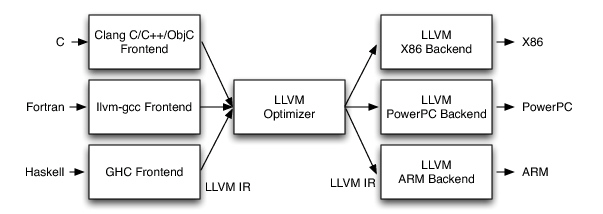
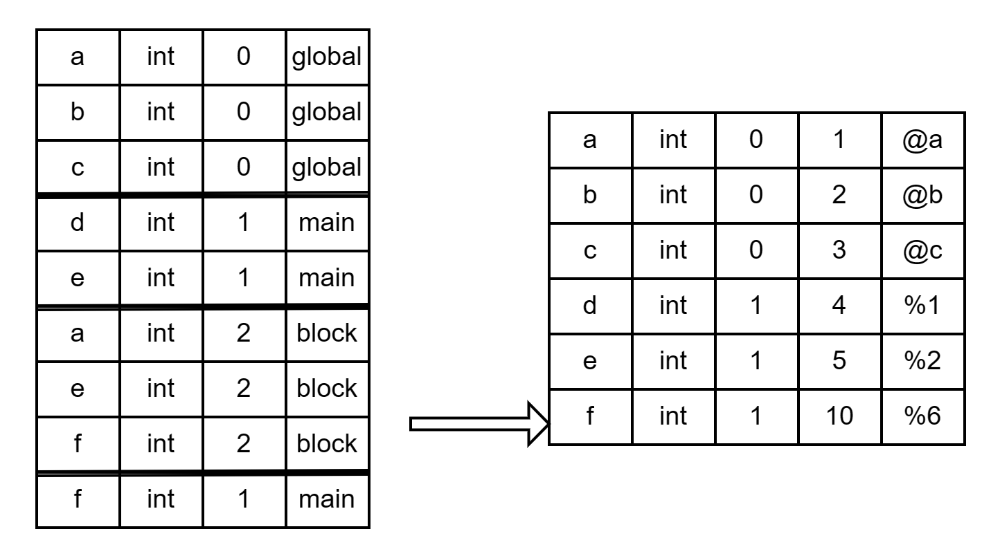

# LLVM 指导手册

对于大部分同学来说，可能是第一次接触 **LLVM**，虽然看上去上手比较困难，但了解了基本语法后还是比较容易的。本教程将分模块为大家讲解 LLVM 主要特点和语法结构，实验文法、C 语言函数与 LLVM IR 之间的对应转换关系，以及如何使用 LLVM 进行代码生成。建议学习过程中可以结合**语法分析**和**中间代码生成**。

## 1. 基本概念

### （1）LLVM？

**LLVM** 最早叫底层虚拟机（Low Level Virtual Machine），最初是伊利诺伊大学的一个研究项目，目的是提供一种现代的、基于 SSA（静态单一赋值）的编译策略，能够支持任意编程语言的静态和动态编译。到现在，LLVM 已经发展成为一个由多个子项目组成的伞式项目，其中许多子项目被各种各样的商业和开源项目用于生产，并被广泛用于学术研究。

现在，LLVM 被用作实现各种静态和运行时编译语言的通用基础设施（例如 C/C++、Java、.NET、Python、Ruby、Scheme、Haskell、D 以及无数鲜为人知的语言所支持的语言族）。一些参考资料：

- <https://aosabook.org/en/v1/llvm.html>
- <https://llvm.org/>

### （2）三端设计

LLVM 流行的一个非常重要的原因就是它采用了**三端设计**，并提供了一个非常灵活而强大的中间代码表示形式。在三端设计中，主要组件是前端、优化器和后端。**前端**解析源代码，检查其错误，并构建特定语言的**抽象语法树**（Abstract Syntax Tree，AST）来表示输入的源代码。AST 可以进一步转化为新的目标码进行优化，最终由后端生成具体的二进制可执行文件。**优化器**的作用是**提高代码的运行效率**，例如消除冗余计算。**后端**负责将代码**映射到目标指令集**，其常见的功能包括指令选择、寄存器分配和指令调度。

这种设计最重要的优点在于对多种源语言和目标体系结构的支持。不难发现，对于 $M$ 种源语言，$N$ 种体系结构，如果前后端不分开，将会需要 $M \times N$ 个编译器，而在三端设计中，只需要 $M$ 种前端和 $N$ 种后端，实现了复用。这一特点的官方表述是 Retargetablity，即可重定向性或可移植性。同学们熟悉的 GCC、Java 中的 JIT，都是采用这种设计。下面这张图反映了 LLVM 中三端设计的应用。



## 2. LLVM 快速上手

> 比起指导书，亲自体验的学习效率要高很多。这一节中会为大家介绍如何在本地生成并运行 LLVM IR。

在平时的使用中，LLVM 一般指的是 LLVM IR，即中间代码。中间代码往往不能单独存在，因此我们需要有一个能生成 LLVM IR 的编译器，所以我们需要使用 GCC 之外的另一款编译器 Clang，也是 LLVM 的子项目之一。

在我们的实验中，评测机采用的 Clang 版本为 12.0，不同版本的 Clang 输出的 LLVM 可能有少许区别，但不会对正确性造成影响。

### （1）开发环境准备

在我们的实验中，主要会用到两个工具：`clang` 和 `lli`。`clang` 是 LLVM 项目中 C/C++ 语言的前端，其用法与 GCC 基本相同，可以为源代码生成 LLVM IR。`lli` 会解释执行 `.bc` 和 `.ll` 程序，方便大家验证生成的 LLVM IR 的正确性。

#### Linux

Linux 下的环境配置相对更方便，使用 Windows 的话推荐大家使用 [WSL 2](https://learn.microsoft.com/zh-cn/windows/wsl/install) + Ubuntu，其他 Linux 环境如虚拟机、云服务器也都是可以的。

首先更新包信息。

```bash
sudo apt update
sudo apt upgrade
```

如果不在意版本，直接进行安装即可。

```bash
sudo apt install llvm
sudo apt install clang
```

如果比较在意版本，可以使用 `apt search` 查找当前发行版包含的 Clang 版本。在 Ubuntu 20.04 中，有 7~12；在 Ubuntu 22.04 中，有 11~15，大家可以选择自己喜欢的版本，当然高版本会更好，也可以选择和评测机相同的 12。

```bash
$ apt search clang | grep -P ^clang-[0-9]+/
clang-10/focal 1:10.0.0-4ubuntu1 amd64
clang-11/focal-updates 1:11.0.0-2~ubuntu20.04.1 amd64
clang-12/focal-updates,focal-security 1:12.0.0-3ubuntu1~20.04.5 amd64
clang-7/focal 1:7.0.1-12 amd64
clang-8/focal 1:8.0.1-9 amd64
clang-9/focal 1:9.0.1-12 amd64
$ apt search llvm | grep -P ^llvm-[0-9]+/
llvm-10/focal 1:10.0.0-4ubuntu1 amd64
llvm-11/focal-updates 1:11.0.0-2~ubuntu20.04.1 amd64
llvm-12/focal-updates,focal-security 1:12.0.0-3ubuntu1~20.04.5 amd64
llvm-7/focal 1:7.0.1-12 amd64
llvm-8/focal 1:8.0.1-9 amd64
llvm-9/focal 1:9.0.1-12 amd64
```

安装特定版本时，可以手动修改默认的版本，从而避免每次命令都包含版本号。

```bash
sudo apt install llvm-12
sudo apt install clang-12
sudo update-alternatives --install /usr/bin/lli lli /usr/bin/lli-12 100
sudo update-alternatives --install /usr/bin/clang clang /usr/bin/clang-12 100
sudo update-alternatives --install /usr/bin/clang++ clang++ /usr/bin/clang++-12 100
```

安装完成后，输入指令查看版本。如果出现版本信息则说明安装成功。

```bash
clang -v 
lli --version 
```

#### Windows

Windows 安装 Clang 比较麻烦，但是我们可以借助强大的 Visual Studio。还没有 Visual Studio？可以去官网下载免费的社区版：[Download Visual Studio Tools](https://visualstudio.microsoft.com/downloads/)。安装时，需要在 Individual components 里勾选对 Clang 的支持。


安装完成后，你的电脑中应该会多出 Visual Studio 的命令行工具，就可以在其中使用 `clang` 了。


不幸的是，Visual Studio 并没有直接对 `lli` 的支持，手动构建比较麻烦，感兴趣的同学可以自行尝试。

#### MacOS

MacOS 上 LLVM 的安装需要 XCode 或 XCode Command Line Tools，其默认自带 Clang 支持。

```bash
xcode-select --install
brew install llvm
```

安装完成后，需要添加 LLVM 到 `$PATH`。

```bash
echo 'export PATH="/usr/local/opt/llvm/bin:$PATH"' >> ~/.bash_profile
```

这时候可以仿照之前查看版本的方法，如果显示版本号则证明安装成功。

> 上文指导安装的是 LLVM 的 Dev 版本，只能编译运行优化 LLVM 代码，不支持代码调试。LLVM 的 Debug 版本需要的空间较大（包括相关配置工具在内共约 30G），且安装操作复杂；实际调试时还需要针对性的编写 LLVM pass。因此，课程组不推荐同学们使用 LLVM 的系统调试工具。阶段性打印信息到控制台不失为一种快捷有效的 debug 方法。

### （2）基本命令

LLVM IR 具有三种表示形式，首先当然是代码中的数据结构，其次是作为输出的二进制位码（Bitcode）格式 `.bc` 和文本格式 `.ll`。在我们的实验中，要求大家能够输出正确的 `.ll` 文件。下面是一些常用指令，针对编译执行的不同阶段输出相应结果：

```bash
clang -ccc-print-phases main.c               # 查看编译的过程
clang -E -Xclang -dump-tokens main.c         # 生成 tokens（词法分析）
clang -fsyntax-only -Xclang -ast-dump main.c # 生成抽象语法树
clang -S -emit-llvm main.c -o main.ll -O0    # 生成 LLVM ir (不开优化)
clang -S -emit-llvm main.m -o main.ll -Os    # 生成 LLVM ir (中端优化)
clang -S main.c -o main.s                    # 生成汇编
clang -S main.bc -o main.s -Os               # 生成汇编（后端优化）
clang -c main.c -o main.o                    # 生成目标文件
clang main.c -o main                         # 直接生成可执行文件
```

作为一门全新的语言，与其讲过于理论的语法，不如直接看一个实例来得直观，也方便大家快速入门。例如，给出源程序 `main.c` 如下。

```c
int a = 1;

int add(int x, int y) {
    return x + y;
}

int main() {
    int b = 2;
    return add(a, b);
}
```

使用命令 `clang -S -emit-llvm main.c -o main.ll` 后，会在同目录下生成一个 `main.ll` 的文件。在 LLVM 中，注释以 `;` 打头。

```llvm
; ModuleID = 'main.c'     
source_filename = "main.c"  
target datalayout = "e-m:e-p270:32:32-p271:32:32-p272:64:64-i64:64-f80:128-n8:16:32:64-S128"
target triple = "x86_64-pc-linux-gnu"

; 从下一行开始，是实验需要生成的部分，注释不要求生成。
@a = dso_local global i32 1, align 4 

; Function Attrs: noinline nounwind optnone uwtable 
define dso_local i32 @add(i32 %0, i32 %1) #0 {
  %3 = alloca i32, align 4
  %4 = alloca i32, align 4
  store i32 %0, i32* %3, align 4
  store i32 %1, i32* %4, align 4
  %5 = load i32, i32* %3, align 4
  %6 = load i32, i32* %4, align 4
  %7 = add i32 %5, %6
  ret i32 %7
}

; Function Attrs: noinline nounwind optnone uwtable 
define dso_local i32 @main() #0 {
  %1 = alloca i32, align 4
  %2 = alloca i32, align 4
  store i32 0, i32* %1, align 4
  store i32 2, i32* %2, align 4
  %3 = load i32, i32* @a, align 4
  %4 = load i32, i32* %2, align 4
  %5 = call i32 @add(i32 %3, i32 %4)
  ret i32 %5
}

; 实验要求生成的代码到上一行即可

attributes #0 = { noinline nounwind optnone uwtable ...}
; 实际的 attributes 很多，这里进行了省略

!llvm.module.flags = !{!0}
!llvm.ident = !{!1}

!0 = !{i32 1, !"wchar_size", i32 4}
!1 = !{!"clang version 10.0.0-4ubuntu1 "}
```

用 `lli main.ll` 解释执行生成的 `.ll` 文件。如果一切正常，输入 `echo $?` 查看上一条指令的返回值。

> 注意，`$?` 只保存返回值的第八位，即实际返回值与 `0xff` 按位与的结果。

在本次实验中，同学们会用到一些库函数。库函数将打包为 `libsysy.zip` 放在课程资料区，使用的时候请将 `libsysy.c` 和 `libsysy.h` 放在同一目录下，对使用到了库函数的源程序进行编译时，需要用到如下指令：

```bash
# 分别导出 libsysy 和 main.c 对应的的 .ll 文件
$ clang -emit-llvm -S libsysy.c -o lib.ll
$ clang -emit-llvm -S main.c -o main.ll

# 使用 llvm-link 将两个文件链接，生成新的 IR 文件
$ llvm-link main.ll lib.ll -S -o out.ll

# 用 lli 解释运行
$ lli out.ll
```

> 对于这些基本的指令，同学们可自行编写自动化脚本进行生成。

LLVM IR 使用的是**三地址码**。下面对上述代码进行简要注释。

- Module ID：指明 Module 的标识
- source_filename：表明该 Module 是从什么文件编译得到的。如果是通过链接得到的，此处会显示 `llvm-link`
- target datalayout 和 target triple 是程序标签属性说明，和硬件/系统有关。

- `@a = dso_local global i32 1, align 4`：全局变量，名称是 `a`，类型是 `i32`，初始值是 1，对齐方式是 4 字节。`dso_local` 表明该变量会在同一个链接单元（`llvm-link` 命令的源文件范围）内解析符号。

  > 这里的 `align` 其实并不是必须的，大家在中间代码生成中也不一定需要生成。
- `define dso_local i32 @add(i32 %0, i32 %1) #0`：函数定义。其中第一个 `i32` 是返回值类型，`@add` 是函数名；第二个和第三个 `i32` 是形参类型，`%0`，`%1` 是形参名。

> LLVM 中的标识符分为两种类型：全局的和局部的。全局的标识符包括函数名和全局变量，会加一个 `@` 前缀，局部的标识符会加一个 `%` 前缀。
>
> `#0` 指出了函数的 attribute group。由于每个函数的 attribute 很多，而且不同函数的 attributes 往往相同，因此将相同的 attributes 合并为一个 attribute group，从而使 IR 更加简洁清晰。

- 大括号中间的是函数体，是由一系列 `BasicBlock` 组成的。每个 `BasicBlock` 都有一个 label，label 使得该 `BasicBlock` 有一个符号表的入口点。`BasicBlock` 以 terminator instruction（`ret`、`br` 等）结尾。每个 `BasicBlock` 由一系列 `Instruction` 组成，`Instruction` 是 LLVM IR 的基本指令。
- `%7 = add i32 %5, %6`：随便拿上面一条指令来说，`%7` 是一个临时寄存器，是 `Instruction` 的实例，它的操作数里面有两个值，一个是 `%5`，一个是 `%6`。`%5` 和 `%6` 也是临时寄存器，即前两条 `Instruction` 的实例。

### （3）LLVM 指令概览

对于一些常用的 Instructions，下面给出示例。对于一些没有给出的，可以参考 [LLVM IR 指令集](https://llvm.org/docs/LangRef.html#instruction-reference)。

|     LLVM IR     |                           使用方法                           |                    简介                    |
| :-------------: | :----------------------------------------------------------: | :----------------------------------------: |
|      `add`      |             ` <result> = add <ty> <op1>, <op2>`              |                     /                      |
|      `sub`      |              `<result> = sub <ty> <op1>, <op2>`              |                     /                      |
|      `mul`      |             `<result> = mul <ty> <op1>, <op2> `              |                     /                      |
|     `sdiv`      |            `<result> = sdiv <ty> <op1>, <op2>  `             |                 有符号除法                 |
| `srem` | `<result> = srem <type> <op1>, <op2>` |有符号取余|
|     `icmp`      |        `<result> = icmp <cond> <ty> <op1>, <op2>   `         |                  比较指令                  |
|      `and`      |             `<result> = and <ty> <op1>, <op2>  `             |                     按位与                     |
|      `or`       |             `<result> = or <ty> <op1>, <op2>   `             |                     按位或                     |
|     `call`      | `<result> =  call  [ret attrs]  <ty> <name>(<...args>)` |                  函数调用                  |
|    `alloca`     |                `  <result> = alloca <type> `                 |                  分配内存                  |
|     `load`      |           `<result> = load  <ty>, <ty>* <pointer>`           |                  读取内存                  |
|     `store`     |            `store  <ty> <value>, <ty>* <pointer>`            |                   写内存                   |
| `getelementptr` | `<result> = getelementptr <ty>, * {, [inrange] <ty> <idx>}*` <br>  `<result> = getelementptr inbounds <ty>, <ty>* <ptrval>{, [inrange] <ty> <idx>}*` | 计算目标元素的位置（数组部分会单独详细说明） |
|      `phi`      | `<result> = phi [fast-math-flags] <ty> [ <val0>, <label0>], ...` |                     /                      |
|   `zext..to`    |          `<result> = zext <ty> <value> to <ty2>  `           |     将 `ty`的`value`的type扩充为`ty2`      |
|   `trunc..to`   |          `<result> = trunc <ty> <value> to <ty2>  `          |     将 `ty`的`value`的type缩减为`ty2`      |
|      `br`       | `br i1 <cond>, label <iftrue>, label <iffalse>` <br> `br label <dest>  ` |                 改变控制流                 |
|      `ret`      |             `ret <type> <value> `  ,`ret void  `             |           退出当前函数，并返回值           |

### （4）LLVM 构建单元

在 C/C++ 中，一个 `.c`/`.cpp` 文件是一个编译单元，在 LLVM 中也是一样，一个 `.ll` 文件对应一个 `Module`。在前的示例中大家可能已经注意到了，LLVM 有着非常严格清晰的结构，如下图。


> 细心的同学可能注意到了图中使用的箭头和斜体，不用怀疑，它们分别表示的就是面向对象中的继承与抽象类。

在 LLVM 中，一个 `Module` 由若干 *`GlobalValue`* 组成，而一个 *`GlobalValue`* 可以是全局变量（`GlobalVariable`），也可以是函数（`Function`）。一个函数由若干基本块（`BasicBlock`）组成，与大家在理论课上学习的基本块是一样的。在基本块内部，则是由若干指令（`Instruction`）组成，也是 LLVM 的基本组成。

可以发现，LLVM 中所有类都直接或间接继承自 `Value`，因此在 LLVM 中，有“一切皆 Value”的说法。通过规整的继承关系，我们就得到了 LLVM 的类型系统。

可以发现，LLVM 中几乎所有的结构都可以认为是一个 `Value`，结构与结构之间的 `Value` 传递可以简单理解为继承属性和综合属性。`User` 类是 `Value` 的子类，存储了一个结构使用的其他 `Value` 的列表（维护 `Use *UseList;`）。而 `Use` 类则是LLVM中的重要概念，用来**维护 `User` 和 `Usee` 的双向索引关系**。

```llvm
A: %add = add nsw i32 %a, %b
B: %add1 = add nsw i32 %a, %b
C: %add2 = add nsw i32 %add, %add1
```

比如，以上这段实例代码中，A 这一条语句被看作是一个 `Instruction`，这个 `Instruction`（继承自 `User`）是一个 `User`（继承自 `Value`，在这条 `Instruction` 中这个 `Value` 就是 `%add`），它与 `%a` 和 `%b` 这两个 `Value` 构成了 `Use` 关系；与此同时，`Instruction` 本身与其结果 `%add` 等价，作为一个 `Value` 变量，又被 C 这条 `Instruction` 所 `Use`。

这其中架构的设计，是为了方便 LLVM 的优化和分析，然后根据优化过后的 `Module` 生成后端代码。比如，公共子表达式删除优化，对于上述代码中的变量 `%add` 和 `%add1` 计算的其实是同一个值，那么我就可以把所有用到 `%add1` 的地方直接用 `%add` 替换。这时，就可以直接获取 `%add1` 的所有 `Use` 关系，使替换过程更简单。

同学们可以根据自己的需要自行设计数据类型。但**如果对代码优化效果要求不高，这部分内容其实没有那么重要，可以直接面向 AST 生成代码。**

### （5）一些说明

- 这一部分的代码生成的目标，即输入 AST（或者四元式） ，输出一个 `Module`（便于继续生成到MIPS） 或直接输出 LLVM IR 代码。想通过 LLVM IR 生成到 MIPS 的同学可以根据对应的 `Module` 结构自行存储数据，然后根据 `Module` 生成对应的 LLVM IR 代码自测正确性。
- 目标生成到 LLVM 语言的同学请注意，`clang` 默认生成的虚拟寄存器是**按数字顺序**命名的，LLVM 限制了所有数字命名的虚拟寄存器必须严格地**从 0 开始递增**，且每个函数**参数和基本块**都会占用一个编号。如果不能确定怎样用数字命名虚拟寄存器，请使用**字符串命名**虚拟寄存器。
- LLVM 架构复杂，为方便同学们了解，我们在 tolangc 编译器中参考 LLVM 的设计设计了一套相对简单的 LLVM IR 数据结构，详见……。

## 2. 主函数与常量表达式

### （1）主函数

首先从最基本的开始，即只包含 `return` 语句的主函数 `main`（或没有参数的函数）：

```c
int main() {
    return 0;
}
```

主要包含文法包括

```c
CompUnit    → MainFuncDef
MainFuncDef → 'int' 'main' '(' ')' Block
Block       → '{' { BlockItem } '}' 
BlockItem   → Stmt
Stmt        → 'return' Exp ';' 
Exp         → AddExp
AddExp      → MulExp 
MulExp      → UnaryExp 
UnaryExp    → PrimaryExp
PrimaryExp  → Number
```

对于一个无参的函数，首先需要从 AST 获取函数的名称，返回值类型。然后分析函数体的 Block。BlockItem 中的 Stmt 可以是 `return` 语句，也可以是其他语句，但是这里只考虑 `return` 语句。`return` 语句中的 Number 在现在默认是**常数**。
所以对于一个代码生成器，同学们需要实现的功能有：

- 遍历 AST，遍历到函数时，获取函数的**名称**、**返回值类型**
- 遍历到 **BlockItem** 内的 **Stmt** 时，如果是 `return` 语句，生成对应的**指令**

### （2）常量表达式

新增内容有

```c
Stmt       → 'return' [Exp] ';' 
Exp        → AddExp
AddExp     → MulExp | AddExp ('+' | '−') MulExp 
MulExp     → UnaryExp | MulExp ('*' | '/' | '%') UnaryExp
UnaryExp   → PrimaryExp | UnaryOp UnaryExp 
PrimaryExp → '(' Exp ')' | Number
UnaryOp    → '+' | '−'
```

对于常量表达式，这里只包含常数的四则运算，正负号操作。这时候就需要用到之前的 Value 思想。举个例子，对于 `1+2+3*4`，根据文法生成的 AST 样式如下


按最左推导的生成顺序，先生成 `1`，然后生成 `2`，然后生成 `1+2`，然后生成 `3`，然后生成 `4`，然后生成 `3*4`，最后生成 `1+2+3*4`。那对于1+2的 **AddExp**，在其生成的指令中，`1` 和 `2` 的值就类似于综合属性，即从 AddExp 的实例的值（`3`）由产生式右边的值（1 和 2）推导出来。而对于 `3*4` 的 **MulExp**，其生成的指令中 `3` 和 `4` 的值就类似于继承属性，即从 MulExp 的实例的值（`12`）由产生式左边的值（`3` 和 `4`）推导出来。最后，对于 `1+2+3*4` 的 **AddExp**，生成指令的实例的值就由产生式右边的 AddExp 的值（`3`）和 MulExp 的值（`12`）推导出来。

同理，对于数字前的**正负**，可以看做是 **`0` 和其做一次 AddExp**，即 `+1` 其实就是 `0+1`（其实正号甚至都不用去管他），`-1` 其实就是 `0-1`。所以在生成代码的时候，可以当作一个特殊的 AddExp 来处理。

> 特别注意：`MulExp → UnaryExp | MulExp ('*' | '/' | '%') UnaryExp` 运算中，`%` 模运算的代码生成不是 mod 哦

### （3）测试样例

源程序

```c
int main() {
    return --+---+1 * +2 * ---++3 + 4 + --+++5 + 6 + ---+--7 * 8 + ----++--9 * ++++++10 * -----11;
}
```

生成代码参考（因为最后的代码是扔到评测机上重新编译去跑的，所以生成的代码不一定要一样，但是要确保输出结果一致）

```llvm
define dso_local i32 @main() {
    %1 = sub i32 0, 1
    %2 = sub i32 0, %1
    %3 = sub i32 0, %2
    %4 = sub i32 0, %3
    %5 = sub i32 0, %4
    %6 = mul i32 %5, 2
    %7 = sub i32 0, 3
    %8 = sub i32 0, %7
    %9 = sub i32 0, %8
    %10 = mul i32 %6, %9
    %11 = add i32 %10, 4
    %12 = sub i32 0, 5
    %13 = sub i32 0, %12
    %14 = add i32 %11, %13
    %15 = add i32 %14, 6
    %16 = sub i32 0, 7
    %17 = sub i32 0, %16
    %18 = sub i32 0, %17
    %19 = sub i32 0, %18
    %20 = sub i32 0, %19
    %21 = mul i32 %20, 8
    %22 = add i32 %15, %21
    %23 = sub i32 0, 9
    %24 = sub i32 0, %23
    %25 = sub i32 0, %24
    %26 = sub i32 0, %25
    %27 = sub i32 0, %26
    %28 = sub i32 0, %27
    %29 = mul i32 %28, 10
    %30 = sub i32 0, 11
    %31 = sub i32 0, %30
    %32 = sub i32 0, %31
    %33 = sub i32 0, %32
    %34 = sub i32 0, %33
    %35 = mul i32 %29, %34
    %36 = add i32 %22, %35
    ret i32 %36
}
```

## 3. 全局变量与局部变量

### （1）全局变量

本章实验涉及的文法包括：

```c
CompUnit     → {Decl} MainFuncDef
Decl         → ConstDecl | VarDecl
ConstDecl    → 'const' BType ConstDef { ',' ConstDef } ';' 
BType        → 'int' 
ConstDef     → Ident  '=' ConstInitVal
ConstInitVal → ConstExp
ConstExp     → AddExp
VarDecl      → BType VarDef { ',' VarDef } ';'
VarDef       → Ident | Ident '=' InitVal
InitVal      → Exp
```

在 LLVM 中，全局变量使用的是和函数一样的全局标识符 `@` ，所以全局变量的写法其实和函数的定义几乎一样。在本次的实验中，全局变/常量声明中指定的初值表达式必须是**常量表达式**。不妨举几个例子：

```c
//以下都是全局变量
int a = 'a';
int b = 2 + 3;
```

生成的 LLVM IR 如下所示

```llvm
@a = dso_local global i32 97
@b = dso_local global i32 5
```

可以看到，对于全局变量中的常量表达式，在生成的 LLVM IR 中需要直接算出其**具体的值**。

### （2）局部变量与作用域

本章内容涉及文法包括：

```c
BlockItem → Decl | Stmt
```

局部变量使用的标识符是 `%`。与全局变量不同，局部变量在赋值前需要申请一块内存。在对局部变量操作的时候也需要采用 **load/store** 来对内存进行操作。
同样的，举个例子来说明一下：

```c
//以下都是局部变量
int a = 1 + 2;
```

生成的 LLVM IR 如下所示

```llvm
%1 = alloca i32
%2 = add i32 1, 2
store i32 %2, i32* %1
```

### （3）符号表设计

这一章将主要考虑变量，包括**全局变量**和**局部变量**以及**作用域**的说明。不可避免地，同学们需要进行符号表的设计。

涉及到的文法如下：

```c
Stmt       → LVal '=' Exp ';' 
           | [Exp] ';'
           | 'return' Exp ';'
LVal       → Ident
PrimaryExp → '(' Exp ')' | LVal | Number
```

举个最简单的例子：

```c
int a = 1;
int b = 2 + a;

int main() {
    int c = b + 4;
    return a + b + c;
}
```

如果需要将上述代码转换为llvm，应当怎么考虑呢？直观来看，a和b是**全局变量**，c是**局部变量**。直观上来说，过程是首先将全局变量a和b进行赋值，然后进入到main函数内部，对c进行赋值。那么在 `return a+b+c;` 的时候，根据上个实验，llvm最后几行应该是

```llvm
%sumab = add i32 %a, %b
%sumabc = add i32 %sumab, %c
ret i32 %sumabc
```

问题就是，如何获取标识符 `%a，%b，%c`，这时候符号表的作用就体现出来了。简单来说，符号表类似于一个索引。通过符号表可以很快速的找到变量对应的标识符。

对于上面的c语言程序，llvm生成如下：

```llvm
@a = dso_local global i32 1
@b = dso_local global i32 3
define dso_local i32 @main() {
    %1 = alloca i32          ;分配c内存
    %2 = load i32, i32* @b   ;读取全局变量b
    %3 = add i32 %2, 4       ;计算b+4
    store i32 %3, i32* %1    ;把b+4的值存入c
    %4 = load i32, i32* @a   ;读取全局变量a
    %5 = load i32, i32* @b   ;读取全局变量b
    %6 = add i32 %4, %5      ;计算a+b;
    %7 = load i32, i32* %1   ;读取c
    %8 = add i32 %6, %7      ;计算(a+b)+c
    ret i32 %8               ;return
}
```

不难发现，对于全局变量的使用，可以直接使用全局变量的**全局标识符**（例如`@a`），而对于**局部变量**，则需要使用分配内存的标识符。由于标识符是**自增的数字**，所以快速找到对应变量的标识符就是符号表最重要的作用。同学们可以选择遍历一遍AST后造出一张统一的符号表，然后根据**完整的符号表**进行代码生成，也可以在遍历AST的同时造出一张**栈式符号表**，根据实时的栈式符号表生成相应代码。

同时，同学们需要注意变量的作用域，即语句块内声明的变量的生命周期在该语句块内，且内层代码块覆盖外层代码块。

```c
int a = 1;
int b = 2;
int c = 3;
int main() {
    int d = 4;
    int e = 5;
    { // blockA
        int a = 7;
        int e = 8;
        int f = 9;
    }
    int f = 10;
}
```

在上面的程序中，在 **blockA** 中，`a` 的值为 `7`，覆盖了全局变量 `a = 1`，`e` 覆盖了 `main` 中的 `e = 5`，而在 `main` 的最后一行，`f` 并不存在覆盖，因为 `main` 外层不存在其他f的定义。

同样的，下面给出上述程序的 LLVM 代码：

```llvm
@a = dso_local global i32 1
@b = dso_local global i32 2
@c = dso_local global i32 3

define dso_local i32 @main() {
    %1 = alloca i32
    store i32 4, i32* %1
    %2 = alloca i32
    store i32 5, i32* %2
    %3 = alloca i32
    store i32 7, i32* %3
    %4 = alloca i32
    store i32 8, i32* %4
    %5 = alloca i32
    store i32 9, i32* %5
    %6 = alloca i32
    store i32 10, i32* %6
}
```

符号表存储的东西同学们可以自己设计，下面给出符号表的简略示例，同学们在实验中可以根据自己需要自行设计。



### （4）测试样例

源程序

```c
int a = 1;
int b = 2 + a;
int c = 3 * (b+------10);
int main() {
    int d = 4 + c;
    int e = 5 * d;
    {
        a = a + 5;
        int b = a * 2;
        a = b;
        int f = 20;
        e = e + a * 20;
    }
    int f = 10;
    return e * f;
}
```

LLVM 参考如下：

```llvm
@a = dso_local global i32 1
@b = dso_local global i32 3
@c = dso_local global i32 39
define dso_local i32 @main() {
    %1 = alloca i32
    %2 = load i32, i32* @c
    %3 = add i32 4, %2
    store i32 %3, i32* %1
    %4 = alloca i32
    %5 = load i32, i32* %1
    %6 = mul i32 5, %5
    store i32 %6, i32* %4
    %7 = load i32, i32* @a
    %8 = load i32, i32* @a
    %9 = add i32 %8, 5
    store i32 %9, i32* @a
    %10 = alloca i32
    %11 = load i32, i32* @a
    %12 = mul i32 %11, 2
    store i32 %12, i32* %10
    %13 = load i32, i32* @a
    %14 = load i32, i32* %10
    store i32 %14, i32* @a
    %15 = alloca i32
    store i32 20, i32* %15
    %16 = load i32, i32* %4
    %17 = load i32, i32* %4
    %18 = load i32, i32* @a
    %19 = mul i32 %18, 20
    %20 = add i32 %17, %19
    store i32 %20, i32* %4
    %21 = alloca i32
    store i32 10, i32* %21
    %22 = load i32, i32* %4
    %23 = load i32, i32* %21
    %24 = mul i32 %22, %23
    ret i32 %24
}
```

`echo $?` 的结果为 **198**

> 相信各位如果去手动计算的话，会算出来结果是 4550。然而由于 `echo $?` 的返回值只截取最后一个字节，也就是 8 位，所以 `4550 mod 256 = 198`

## 4. 函数的定义及调用

> 本章主要涉及**不含数组**的函数的定义，调用等。

### （1）库函数

涉及文法有：

```c
Stmt → LVal '=' 'getint''('')'';'
     | LVal '=' 'getchar''('')'';'
     | 'printf''('FormatString{','Exp}')'';'

```


首先添加**库函数**的调用。在实验的llvm代码中，库函数的声明如下：

```llvm
declare i32 @getint()
declare i8 @getchar()
declare void @putint(i32)
declare void @putch(i32)
declare void @putstr(i8*)
```

只要在 LLVM IR 代码开头加上这些声明，就可以在后续代码中使用这些库函数。同时对于用到库函数的 LLVM 代码，在编译时也需要使用 `llvm-link` 命令将库函数链接到生成的代码中。

对于库函数的使用，在文法中其实就包含三句，即 `getint`，`getchar` 和 `printf`。其中，`printf` 包含了有 Exp 和没有 Exp 的情况。同样的，这里给出一个简单的例子：

```c
int main() {
    int a, b;
    a = getint();
    b = getchar();
    printf("hello:%d, %d", a, b);
    return 0;
}
```

LLVM 代码如下：

```llvm
declare i32 @getint()
declare i8 @getchar()
declare void @putint(i32)
declare void @putch(i32)
declare void @putstr(i8*)

define dso_local i32 @main() {
    %1 = alloca i32
    %2 = alloca i32
    %3 = call i32 @getint() 
    store i32 %3, i32* %1
    %4 = call i8 @getchar()
    %5 = zext i8 %4 to i32
    store i32 %5, i32 * %2
	%6 = load i32, i32 * %1
	%7 = load i32, i32 * %2
    call void @putch(i32 104)
    call void @putch(i32 101)
    call void @putch(i32 108)
    call void @putch(i32 108)
    call void @putch(i32 111)
    call void @putch(i32 58)
    call void @putint(i32 %6)
    call void @putch(i32 44)
	call void @putch(i32 32)
	call void @putint(i32 %7)
    ret i32 0
}
```


不难看出，`call i32 @getint()` 即为调用 `getint` 的语句，`call i32 @getchar()` 即为调用 `getchar` 的语句，对于其他的任何函数的调用也是像这样去写。而对于 `printf`，则需要将其转化为多条 `putch` 和 `putint` 的调用，或者使用 `putstr` 以字符串输出。这里需要注意的是，`putch` 和 `putint` 的参数都是 `i32` 类型，所以需要将字符串中的字符转化为对应的 ascii 码。


### （2）函数定义与调用

涉及文法如下：

```c
CompUnit    → {Decl} {FuncDef} MainFuncDef
FuncDef     → FuncType Ident '(' [FuncFParams] ')' Block 
FuncType    → 'void' | 'int' | 'char'
FuncFParams → FuncFParam { ',' FuncFParam }
FuncFParam  → BType Ident
BType 		→ 'int' | 'char'
UnaryExp    → PrimaryExp | Ident '(' [FuncRParams] ')' | UnaryOp UnaryExp 
```

其实之前的 main 函数也是一个函数，即主函数。这里将其拓广到一般函数。对于一个函数，其特征包括**函数名**，**函数返回类型**和**参数**。在本实验中，函数返回类型有`char`、`int` 和 `void` 三种，参数类型有 `char` 和 `int` 两种。

> 在这里我们讨论一下 `char` 类型数据的处理。
>
> 我们从文法中可以看出，`char` 类型的数据在输入时因为字面量的存在，需要和int类型区分；在赋值时需要截断高位的数字。在计算和输出时，`int` 和 `char` 并无区别，都作为常量按数字处理。因此课程组建议，在语义分析中，我们可以将 `int` 和 `char` 都视为统一的数字，**用 i32** 作为 LLVM 中的**统一数据类型**存储使用，在赋值时特殊处理。因此，函数的类型在中间代码翻译时可以简化为 `void` 和 `i32`，函数参数类型可以统一成 `i32`。当然，也可以自行实现 `char` 类型的处理，比如将其翻译成 `i8`。

FuncFParams 之后的 Block 则与之前主函数内处理方法一样。值得一提的是，由于每个**临时寄存器**和**基本块**占用一个编号，所以没有参数的函数的第一个临时寄存器的编号应该从 **1** 开始，因为函数体入口占用了一个编号 0。而有参数的函数，参数编号从 **0** 开始，**进入 Block 后需要跳过一个基本块入口的编号**（可以参考测试样例）。

当然，如果全部采用字符串编号寄存器，上述问题都不会存在。

对于函数的调用，参考之前库函数的处理，不难发现，函数的调用其实和**全局变量**的调用基本是一样的，即用 `@函数名` 表示。所以函数部分和**符号表**有着密切关联。同学们需要在函数定义和函数调用的时候对符号表进行操作。对于有参数的函数调用，则在调用的函数内传入参数。对于没有返回值的函数，则直接 `call` 即可，不用为语句赋一个实例。

### （3）测试样例

源代码：

```c
int a=1000;
int aaa(int a,int b){
        return a+b;
}
void ab(){
        a=1200;
        return;
}
int main(){
        ab();
        int b=a,a;
        a=getint();
        printf("%d",aaa(a,b));
        return 0;
}
```

llvm输出参考：

```llvm
declare i32 @getint()
declare void @putint(i32)
declare void @putch(i32)
declare void @putstr(i8*)
@a = dso_local global i32 1000
define dso_local i32 @aaa(i32 %0, i32 %1){
  %3 = alloca i32
  %4 = alloca i32
  store i32 %0, i32* %3
  store i32 %1, i32* %4
  %5 = load i32, i32* %3
  %6 = load i32, i32* %4
  %7 = add nsw i32 %5, %6
  ret i32 %7
}
define dso_local void @ab(){
  store i32 1200, i32* @a
  ret void
}

define dso_local i32 @main(){
  %1 = alloca i32
  %2 = alloca i32
  call void @ab()
  %3 = load i32, i32* @a
  store i32 %3, i32* %1
  %4 = call i32 @getint()
  store i32 %4, i32* %2
  %5 = load i32, i32* %2
  %6 = load i32, i32* %1
  %7 = call i32 @aaa(i32 %5, i32 %6)
  call void @putint(i32 %7)
  ret i32 0
}
```

- 输入：1000
- 输出：2200

## 5. 条件语句与短路求值

### （1）条件语句

涉及文法如下

```c
Stmt    → 'if' '(' Cond ')' Stmt [ 'else' Stmt ]
Cond    → LOrExp
RelExp  → AddExp | RelExp ('<' | '>' | '<=' | '>=') AddExp
EqExp   → RelExp | EqExp ('==' | '!=') RelExp
LAndExp → EqExp | LAndExp '&&' EqExp
LOrExp  → LAndExp | LOrExp '||' LAndExp 
```

在条件语法中，需要同学们进行条件的判断与选择。这时候就涉及到基本块的标号。在llvm中，每个**临时寄存器**和**基本块**占用一个编号。所以对于纯数字编号的llvm，这里就需要进行**回填**操作。对于在代码生成前已经完整生成符号表的同学，这里就会显得十分容易。对于在代码生成同时生成符号表的同学，也可以采用**栈**的方式去回填编号，对于采用字符串编号的则没有任何要求。

要写出条件语句，首先要理清楚逻辑。在上述文法中，最重要的莫过于下面这一条语法

```c
Stmt    → 'if' '(' Cond ')' Stmt1 [ 'else' Stmt2 ]  (BasicBlock3)
```

为了方便说明，对上述文法的两个Stmt编号为Stmt1和2。在这条语句之后基本块假设叫BasicBlock3。不难发现，条件判断的逻辑如左下图。


首先进行 Cond 结果的判断，如果结果为 **1** 则进入 **Stmt1**，如果 Cond 结果为**0**，若文法有 `else` 则将进入 **Stmt2**，否则进入下一条文法的基本块**BasicBlock3**。在 Stmt1 或 Stmt2 执行完成后都需要跳转到 BasicBlock3。对于一个 LLVM 程序来说，对一个含 `else` 的条件分支，其基本块构造可以如右上图所示。

如果能够理清楚基本块跳转的逻辑，那么在写代码的时候就会变得十分简单。

这时候再回过头去看 Cond 里面的代码，即 LOr 和 Land，Eq 和 Rel。不难发现，其处理方式和加减乘除非常像，除了运算结果都是 1 位（i1）而非 32 位（i32）。同学们可能需要用到 `trunc` 或者 `zext` 指令进行类型转换。

### （2）短路求值

可能有的同学会认为，反正对于 LLVM 来说，跳转与否只看 Cond 的值，所以只要把 Cond 算完结果就行，不会影响正确性。不妨看一下下面这个例子：

```c
int a = 5;
int change() {
    a = 6;
    return a;
}
int main() {
    if (1 || change()) {
        printf("%d", a);
    }
    return 0;
}
```

如果要将上面这段代码翻译为 LLVM，同学们会怎么做？如果按照传统方法，即先**统一计算 Cond**，则一定会执行一次 `change()` 函数，把全局变量的值变为**6**。但事实上，由于短路求值的存在，在读完1后，整个 `Cond` 的值就**已经被确定**了，即无论 `1||` 后面跟的是什么，都不影响 `Cond` 的结果，那么根据短路求值，后面的东西就不应该执行。所以上述代码的输出应当为**5**而不是 6，也就是说， LLVM 不能够单纯的把 `Cond` 计算完后再进行跳转。这时候就需要对 `Cond` 的跳转逻辑进行改写。

改写之前同学们不妨思考一个问题，即什么时候跳转。根据短路求值，只要条件判断出现“短路”，即不需要考虑后续与或参数的情况下就已经能确定值的时候，就可以进行跳转。或者更简单的来说，当 **LOrExp 值为 1**或者 **LAndExp 值为 0**的时候，就已经没有必要再进行计算了。

```c
Cond    → LOrExp
LAndExp → LAndExp '&&' EqExp
LOrExp  → LOrExp '||' LAndExp 
```

- 对于连或来说，只要其中一个 LOrExp 或最后一个 LAndExp 为 `1`，即可直接跳转 Stmt1。
- 对于连与来说，只要其中一个 LAndExp 或最后一个 EqExp 为 `0`，则直接进入下一个 LOrExp。如果当前为连或的最后一项，则直接跳转 Stmt2（有 `else`）或 BasicBlock3（没 `else`）

上述两条规则即为短路求值的最核心算法，示意图如下。


### （3）测试样例

```c
int a = 1;
int func() {
    a = 2;
    return 1;
}

int func2() {
    a = 4;
    return 10;
}
int func3() {
    a = 3;
    return 0;
}
int main() {
    if (0 || func() && func3() || func2()) {
        printf("%d--1", a);
    }
    if (1 || func3()) {
        printf("%d--2", a);
    }
    if (0 || func3() || func() < func2()) {
        printf("%d--3", a);
    }
    return 0;
}
```

```llvm
declare i32 @getint()
declare void @putint(i32)
declare void @putch(i32)
declare void @putstr(i8*)
@a = dso_local global i32 1
define dso_local i32 @func() {
    %1 = load i32, i32* @a
    store i32 2, i32* @a
    ret i32 1
}
define dso_local i32 @func2() {
    %1 = load i32, i32* @a
    store i32 4, i32* @a
    ret i32 10
}
define dso_local i32 @func3() {
    %1 = load i32, i32* @a
    store i32 3, i32* @a
    ret i32 0
}

define dso_local i32 @main() {
    %1 = call i32 @func()
    %2 = icmp ne i32 %1, 0
    br i1 %2, label %3, label %6

3:
    %4 = call i32 @func3()
    %5 = icmp ne i32 %4, 0
    br i1 %5, label %9, label %6

6:
    %7 = call i32 @func2()
    %8 = icmp ne i32 %7, 0
    br i1 %8, label %9, label %11

9:
    %10 = load i32, i32 * @a
    call void @putint(i32 %10)
    call void @putch(i32 45)
    call void @putch(i32 45)
    call void @putch(i32 49)
    br label %11

11:
    %12 = load i32, i32 * @a
    call void @putint(i32 %12)
    call void @putch(i32 45)
    call void @putch(i32 45)
    call void @putch(i32 50) 
    %13 = call i32 @func3()
    %14 = icmp ne i32 %13, 0
    br i1 %14, label %21, label %15

15:
    %16 = call i32 @func()
    %17 = call i32 @func2()
    %18 = icmp slt i32 %16, %17
    %19 = zext i1 %18 to i32
    %20 = icmp ne i32 %19, 0
    br i1 %20, label %21, label %23

21:
    %22 = load i32, i32 * @a
    call void @putint(i32 %22)
    call void @putch(i32 45)
    call void @putch(i32 45)
    call void @putch(i32 51)
    br label %23

23:
    ret i32 0
}
```

- 输出：4--14--24--3

## 6. 条件判断与循环

### （1）循环

涉及文法如下：

```c
Stmt    → 'for' '(' [ForStmt] ';' [Cond] ';' [ForStmt] ')' Stmt 
        | 'break' ';'
        | 'continue' ';'
ForStmt → LVal '=' Exp
```

如果经过了上一章的学习，这一章其实难度就小了不少。对于这条文法，同样可以改写为

```c
Stmt    → 'for' '(' [ForStmt1] ';' [Cond] ';' [ForStmt2] ')' Stmt (BasicBlock)
```

如果查询C语言的 `for` 循环，其中对 `for` 循环的描述为：

```c
for(initialization;condition;incr/decr){  
   //code to be executed  
}
```

不难发现，实验文法中的 ForStmt1、Cond、ForStmt2 分别表示了上述 for 循环中的**初始化（initialization）**，**条件（condition）**和**增量/减量（increment/decrement）**。同学们去搜索C语言的 `for` 循环逻辑的话也会发现，`for` 循环的逻辑可以表述为

- 1.执行初始化表达式 ForStmt1
- 2.执行条件表达式 Cond，如果为1执行循环体 Stmt，否则结束循环执行 BasicBlock
- 3.执行完循环体 Stmt 后执行增量/减量表达式 ForStmt2
- 4.重复执行步骤 2 和步骤 3


### （2）break/continue

对于 `break` 和 `continue`，直观理解为，`break` **跳出循环**，`continue` **跳过本次循环**。再通俗点说就是，`break` 跳转到的是 **BasicBlock**，而 `continue` 跳转到的是 **ForStmt2**。这样就能达到目的了。所以，对于循环而言，跳转的位置很重要。这也是同学们在编码的时候需要着重注意的点。

同样的，针对这两条指令，对上图作出一定的修改，就是整个循环的流程图了。


### （3）测试样例

```c
int main() {
    int a1 = 1, a2;
    a2 = a1;
    int temp;
    int n, i;
    n = getint();
    for (i = a1 * a1; i < n + 1; i = i + 1) {
        temp = a2;
        a2 = a1 + a2;
        a1 = temp;
        if (i % 2 == 1) {
            continue;
        }
        printf("round %d: %d\n", i, a1);
        if (i > 19) {
            break;
        }
    }
    return 0;    
}
```

```llvm
declare i32 @getint()
declare void @putint(i32)
declare void @putch(i32)
declare void @putstr(i8*)
define dso_local i32 @main() {
    %1 = alloca i32
    store i32 1, i32* %1
    %2 = alloca i32
    %3 = load i32, i32* %1
    store i32 %3, i32* %2
    %4 = alloca i32
    %5 = alloca i32
    %6 = alloca i32
    %7 = call i32 @getint()
    store i32 %7, i32* %5
    %8 = load i32, i32* %1
    %9 = load i32, i32* %1
    %10 = mul i32 %8, %9
    store i32 %10, i32* %6
    br label %11

11:
    %12 = load i32, i32* %6
    %13 = load i32, i32* %5
    %14 = add i32 %13, 1
    %15 = icmp slt i32 %12, %14
    %16 = zext i1 %15 to i32
    %17 = icmp ne i32 0, %16
    br i1 %17, label %18, label %44

18:
    %19 = load i32, i32* %2
    store i32 %19, i32* %4
    %20 = load i32, i32* %2
    %21 = load i32, i32* %1
    %22 = load i32, i32* %2
    %23 = add i32 %21, %22
    store i32 %23, i32* %2
    %24 = load i32, i32* %4
    store i32 %24, i32* %1
    br label %25

25:
    %26 = load i32, i32* %6
    %27 = srem i32 %26, 2
    %28 = icmp eq i32 %27, 1
    %29 = zext i1 %28 to i32
    %30 = icmp ne i32 0, %29
    br i1 %30, label %31, label %32

31:
    br label %41

32:
    %33 = load i32, i32* %6
    %34 = load i32, i32* %1
    call void @putch(i32 114)
    call void @putch(i32 111)
    call void @putch(i32 117)
    call void @putch(i32 110)
    call void @putch(i32 100)
    call void @putch(i32 32)
    call void @putint(i32 %33)
    call void @putch(i32 58)
    call void @putch(i32 32)
    call void @putint(i32 %34)
    call void @putch(i32 10)
    br label %35

35:
    %36 = load i32, i32* %6
    %37 = icmp sgt i32 %36, 19
    %38 = zext i1 %37 to i32
    %39 = icmp ne i32 0, %38
    br i1 %39, label %40, label %41

40:
    br label %44

41:
    %42 = load i32, i32* %6
    %43 = add i32 %42, 1
    store i32 %43, i32* %6
    br label %11

44:
    ret i32 0
}
```

- 输入：10

- 输出：


      round 2: 2
      round 4: 5
      round 6: 13
      round 8: 34
      round 10: 89

- 输入：40

- 输出：

      round 2: 2
      round 4: 5
      round 6: 13
      round 8: 34
      round 10: 89
      round 12: 233
      round 14: 610
      round 16: 1597
      round 18: 4181
      round 20: 10946


> 本质为一个只输出20以内偶数项的斐波那契数列

## 7. 数组与函数

### （1）数组

数组涉及的文法相当多，包括以下几条：

```c
ConstDef     → Ident { '[' ConstExp ']' } '=' ConstInitVal
ConstInitVal → ConstExp | '{' [ ConstExp { ',' ConstExp } ] '}' 			   |ConstString
VarDef       → Ident { '[' ConstExp ']' } | Ident { '[' ConstExp ']' } '=' InitVal
InitVal      → Exp | '{' [ Exp { ',' Exp } ] '}' | ConstString
FuncFParam   → BType Ident ['[' ']']
LVal         → Ident {'[' Exp ']'}
```

在数组的编写中，同学们会频繁用到 `getelementptr` 指令，故先系统介绍一下这个指令的用法。

`getelementptr` 指令的工作是计算地址。其本身不对数据做任何访问与修改。其语法如下：

```llvm
<result> = getelementptr <ty>, <ty>* <ptrval>, {<ty> <index>}*
```

现在来理解一下上面这一条指令。第一个 `<ty>` 表示的是第一个索引所指向的类型，有时也是**返回值的类型**。第二个 `<ty>` 表示的是后面的指针基地址 `<ptrval>` 的类型， `<ty> <index>` 表示的是一组索引的类型和值，在本实验中索引的类型为i32。索引指向的基本类型确定的是增加索引值时指针的偏移量。

说完理论，不如结合一个实例来讲解。考虑数组 `a[5]`，需要获取 `a[3]` 的地址，有如下写法：

```llvm
%1 = getelementptr [5 x i32], [5 x i32]* @a, i32 0, i32 3

%2 = getelementptr [5 x i32], [5 x i32]* @a, i32 0
%3 = getelementptr i32, i32* %2, i32 3

%3 = getelementptr i32, i32* @a, i32 3
```

### （2）数组定义与调用

这一章将主要讲述数组定义和调用，包括全局数组，局部数组的定义，以及函数中的数组调用。对于全局数组定义，与全局变量一样，同学们需要将所有量**全部计算到特定的值**。对于一个维度内全是 0 的地方，可以采用 `zeroinitializer` 来统一置 0。

```c
int a[1 + 2 + 3 + 4] = {1, 1 + 1, 1 + 3 - 1, 0, 0, 0, 0, 0, 0, 0};
int b[20];
char c[] = "foobar";
```

```llvm
@a = dso_local global [10 x i32] [i32 1, i32 2, i32 3, i32 0, i32 0, i32 0, i32 0, i32 0, i32 0, i32 0]
@b = dso_local global [20 x i32] zeroinitializer
@c = dso_local global [8 x i8] c"foobar\00\00", align 1
```

当然，`zeroinitializer` 不是必须的，同学们完全可以一个个 `i32 0` 写进去，但对于一些很阴间的样例点，不用 `zeroinitializer` 可能会导致 **TLE** ，例如全局数组 `int a[1000];` ，不使用该指令就需要输出 **1000 次 i32 0**，必然导致 TLE，所以还是推荐同学们使用 `zeroinitializer`。

对于局部数组，在定义的时候同样需要使用 `alloca` 指令，其存取指令同样采用 **load 和 store**，只是在此之前需要采用 `getelementptr` 获取数组内应位置的地址。

字符数组的字符串常量初始化，可以自行设计实现。LLVM 中，全局字符数组的字符串常量初始化可以直接通过字符串赋值，局部字符数组则也需要通过 `alloca` 指令分配内存空间，逐个元素初始化。不要忘记字符串常量末尾的结束符 '\00' 和填充符号 '\00'。

对于数组传参，其中涉及到维数的变化问题，例如，对于参数中**含维度的数组**，同学们可以参考上述 `getelementptr` 指令自行设计，因为该指令很灵活，所以下面的测试样例仅仅当一个参考。同学们可以将自己生成的 LLVM IR 使用 **lli** 编译后自行查看输出比对。

### （3）测试样例

```c
int a[3 + 3] = {1, 2, 3, 4, 5, 6};
void a1(int x) {
    if (x > 1) {
        a1(x - 1);
    }
    return;
}
int a2(int x, int y[]) { return x + y[2]; }
int main() {
    int c[3] = {1, 2, 3};
    a1(c[2]);
    int x = a2(a[4], a);
    printf("%d", x);
    return 0;
}
```

```llvm
declare i32 @getint()
declare i8 @getchar()
declare void @putint(i32)
declare void @putch(i32)
declare void @putstr(i8*)
@a = dso_local global [6 x i32] [i32 1, i32 2, i32 3, i32 4, i32 5, i32 6]
@b = dso_local global [10 x i32] [i32 104, i32 101, i32 108, i32 108, i32 111, i32 0, i32 0, i32 0, i32 0, i32 0]
define dso_local void @a1(i32 %0) {
	%2 = alloca i32
	store i32 %0, i32 * %2
	%3 = load i32, i32 * %2
	%4 = icmp sgt i32 %3, 1
	%5 = zext i1 %4 to i32
	%6 = icmp ne i32 %5, 0
	br i1 %6, label %7, label %10

7:
	%8 = load i32, i32 * %2
	%9 = sub i32 %8, 1
	call void @a1(i32 %9)
	br label %10

10:
	ret void
}
define dso_local i32 @a2(i32 %0, i32* %1) {
	%3 = alloca i32
	store i32 %0, i32 * %3
	%4 = alloca i32*
	store i32* %1, i32* * %4
	%5 = load i32, i32 * %3
	%6 = load i32*, i32* * %4
	%7 = getelementptr i32, i32* %6, i32 2
	%8 = load i32, i32 * %7
	%9 = add i32 %5, %8
	ret i32 %9
}
define dso_local i32 @a3(i32 %0, i32* %1) {
    %3 = alloca i32
    store i32 %0, i32 * %3
    %4 = alloca i32*
    store i32* %1, i32* * %4
    %5 = load i32, i32 * %3
    %6 = load i32*, i32* * %4
    %7 = getelementptr i32, i32* %6, i32 2
    %8 = load i32, i32 * %7
    %9 = add i32 %5, %8
    ret i32 %9
}
define dso_local i32 @main() {
    %1 = alloca [3 x i32]
    %2 = getelementptr [3 x i32], [3 x i32]* %1, i32 0, i32 0
    store i32 1, i32 * %2
    %3 = getelementptr [3 x i32], [3 x i32]* %1, i32 0, i32 1
    store i32 2, i32 * %3
    %4 = getelementptr [3 x i32], [3 x i32]* %1, i32 0, i32 2
    store i32 3, i32 * %4
    %5 = getelementptr [3 x i32], [3 x i32]* %1, i32 0, i32 2
    %6 = load i32, i32 * %5
    call void @a1(i32 %6)
    %7 = getelementptr [6 x i32], [6 x i32]* @a, i32 0, i32 4
    %8 = load i32, i32 * %7
    %9 = getelementptr [6 x i32], [6 x i32]* @a, i32 0, i32 0
    %10 = call i32 @a2(i32 %8, i32* %9)
    %11 = alloca i32
    store i32 %10, i32 * %11
    %12 = getelementptr [6 x i32], [6 x i32]* @a, i32 0, i32 0
    %13 = load i32, i32 * %12
    %14 = getelementptr [10 x i32], [10 x i32]* @b, i32 0, i32 0
    %15 = call i32 @a3(i32 %13, i32* %14)
    %16 = alloca i32
    store i32 %15, i32 * %16
    %17 = load i32, i32 * %11
    %18 = load i32, i32 * %16
    %19 = add i32 %17, %18
    call void @putint(i32 %19)
    ret i32 0
}
```

- 输出：117
