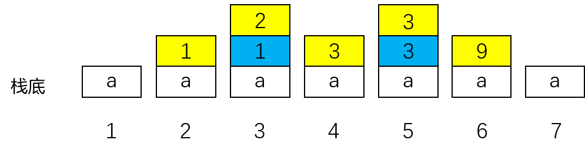
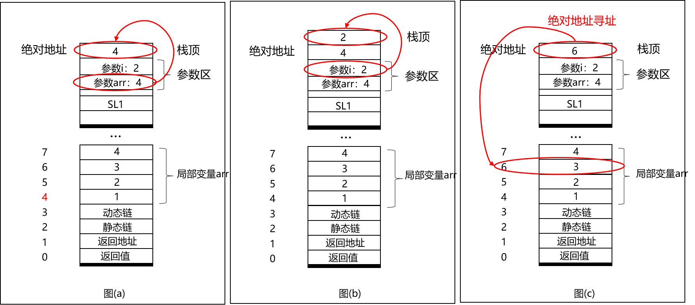
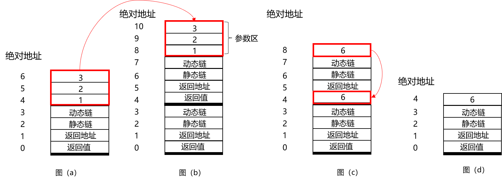

# 中间代码生成 - Pcode

## 一、Pcode 介绍

Pcode 源于 Pascal 编译器产生的基于栈式虚拟机的中间代码。尽管中间代码（如四元式等）通常与机器无关，但是由于 Pcode 是基于栈式虚拟机的，因此在生成 Pcode 时必须考虑栈式虚拟机的一些特性，以及运行时的内存管理等。首先简单介绍关于栈式虚拟机的一些基本知识。

### （1）栈式虚拟机的工作过程

栈式虚拟机可以理解为一个解释执行程序（如 Python 解释器），它能够执行输入的 Pcode 代码并产生相应的结果。

和我们学过的 MIPS 架构不同，栈式虚拟机中没有众多寄存器用于保存运算结果或变量（如 MIPS 中的 `$t` 寄存器和 `$s` 寄存器等），而是只有 5 个基本的、有特殊用途的寄存器，它们不能用来保存运算结果。这就意味着变量、中间结果等都必须保存在内存的数据区中。

此外，**栈式虚拟机的最大特点，就在于其将内存的数据区视为一个栈**，大量的运算都是针对栈顶的入栈、退栈、计算来完成的，内存的动态管理也是基于栈的。例如，对于下列代码

```
int a = 1;
printf("%d", (a + 2) * 3);
```



栈式虚拟机的栈变化如上图所示（黄色为栈顶，蓝色为次栈顶）。

1. 为变量 `a` 分配内存空间，并初始化
2. 栈顶压入变量 `a` 的值（为 1）
3. 栈顶压入常数 2
4. 栈顶与次栈顶相加，弹出两个元素，并压入运算结果（为 3）
5. 栈顶压入常数 3
6. 栈顶与次栈顶相乘，弹出两个元素，并压入运算结果（为 9）
7. 弹出栈顶，并输出其值（输出 9）

可以看到，在栈式虚拟机中，变量都保存在内存中，运算的中间结果也保存在内存中，且操作都是基于栈的数据结构进行的。

### （2）栈式虚拟机的5个寄存器

栈式虚拟机中只有 5 个寄存器：PC、SP、MP、NP 和 EP，这里简单介绍每个寄存器的作用。

- PC：程序计数器，和 MIPS 中的 PC 相同，指向下一条将要执行的指令
- SP：栈指针，指向栈顶，便于入栈退栈
- MP：标志指针，指向当前活动记录基地址（活动记录后续会介绍）
- NP：堆指针，指向空闲堆空间起始位置
- EP：顶指针，指向当前程序模块在栈中的最高位置

其中，由于我们的文法不涉及内存的运行时分配（如`new()`），因此实现的栈式虚拟机不需要堆区，也就不需要 NP 寄存器；且可以假定栈式虚拟机有无限大的内存空间，因此也不需要 EP 寄存器来防止栈溢出。所以，我们真正需要实现的只有 PC、SP 和 MP 三个寄存器。

事实上，由于我们需要使用特定编程语言来模拟栈式虚拟机的操作，而非借助硬件实现，这里的寄存器的概念也不复存在了：例如，栈指针 SP 完全可以通过 `stack` 数据结构所代替，或者是在程序中用一个 `int top;` 取代。在 tolangc 中，在 `pcode/runtime/PcodeRuntime.h` 中声明了 `PcodeRuntime` 类，其部分结构如下。

```cpp
class PcodeRuntime {
private:
    std::stack<ActivityRecord> _ars;
    PcodeModule &_module;
    /* ... */
};
```

这里的 `_ars` 就是存放活动记录的栈，`_module` 则用于存放 Pcode 指令。可以看出，**在实现栈式虚拟机时，只需要保证程序在逻辑上仍符合栈操作的定义，但具体写法可以根据需要灵活变动。**

## 二、动态内存管理

在正式介绍 Pcode 代码之前，先了解一下动态内存管理的一些知识。

### （1）静态与动态

内存管理是编译过程中一个非常重要的过程。其中，最大的难点在于，分程序结构在编译时程序是静态的，而程序运行时却是动态的，因此，我们在编译时不可能完全确定好内存的分配。例如以下代码

```c
/* 计算斐波那契数列 */
int fibo(int n) {
	if(n <= 1) return 1;
	int x = fibo(n - 1);
	int y = fibo(n - 2);
	return x + y;
}

int main() {
	int n;
	n = getint();
	n = fibo(n);
	printf("%d", n);
	return 0;
}
```

程序运行时，每次调用 `fibo()` 都要分配一块内存空间（至少需要为变量 `n` `x` `y` 分配内存空间），但是在编译时，我们并不能确定输入的 `n` 是多少，也就无法确定 `fibo()` 会被调用多少次，无法确定需要分配多少的内存空间。除了内存的分配，内存的访问（如数组存取）同样存在上述问题。

解决上述问题，就需要引入活动记录的概念。

### （2）活动记录

我们可以观察 `pcode/runtime/ActivityRecord.h` 中的如下代码，其中的 `ActivityRecord` 类用于保存一次函数调用需要的参数、临时变量等数据。

```cpp
class ActivityRecord {
public:
    std::vector<float> _args;
    std::vector<float> _tmps;

public:
    /* 压入函数参数 */
    void addArg(float arg) { 
        _args.emplace(_args.begin(), arg); 
    }
    /* 获取第 n 个位置的参数 */
    float getNthArg(int n) const { 
        return _args[n - 1]; 
    }
    /* 压入一个临时变量 */
    void pushTmp(float tmp) { 
        _tmps.push_back(tmp); 
    }
    /* 弹出一个临时变量 */
    float popTmp() { 
        float tmp = _tmps[_tmps.size() - 1];
        _tmps.pop_back();
        return tmp;
    } 
};
```

`ActivityRecord` 类有两个成员 `_args` 和 `_tmps`，它们都是可变长数组类型。其中前者用于存放函数参数，后者用于存放临时数据。假如有 tolang 的函数 `fn add(a, b, c) => a + b + c;`，并执行了 `add(1, 2, 3)` 调用，那么实参 1，2，3 就会被压入 `_args`；计算时，`a + b ` 的临时结果需要保存，则会被压入 `_tmps` 中。

这里我们再次注意到前面提过的理念，即实现重于原理。tolang 中只有 `float` 类型的数据，函数实参和临时数据原则上应该存放于一个 `stack` 中即可。但是 `stack` 本身支持的操作，在实际编程中会带来诸多不便，例如，假如我们在上述 `add` 函数执行时，要得知参数 `b`（第二个位置的参数）的值，这个值位于栈底的第二个位置，但是 `stack` 又不支持我们用下标 `[1]` 直接访问。通过两个 `vector`，并封装四个函数，我们既按照栈式虚拟机的原理实现了活动记录，又简化了编码。

具体来说，**活动记录 Activity Record（AR）一般指一个过程一次执行所需的内存信息**。在 SysY 文法中，过程可以简单理解为一个 Block，也就是说，**在每次执行一个 Block 时，我们都会为其分配一块内存区域，这块区域用于分配变量、保存临时结果、保存运行时状态等信息。**


一个活动记录主要包含以下几种数据。

- 返回值，表示该过程执行结束的返回值，可以理解为函数返回值
- 返回地址，表示该过程执行结束后应该返回的指令地址，类似 MIPS 中 `$ra` 寄存器
- 静态链 Static Link（SL），指向外层活动记录的基地址，可以理解为当前 Block 外层的 Block 的 AR 基地址。其静态体现在可以根据程序源代码直接确定 Block 之间的嵌套关系
- 动态链 Dynamic Link（DL），指向调用者的活动记录的基地址。其动态体现在编译时无法确定被谁调用，只有运行时才能确定
- 参数区，调用过程（函数）时用于传递参数，类似 MIPS 中 `$a` 寄存器的作用
- 数据区，包括局部数据区和临时变量区。其中，局部数据区存储定义的局部变量，临时变量区存储运算的中间结果等。

接下来我们重点分析 AR 中的静态链和动态链的作用。

### （3）静态链 SL

静态链的值是外层活动记录的基地址，作用主要是进行不同作用域下的变量访问。

```c
int main() {               // ==== Block1 ====
    int a = 10;
    int b = 20;
    if(a < b) {               // ==== Block2 ====
        int a = 0;               // 覆盖 Block1 中 a 的定义
        while (a < 10) {         // ==== Block3 ====
            b = b + 1;              // 引用的 Block1 的 b  -----1
            a = a + 1;              // 引用的 Block2 的 a  -----2
        }                        // ==== Block3 ====
    }                         // ==== Block2 ====
    printf("%d", b);
    return 0;
}                          // ==== Block1 ====            
```

根据静态的程序，如注释所示，我们可以确定三个 Block 之间的嵌套关系，以及每个变量定义的作用域。

如下图所示，在程序执行到 Block3 时，内层中存在 3 个 AR，对应三个 Block。图中只简单画出了 AR 的局部变量区和静态链 SL，黑色加粗表示 AR 基地址。


注意，在程序执行到 Block3 中的 1 处时，此时需要引用变量 `b`，但是变量 `b` 在当前 AR（AR3）中并没有定义，因此通过 SL3 找到 AR2，发现在 AR2 中也没有 `b` 的定义，再次通过 SL2 找到 AR1，最后在 AR1 中发现了 `b` 的定义。事实上，从源程序中也可以发现，1 处引用的确实是 Block1 定义的变量 `b`。在执行到 2 处时，引用变量 `a`，类似上面的过程，可以在 AR2 中找到变量 `a` 的定义。

上述过程说明，我们只要沿着静态链找，找到的第一个定义点，就是对应的变量定义。

在这里，还需要定义两个重要概念：Level 和 Addr。Level 表示活动记录的深度，例如处于 AR3 中时，变量 `a` 的Level 为 1（通过一次静态链搜索即可在 AR2 中找到定义），变量 `b` 的 Level 为 2（通过 2 次静态链搜索即可在 AR1 中找到定义）。Addr 表示变量与其定义 AR 的基地址的相对偏移。有了这两个概念，我们就可以很方便地来跨活动记录访问变量。例如，当前处于 AR3，要访问变量 `b`：因为变量 `b` 的 Level 为 2，所以通过 2 次静态链搜索，找到 AR1 （的基地址），再加上变量 `b` 的 Addr（距离 AR1 基地址的相对偏移），即可确定变量 `b` 的绝对地址，访问变量 `b`。

因此，在编译生成代码时，我们对变量的访问只需要给出 Level 和 Addr 两个值即可。注意，**Level、Addr 的值在编译时是可以通过符号表确定的**，其中 Level 可以根据 Block 的相互嵌套关系（或符号表的深度）确定，Addr 则可以根据该block内的变量大小和数量确定，这也是**静态**的一种体现。

在上面的例子中，我们似乎可以直接确定变量 `a` 和变量 `b` 的绝对地址，甚至不用通过 Level、Addr 和静态链来访问。但是，对于更复杂的情况，如递归调用（`fibo(n)`），编译时，我们无法确定当前是第几次调用，也就无法确定 AR 的基地址（因为每次调用都要分配一个 AR），无法通过绝对地址来访问，但可以通过相对的 Level 和 Addr 来访问，这也是静态链的必要性所在。

在 tolang 中，由于不存在上述 Block 嵌套问题，因此也就不需要 SL、Level 和 Addr 的引入，直接使用变量名查找即可。tolangc 在 Pcode 部分相对规范地实现了符号表操作，你可以借鉴此思路进一步完善。

1. 变量

   ```cpp
   class PcodeVariable;
   using PcodeVarPtr = std::shared_ptr<PcodeVariable>; 
   class PcodeVariable {
   private:
       std::string _name;
       float _value;
       /* ... */
       // tolangc 中我们只需要名称和值即可
       // SysY 中你或许应该添加 Level、Addr 等更多成员
   };
   ```

2. 变量的集合

   ```cpp
   class PcodeModule {
   private:
       std::map<std::string, PcodeVarPtr> _variables;
       /* ... */
       // tolangc 中用了变量名到 PcodeVariable 的映射存储所有变量
       // sysY 中你或许可以把这部分放到每个 ActivityRecord 中
   };
   ```

3. 符号

   ```cpp
   struct PcodeSymbol;
   using PcodeSymbolPtr = std::shared_ptr<PcodeSymbol>;
   struct PcodeSymbol { /* ... */ };
   ```

4. 符号表节点

   ```cpp
   class PcodeSymbolTableNode;
   using PcodeSymbolNodePtr = std::shared_ptr<PcodeSymbolTableNode>;
   class PcodeSymbolTableNode {
   private:
       // 符号表节点中存放了当前作用域的所有符号
       std::map<std::string, PcodeSymbolPtr> _symbols;
       // 数组形式实现树状的符号表
       int _parent;
       std::vector<int> _children;
   
   public:
       // 获取父节点
       int getParent() const { return _parent; }
       // 插入符号
       void insertSymbol(const PcodeSymbolPtr &symbol) {
           _symbols.emplace(symbol->content, symbol);
       }
       // 添加孩子节点
       void addChild(int child) { _children.push_back(child); }
       // 获取符号
       PcodeSymbolPtr getSymbol(const std::string &content) const {
           return _symbols.at(content);
       }
       // 查找符号
       PcodeSymbolPtr searchSymbol(const std::string &content) const {
           auto it = _symbols.find(content);
           if (it != _symbols.end()) {
               return it->second;
           }
           return nullptr;
       }
       /* ... */
   };
   ```

4. 符号表

   ```cpp
   class PcodeSymbolTable;
   using PcodeSymbolTablePtr = std::shared_ptr<PcodeSymbolTable>;
   class PcodeSymbolTable {
   private:
       // 数组实现树状符号表
       std::vector<PcodeSymbolNodePtr> _table;
       // 当前节点
       int _current;
       // _table 中最后一个节点
       int _last;
   
   public:
       void pushScope();
       void popScope();
   
       // 插入符号：调用当前符号表节点的 insertSymbol 函数
       // 在 SysY 中，你或许可以在这里一并确定变量的 Level 和 Addr
       void insertSymbol(const PcodeSymbolPtr &symbol) {
           _table[_current]->insertSymbol(symbol);
       }
       PcodeSymbolPtr searchSymbol(const std::string &content) const {
           return _table[_current]->searchSymbol(content);
       }
       /* ... */
   };
   ```

树状符号表的实现思路和原理，具体请参看符号表相关教程。这里的示例代码仅是针对 tolang 的简化实现，主要目的是便于同学们熟悉 Pcode 部分的类设计和命名。

### （4）动态链

动态链的作用主要是在函数调用完成后，能够使标志指针 MP 回到调用前的状态（指向调用者的 AR 基地址）。因此，调用者在调用函数时，需要将当前 MP 的值填入函数 AR 的 DL 中，函数执行完毕后，将 DL 的值赋给 MP。由于编译时无法预知调用者的 AR 基地址，因此 DL 的值在编译时无法确定，只能在程序运行过程中再填入。

其实，动态链解决的就是函数返回的问题。我们以如下 tolang 代码说明。

```js
fn f() => 1;
fn g() => 1 + f();

var a;
let a = 2 + g();
```

假设我们能得到如下伪代码。

```
函数 f
    装载数字 1
    返回         --- 3
函数 g
    装载数字 1
    调用 f       --- 2
    加法         --- B
    返回         --- 4

定义 a
装载数字 2
调用 g           --- 1
加法             --- A
赋值 a
```

伪代码会从 `定义 a` 开始执行，执行到 1 处调用 `g`。当 `g` 函数体执行到 2 处时，又调用函数 `f`。注意，在函数 `f` 的 `返回`（语句 3）执行后，程序应继续执行 `g` 的剩余部分，然而，程序应该从 `g` 的哪一条语句开始往后执行呢？

其实不难发现，主函数执行完 `g` 后应当执行语句 A，`g` 函数执行完 `f` 后应当执行语句 B。因此，主函数调用 `g`、创建 AR (g) 时，就应该在其中存入这样的信息：AR (g) 运行结束后，程序跳回语句 A 继续执行。`g` 函数调用 `f`，创建 AR (f) 时，就应该在其中存入这样的信息：AR (f) 运行结束后，程序跳回语句 B 继续执行。假如上述所有指令是顺序存放的，那么在被调用者的 AR 中，存入调用者调用语句的地址、或是该语句的下一条语句的地址，都是可以的。

不过在下一部分我们会发现，解释执行 Pcode 时，借助程序本身的递归性就可以实现动态链。

## 三、Pcode 代码介绍

在了解完栈式虚拟机和基于活动记录的动态内存管理后，我们正式介绍 Pcode 代码。Pcode 代码围绕栈式虚拟机的特点，其操作主要针对栈来进行。下面给出一些供参考的 Pcode 代码，**当然你也可以根据自己的需要来自行设计代码。**

| 指令名称 | 指令格式        | 说明                                                         |
| -------- | --------------- | ------------------------------------------------------------ |
| LIT      | LIT imm         | 加载立即数 imm 到栈顶                                        |
| OPR      | OPR opcode      | 进行栈顶与次栈顶（或者单独栈顶）的运算，并将结果压入栈顶；`opcode` 决定运算类型 |
| LOD      | LOD level, addr | 以栈顶元素为动态偏移，加载内存中 `(level, addr) + 动态偏移` 处的变量值到栈顶 |
| STO      | STO level, addr | 以栈顶元素为动态偏移，把次栈顶的元素写入内存中 `(level, addr) + 动态偏移` 处的变量 |
| CAL      | CAL label       | 函数调用（分配 AR、设置 SL、DL、参数等）                     |
| BLKS     | BLKS            | 开启新的 Block（分配新的 AR，设置 SL、DL 等）                |
| BLKE     | BLKE level      | 结束当前 Block（回收当前 AR）                                |
| JMP      | JMP label       | 无条件跳转到 label                                           |
| JPC      | JPC label       | 栈顶为 0 时跳转到 label，否则顺序执行                        |
| JPT      | JPT label       | 栈顶不为 0 时跳转到 label，否则顺序执行                      |
| INT      | INT imm         | 栈顶寄存器加 imm，用于控制栈顶指针的移动                     |
| RED      | RED             | 读入数字到栈顶                                               |
| WRT      | WRT             | 输出栈顶数字                                                 |
| WRTS     | WRTS str        | 输出字符串                                                   |
| LABLE    | label:          | 标识 label，用于跳转                                         |
| RET      | RET             | 返回调用者并回收 AR                                          |
| LEA      | LEA level, addr | 加载 `(level, addr)` 处变量的绝对地址到栈顶                  |

下面对生成上述代码中的一些注意事项进行讲解。

### （1）内存访问：LOD 与 STO

前面我们提到，通过 Level和 Addr，即可对内存中的变量进行存取。但是为什么在 LOD 和 STO 指令中，我们还需要以栈顶值为动态偏移呢？考虑下面的例子

```c
int main() {
	int arr[4] = {1, 2, 3, 4};
	int i;
    i = getint();
	i = i % 4;
	printf("%d", arr[i]);  // --- 1
	return 0;
}
```

尽管我们知道变量 `arr` 的 `(level, addr)`，但是由于变量 `i` 的值在编译时无法确定，因此需要在运行时将变量 `i` 的值加载到栈顶作为动态偏移，再和 `(level, addr)` 配合进行数组元素的访问。

其中，1 处输出 `arr[i]` 的 Pcode 代码示例如下

```
// 加载 i 到栈顶
// i 在当前 AR 中定义，level=0，addr=8，动态偏移为 0
LIT 0
LOD 0, 8

// 加载 arr[i] 到栈顶
// arr 的 level=0，addr=4，动态偏移为栈顶的 i
LOD 0, 4

// 输出栈顶元素，即 arr[i]
WRT
```

### （2）Block 与AR ：BLKS 与 BLKE

在 SysY 文法中，进入一个 Block 相当于进入一个新的过程，需要分配一个活动记录 AR；而从一个 Block 退出时，也需要回收其 AR。

需要注意的是，对于 AR 的分配，编译的时候，只需要生成 BLKS 指令即可，不必填充 AR 中的 SL、DL（编译时也无法确定）；栈式虚拟机在解释执行 BLKS 指令时，会分配 AR 并填充上述字段。

通常来说，对于每个 Block，Block 的开始通过 BLKS（BLocK Start）指令分配 AR，结束时通过 BLKE（BLocK End）指令回收 AR。但是，还需要考虑下面几种特殊情况。

```c
int func(int a, int b) {
	int x = a + b;
	if (x < 10) {
		int y = x * a;
		if(y < 10) {
			return y;	// --- 1
		}
	}
	return 0;
}
```

在如上的函数中，执行到 1 处时，分配了 3 个 AR，在执行 `return` 返回调用者时，需要一次性回收这三个 AR。

```c
int main() {
	int i = 10;
	while (i > 0) {
		int a;
		a = getint();
		if (a < 10) {
			int b = a + i;
			if (b > 10) {
                break; // --- 1
            }
		}
		i = i - 1;
	}
    return 0;
}
```

在如上代码中，进入循环后，执行到 1 处 `break` 时，需要回收循环体的三个 AR。（`continue` 同理）

对于这两种情况，建议在编译过程中记录函数定义 Block 和循环 Block 的深度，在遇到 `return/break/continue` 时，通过 Block 深度确定需要回收多少个 AR，从而在 `return/break/continue` 之前生成若干条 `BLKE` 指令。

此外，还需要考虑以下隐式 Block 的情况。

```c
int ga = 0;

int add() {
	ga = ga + 1;
	return ga;
}

int main() {
    int b = 10;
	while (ga < 10) int a = 3 + add(); // --- 1
	return 0;
}
```

虽然没有显式定义 Block，但是 1 处依然要分配新的 AR，对于这种情况，可以按照定义了 Block 处理。

### （3）传地址的数组存取

在函数中，可能涉及到传地址参数，并以此来进行数组的存取。

```c
void func(int arr[], int i) {
	printf("%d", arr[i]);
}

int main() {
	int arr[4] = {1, 2, 3, 4};
	func(arr, 2);
	return 0;
}
```

对于这种情况，建议先读取形参的值作为绝对基地址（图 a），然后由绝对基地址 + 偏移值得到绝对地址存储在栈顶，来进行绝对寻址（图 c）。注意，在绝对地址寻址时，可以将 LOD/STO 指令中的 level 和 addr 设置为特殊值以示区分。



给出上面例子中 `func()` 一种可能的 Pcode 代码供参考。

```
// 为形参 arr 分配空间（参数的值已经由调用者设置好）
INT 1 

// 为形参 i 分配空间（参数的值已经由调用者设置好）
INT 1 

// 加载参数 arr 的值（level=0，addr=4，动态偏移栈顶为 0）
LIT 0
LOD 0, 4 

// 加载参数 i 的值（level=0，addr=5，动态偏移栈顶为 0）
LIT 0
LOD 0, 5

// 栈顶与次栈顶相加，得到绝对地址压入栈顶
OPR 1 

// 按栈顶绝对地址寻址
// level=-1，addr=0 表示按栈顶存储的绝对地址寻址
LOD -1, 0 

// 输出栈顶元素
WRT 

// 返回
RET
```

## 四、Pcode 解释执行程序

除了 Pcode 代码生成，同学们还需要完成一个栈式虚拟机来解释执行生成的 Pcode。该栈式虚拟机理论上需要包括：代码区（用于存储 Pcode 代码），数据区（栈），三个寄存器（PC、MP、SP）。大部分指令的解释执行只需要按其对栈的操作进行实现即可，这里主要介绍一下函数调用和返回的解释执行过程。

函数调用（CAL 指令）的执行过程包括

1. 准备好若干个参数，存储在栈顶
2. 为函数分配 AR，并设置返回地址、SL（为全局变量所在的 AR 的基地址）、DL（为调用者 AR 基地址，存储在 MP 中）和参数。其中，实参原本在调用者的栈顶，需要复制到函数 AR 的参数区，之后函数只需要通过 INT 指令来为形参分配空间即可
3. 分配好 AR 后，将 MP 设置为新的 AR 的基地址，栈顶指针 SP 指向参数区起始位置
4. 设置 PC 为函数入口指令地址

其中，第 1、2 步和 BLKS 的解释执行过程较为类似。

函数返回（主要是 RET 和 BLKE 指令）的执行过程包括

1. 如果有返回值，将返回值填入函数第一个 AR 的返回值区域。注意，`return` 语句可能出现在函数体中的任一个 Block，但是返回值建议填入函数的第一个 AR（也就是 CAL 指令分配的 AR）
2. 回收所有函数 AR（可以通过若干 BLKE 指令来回收）
3. 恢复 PC（返回地址）、SP（函数第一个 AR 基地址 -1，刚好指向调用者栈顶）、MP（动态链）。如果有返回值，则执行 INT 1 指令，使 SP + 1，此时返回值正好处于调用者栈顶

举例说明。

```c
int add(int a, int b, int c) {
	int r = a + b + c;
	return r;
}

int main() {
	int r = add(1, 2, 3);
	printf("%d", r);
	return 0;
}
```



1. 图（a）：`main` 中准备好三个参数，存储在栈顶，准备调用 `add()`

2. 图（b）：执行 CAL 指令，为函数分配 AR，设置返回地址、SL、DL，同时把参数填入到参数区，更新 PC、SP、MP 寄存器。注意，分配的 AR 可以直接覆盖原本栈顶的参数。

3. 图（c）：`add()` 中计算完结果，把结果填入 AR 中的返回值，准备返回

4. 图（d）：执行 RET 指令，回收 CAL 分配的 AR，恢复 PC、SP、MP 寄存器。由于有返回值，SP + 1，使得返回值 6 刚好在栈顶，便于后续操作。

## 五、tolangc 的 Pcode 部分

### （1）指令集

前文所述的栈式虚拟机和 Pcode 为最符合理论、最理想的实现，实际上，你可以借助程序本身的递归性，在保证正确性的基础上进一步简化其实现。下面介绍 tolangc 的 Pcode 部分供参考。

tolangc 定义了一套 Pcode 指令，如下表所示。

| 指令        | 含义                                               |
| ----------- | -------------------------------------------------- |
| DEF var     | 定义名为 var 的变量                                |
| ARG index   | 加载第 index 个位置的函数实参到栈顶                |
| LI imm      | 加载立即数 imm 到栈顶                              |
| OPR op      | 弹出栈顶元素（和次栈顶元素）执行 op 操作，结果入栈 |
| LOAD var    | 加载变量 var 的值到栈顶                            |
| STORE var   | 存储栈顶的值到变量 var 中                          |
| CALL fn     | 调用函数 fn（实参已顺序入栈）                      |
| RET         | 从当前函数返回                                     |
| JIT label   | 弹出栈顶元素，如果非 0，跳转 label                 |
| JUMP label  | 跳转 label                                         |
| READ        | 从标准输入读一个数，存入栈顶                       |
| WRITE       | 弹出栈顶，输出到标准输出                           |
| LABEL label | 标记一个标签（tag）                                |

相关类的声明如下。

```cpp
// 抽象指令父类
class PcodeInstruction {
public:
    typedef enum {
        DEF = 0,
        ARG,
        /* ... */
    } PcodeInstructionType;
private:
    PcodeInstructionType _type;
public:
    PcodeInstruction(PcodeInstructionType type) : _type(type) {}
    PcodeInstructionType getType() const { return _type; }
    
    // 每个指令都有自己的 print 函数
    virtual void print(std::ostream &out) const = 0;
    
    // 创建指令通过 PcodeInstruct::create() 实现
    template<typename T, typename... Args>
    static std::shared_ptr<PcodeInstruction> create(Args&&... args) {
        return std::make_shared<T>(std::forward<Args>(args)...);
    }
};
using PcodeInstPtr = std::shared_ptr<PcodeInstruction>;

// ARG 指令
class PcodeArgumentInst : public PcodeInstruction {
private:
    int _index;
public:
    PcodeArgumentInst(int index) : 
        PcodeInstruction(PcodeInstruction::ARG), _index(index) {}
    int getIndex() const { return _index; }
    void print(std::ostream &out) const override {
        out << "ARG\t\t" << _index << std::endl;
    }
};

// LI 指令
class PcodeLoadImmediateInst : public PcodeInstruction {
private:
    float _imm;
public:
    PcodeLoadImmediateInst(float imm) :
        PcodeInstruction(PcodeInstruction::LI), _imm(imm) {}
    float getImm() const { return _imm; }
    void print(std::ostream &out) const override {
        out << "LI\t\t" << _imm << std::endl;
    }
};

/* ... */
```

在 tolang 中，只可能出现最外层的全局作用域和函数内部的作用域两层，而函数内部作用域，我们统一用位置参数标识。下面给出一些 tolang 代码及其对应的 Pcode 帮助理解。

```js
// tolang 代码 1
fn add(a, b) => a + b * 2;
var a;
get a;
let a = add(a, 10);
put a;
```

```
// Pcode 代码 1
// 标记函数 add
LABEL	add
ARG		1     // 加载第一个参数到栈顶
ARG		2     // 加载第二个参数到栈顶
LI		2     // 加载立即数 2 到栈顶
OPR		mul   // 执行乘法
OPR		add   // 执行加法
RET           // 返回

// 标记 main 函数
LABEL	_Main
DEF		a     // 定义变量 a
READ          // 读取一个数到栈顶
STORE	a     // 将栈顶值存入变量 a
LOAD	a     // 加载变量 a 的值到栈顶
LI		10    // 加载立即树 10 到栈顶
CALL	add   // 调用 add 函数
STORE	a     // 将栈顶值（add 返回值）存入变量 a
LOAD	a     // 加载变量 a 的值到栈顶
WRITE         // 输出栈顶值
```

```js
// tolang 代码 2
var a;
var b;
let a = 1;
get b;

if a < b to IfBranch;
to EndBranch;

tag IfBranch;
put -1;
to IfElseEnd;

tag EndBranch;
put 1;
to IfElseEnd;

tag IfElseEnd;
```

```
// Pcode 代码 2
// 标记 main 函数
LABEL	_Main
DEF		a          // 定义变量 a
DEF		b          // 定义变量 b
LI		1          // 加载立即数 1 到栈顶
STORE	a          // 将栈顶值存入变量 a
READ               // 读取一个数到栈顶
STORE	b          // 将栈顶值存入变量 b
LOAD	a          // 加载变量 a 的值到栈顶
LOAD	b          // 加载变量 b 的值到栈顶
OPR		les        // 执行小于运算
JIT		IfBranch   // 如果栈顶大于 0（为真），跳转 IfBranch
JUMP	ElseBranch // 跳转 ElseBranch

// 标记 IfBranch 块
LABEL	IfBranch
LI		1          // 加载立即数 1 到栈顶
OPR		neg        // 执行负数运算
WRITE              // 输出栈顶值
JUMP	IfElseEnd  // 跳转 IfElseEnd

// 标记 ElseBranch
LABEL	ElseBranch
LI		1          // 加载立即数 1 到栈顶
WRITE              // 输出栈顶值
JUMP	IfElseEnd  // 跳转 IfElseEnd

// 标记 IfElseEnd
LABEL	IfElseEnd
```

由于 tolang 中有标签和跳转，因此可以参考基本块的概念，声明 `PcodeBlock`。

```cpp
struct PcodeBlock;
using PcodeBlockPtr = std::shared_ptr<PcodeBlock>; 
struct PcodeBlock {
    std::vector<PcodeInstPtr> instructions; // Block 的指令集
    PcodeBlockPtr next = nullptr;           // 下一块的指针
    void insertInst(PcodeInstPtr &inst) {
        instructions.push_back(inst);
    }
    static PcodeBlockPtr create() {
        return std::make_shared<PcodeBlock>();
    }
};
```

在此基础上把所有基本块聚合，并附加一些其他的数据结构以辅助，我们可以声明 `PcodeModule` 类，此后，不论是遍历语法树生成 Pcode，还是遍历 Pcode 解释执行，都将围绕 `PcodeModule` 展开。

```cpp
class PcodeModule {
private:
    // Block 集合
    std::vector<PcodeBlockPtr> _blocks;
    // 变量集合
    std::map<std::string, PcodeVarPtr> _variables;
    // 函数集合
    std::map<std::string, PcodeFuncPtr> _functions;
    // 标签集合
    std::map<std::string, PcodeBlockPtr> _labels;
    
    /* ... */
public:
    // 输出所有 Pcode 代码的函数
    void print(std::ostream &out) const {
        for (auto &b : _blocks) {
            for (auto &i : b->instructions) {
                i->print(out);
            }
            out << "\n";
        }
    }
};
```

### （2）遍历语法树

我们声明 `PcodeVisitor` 类，它可以遍历语法树，生成 Pcode 代码。

```cpp
class PcodeVisitor {
private:
    PcodeModule &_module;
    PcodeBlockPtr _curBlock = nullptr; // 当前所在 Block
    PcodeSymbolTable _symbolTable;     // 符号表
、
    // 创建基本块
    void createBlock() {
        if (_curBlock == nullptr) {
            // 如果当前块为空，创建基本块作为当前块
            _curBlock = PcodeBlock::create();
        } else {
            // 如果当前块非空，创建基本块作为当前块的后继块
            _curBlock->next = PcodeBlock::create();
            // 设置当前块为后继块
            _curBlock = _curBlock->next;
        }
        // 将当前块添加到基本块列表中
        _module.addBlock(_curBlock);
    }

    // 一系列访问不同非终结符节点的函数
    void visitFuncDef(const FuncDef &node);
    void visitVarDecl(const VarDecl &node);
    void visitStmt(const Stmt &node);
    
    /* ... */

public:
    // 入口函数
    void visit(const CompUnit &node);
    // 利用一个 PcodeModule 示例初始化 PcodeVisitor 对象
    PcodeVisitor(PcodeModule &pm) : _module(pm) {}
};
```

举例说明几个 visit 函数。

```cpp
void PcodeVisitor::visitPutStmt(const PutStmt &node) {
    visitExp(*node.exp);   
    auto write = PcodeInstruction::create<PcodeWriteInst>();
    _curBlock->insertInst(write);
}
```

根据文法 `put Exp;`，对于 `PutStmt` 类型的节点 `node`，我们应优先访问其 `Exp` 子节点，并生成相关的 Pcode 指令。由于这里同样适用递归下降思想，我们不必关心 `visitExp` 到底做了什么，我们只需要知道，它能够生成正确的计算指令，并保证计算完成后，栈顶就是我们要输出的表达式的值。所以在 `visitExp` 后，我们创建了一条 `PcodeWriteInst`、即 WRITE 指令，并将其插入当前块。

```cpp
void PcodeVisitor::visitBinaryExp(const BinaryExp &node) {
    visitExp(*node.lhs);
    visitExp(*node.rhs);
    PcodeOperationInst::OperationType op;
    switch (node.op) {
        case BinaryExp::PLUS: op = PcodeOperationInst::ADD; break;
        case BinaryExp::MINU: op = PcodeOperationInst::SUB; break;
        case BinaryExp::MULT: op = PcodeOperationInst::MUL; break;
        case BinaryExp::DIV : op = PcodeOperationInst::DIV; break;
    }
    auto opr = PcodeInstruction::create<PcodeOperationInst>(op);
    _curBlock->insertInst(opr);
}
```

对于二元运算节点  `BinaryExp`，我们先访问左操作数，再访问右操作数。同样我们知道，这两步执行完，栈顶和次栈顶一定就是就是两个操作数了。所以接下来只需要判断二元运算的类型，并生成对应的 OPR 指令插入当前块即可。

```cpp
void PcodeVisitor::visitIdentExp(const IdentExp &node) {
    if (_symbolTable.inFunctionScope()) {
        int index = _symbolTable.getIndexOf(node.ident->value);
        if (index > 0) {
            auto arg = PcodeInstruction::create<PcodeArgumentInst>(index);
            _curBlock->insertInst(arg);
        }
    } else {
        auto load = PcodeInstruction::create<PcodeLoadInst>
                    (_module.getVariable(node.ident->value));
        _curBlock->insertInst(load);
    }
}
```

需要说明的是对标识符 `IdentExp` 的访问。前文已述，tolang 中的作用域最多只有两层，因此全局变量（也就是 `main` 中的变量）可以直接用名称访问，函数形参可以通过位置访问。在 `visitIdentExp` 中，如果当前符号表处在函数的作用域中，我们就查询 `node` 对应的形参是第几个位置的形参，得到 `index` 后即可创建对应的 ARG 指令；如果当前作用域就是全局作用域，我们直接从 PcodeModule 的 `variables` 列表中查找对应的变量，并创建对应的 LOAD 指令。当然，在实现 SysY 的 Pcode 部分时，你需要考虑这里如果没有找到，应报出访问未定义的变量错误。

### （3）解释执行

生成所有 Pcode 指令后，我们可以通过 `PcodeRuntime` 实现 Pcode 运行。

```cpp
class PcodeRuntime {
private:
    std::stack<ActivityRecord> _ars; // 活动记录栈
    PcodeModule &_module;
    PcodeBlockPtr _currentBlock;
    void excuteInst(const PcodeInstPtr &inst);
    void executeArg(const PcodeInstPtr &inst);
    void executeLi(const PcodeInstPtr &inst);
    
    /* ... */

public:
    // 初始化当前块为 main 函数的第一个块
    PcodeRuntime(PcodeModule &pm) : 
        _module(pm), _currentBlock(pm.getMainBlock()) {}
    // 入口
    void run();
};
```

虽然 tolang 没有 `main` 函数，但是我们为了方便起见，称 `CompUnit: {FuncDef} {VarDecl} {Stmt}` 中的 `{VarDecl} {Stmt}` 为 `main` 函数。

```cpp
void PcodeRuntime::run() {
    // 为 main 函数创建一个 AR
    _ars.push(ActivityRecord());
    // 遍历 main 函数的所有块，执行其中的指令
    while (_currentBlock != nullptr) {
        /* ... */
        for (auto &inst : _currentBlock->instructions) {
            // 如果 inst 为 JIT 或 JUMP，
            // 直接在这里通过修改 _currentBlock 实现跳转
            if (inst->getType() == PcodeInstruction::JIT) {
                /* ... */
            } else if (inst->getType() == PcodeInstruction::JUMP) {
                /* ... */
            } else {
                // 否则就执行其他指令
                excuteInst(inst);
            }
        }
        /* ... */
        // 更新 _currentBlock
        _currentBlock = _currentBlock->next;
    }
}
```

下面再给出几个典型函数的介绍。

```cpp
void PcodeRuntime::executeArg(const PcodeInstPtr &inst) {
    auto &ar = _ars.top();
    auto arg = std::dynamic_pointer_cast<PcodeArgumentInst>(inst);
    ar.pushTmp(ar.getNthArg(arg->getIndex()));
}
```

执行 ARG 指令，先获取当前 AR `ar`，然后将 ARG 指令的 index 传给 `ar` 的 `getNthArg` 函数，得到对应的位置参数的值，然后调用 `ar.pushTmp()` 压入栈顶。

```cpp
void PcodeRuntime::executeOpr(const PcodeInstPtr &inst) {
    auto &ar = _ars.top();
    auto opr = std::dynamic_pointer_cast<PcodeOperationInst>(inst);
    auto op = opr->getOp();
    if (op == PcodeOperationInst::NEG) {
        auto operand = ar.popTmp();
        ar.pushTmp(-operand);
    } else {
        auto second = ar.popTmp();
        auto first = ar.popTmp();
        switch (op) {
            case PcodeOperationInst::ADD:
                ar.pushTmp(first + second); break;
            case PcodeOperationInst::SUB:
                ar.pushTmp(first - second); break;
            case PcodeOperationInst::MUL:
                ar.pushTmp(first * second); break;
            /* ... */
        }
    }
}
```

对于 OPR 指令，我们先获取指令的运算类型。只有负数运算需要用到栈顶元素，其余运算都要用到栈顶和次栈顶元素。所以，我们先判断 `op == PcodeOperationInst::NEG`，如果成立，弹出栈顶元素取负后入栈；否则，我们弹出两个元素，根据运算符类型执行运算操作，并将结果入栈。

```cpp
void PcodeRuntime::executeCall(const PcodeInstPtr &inst) {
    auto &prevAr = _ars.top();
    auto call = std::dynamic_pointer_cast<PcodeCallInst>(inst);
    auto cnt = call->getFn()->getParamCounter();
    _ars.push(ActivityRecord());
    auto &ar = _ars.top();
    for (int i = 0; i < cnt; i++) {
        auto num = prevAr.popTmp();
        ar.addArg(num);
    }
    for (auto &inst : _module.getLabel(call->getFn()->getName())->instructions) {
        excuteInst(inst);
    }
}
```

对于前文重点提及的函数调用，我们首先获取函数的参数个数，存放于 `cnt` 中，然后为函数新建一个 AR。接下来，我们从调用者的 AR 中，取出预先准备好的形参，压入新 AR 的参数区。最后我们遍历函数的每一条指令并执行。**这里的递归调用保证了即便不设置返回地址、不维护动态链，仍可正确运行程序。**

```cpp
void PcodeRuntime::executeRet() {
    auto &funcAr = _ars.top();
    float retVal = funcAr.popTmp();
    _ars.pop();
    auto &ar = _ars.top();
    ar.pushTmp(retVal);
}
```

对应的，对于 RET 指令的处理，我们只需要暂存当前栈顶（返回值），随后弹出当前 AR，返回原 AR（调用者 AR），并把暂存的返回值压入栈顶即可。

### （4）调用

```cpp
if (options.emit_pcode) {
    PcodeModule pm;
    PcodeVisitor pv(pm);
    pv.visit(*root);

    if (output.length() == 0) {
        output = "out.pcode";
    }
    outfile.open(output, std::ios::out);
    pm.print(outfile);
    PcodeRuntime pr(pm);
    pr.run();

    return;
}
```

调用相关模块生成并解释执行 Pcode 时，先创建一个用于存储必要数据的 `PcodeModule`，随后用之初始化 `PcodeVisitor` 并通过 `pv.visit(*root)` 遍历语法树、将生成的指令和其他辅助数据存入 `pm` 对象中。在输出 Pcode 代码后，使用 `pm` 初始化 `PcodeRuntime` 对象，调用 `run()` 解释执行。
