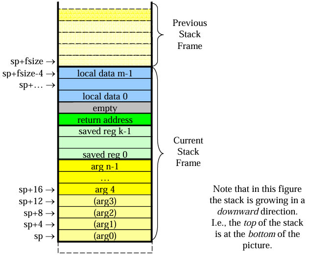
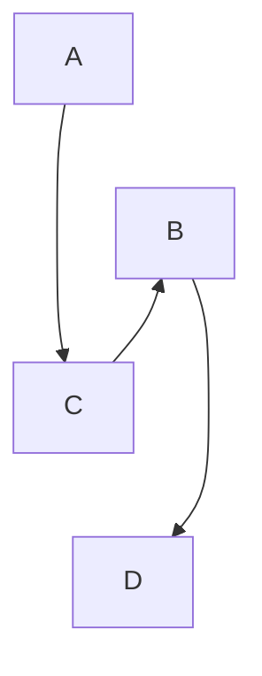

# 目标代码生成

中间代码生成后，我们就来到了编译器设计的最后阶段了。目标代码生成通常以编译器此前生成的**中间代码**、**符号表**及其他相关信息作为输入，输出与源程序**语义等价**的目标程序代码。 代码生成模块需要面向某一个特定的目标体系结构生成目标代码，这种目标体系结构可以是 X86、MIPS、ARM 等，而且由于我们采用三端设计，因此我们可以把目标代码生成理解成是**对中间代码的翻译**。对于不同体系结构，中间代码翻译成目标代码的处理方式也不同。下面我们给出一个中间代码为四元式，目标代码为MIPS指令结构的指导方案。

## 一、MIPS 快速回顾

大家在之前的课程中应该对 MIPS 已经有所掌握了，因此这里就简单对 MIPS 相关概念做一个回顾。

### （1）基本结构

一个基本的 MIPS 程序包含 `.data` 数据段和 `.text` 代码段两部分。`.data` 段存储了全局变量，`.text` 段则存储了可执行的指令。

在 `.data` 段中声明的变量其实是一个个标签，本质是一个常数，表示改变量的地址。

在 `.text` 中，我们可以通过定义标签的方式声明函数，并通过 `jal` 以及 `j $ra` 的方式进行调用和返回。

### （2）寄存器

作为 RISC 架构的一员，MIPS 中有 32 个通用寄存器，下面对他们的作用进行简单介绍。

- `$zero`：始终为 0，可以用来减少常数 0 的使用。
- `$at`（assembly temporary)：汇编器保留寄存器，由汇编器在特定场景（通常是加载大常数）自动生成。
- `$v0 - $v1`：作为函数返回值，一般返回值只使用 `$v0`，当返回值超过 32 位时会同时使用 `$v1`。
- `$a0 - $a3`：函数调用参数，前 4 个参数通常保存在这几寄存器中，更多的参数则是压栈处理。
- `$t0 - $t7, $t8 - $t9`：临时寄存器，用于基本块内的变量，发生函数调用时不必保存。
- `$s0 - $s7`（saved）：全局寄存器，这些寄存器用于跨基本块的变量，往往需要在发生函数调用时进行保存。
- `$k0 - $k1`（keep）：系统保留寄存器，在系统发生中断时使用。
- `$sp, $fp`：栈帧寄存器，`$sp` 保存栈顶（低地址），`$fp` 保存栈底（高地址）。
- `$ra`：返回地址，`jal` 指令会自动将下一条指令的地址保存在 `$ra` 中，从而函数调用可以正确的返回。

虽然这些寄存器有自己的调用规范，可以帮助大家生成更高质量的汇编代码，但是我们实验中的代码比较简单，因此不必完全遵守，比如可以仅使用 `$sp` 完成栈的管理等。

## 二、`.data` 段生成

在 MIPS 汇编语言中，全局数据段使用 `.data` 伪指令来定义。全局数据段的定义应该包括程序中所有全局变量的声明。生成全局数据段的步骤如下：

+ 在汇编文件中使用 `.data` 伪指令来定义全局数据段。

+ 对于每个全局变量，生成对应的指令。指令的格式应该根据变量的类型和初始化情况来确定。例如，对于 `int` 类型的变量，可以使用 `.word` 伪指令来分配 4 字节的空间。对于 `printf` 中的字符串，可以使用 `.asciiz` 来分配空间。

例如，对于以下代码，我们分别有两个初始化和未初始化的全局变量，以及一个常量字符串。

```c
int a = 2;
int b[10] = { 1, 2, 3, 4, 5, 6, 7, 8, 9, 10 };
char c;
char d[10];

int main() {
    printf("This is a string\n");
    return 0;
}
```

那么生成的 MIPS 代码中的 `.data` 段如下。对于重复的初值，我们可以用 `<value>:<count>` 的形式来避免一长串相同的值，对于不同类型的变量，我们可以选择 `.word` 或 `.byte` 进行存储。

```assembly
.data
    a: .word 2
    b: .word 1, 2, 3, 4, 5, 6, 7, 8, 9, 10
    c: .byte 0
    d: .byte 0:10
    .str: .asciiz "This is a string\n"
```

> MIPS `.data` 段的数据是依次存储的，因此细心的你可能会觉得这里有潜在的字节不对齐的问题。但是不用担心，在 `.data` 段汇编器是会自动完成字节对齐的操作的，不过之后在 `.text` 段使用 1 字节存储 `char` 类型变量时就需要注意变量的分配的位置了。

通过生成全局数据段，我们可以在程序运行之前为所有的全局变量分配内存空间，并在必要时将它们初始化为指定的值。这样，在程序的执行过程中，全局变量的值就可以被保存在内存中，并随时被读取和修改。

## 三、`.text` 段生成

`.text` 段中包含了程序所有的可执行指令以及用于跳转的标签。由于我们已经有了中间代码的基础，因此这里最关键的就是将中间代码中的虚拟寄存器转换为实际的寄存器，并完成内存管理。

### （1）栈帧管理

当我们调用函数时，都需要为其在栈上分配一段内存，称为栈帧。其中包含了函数中定义的局部变量，溢出的变量，保存的寄存器以及传出的参数。在 MIPS 中，栈帧的基本结构如下。



> 尽管 MIPS 中使用 `$fp` 和 `$sp` 共同维护栈帧，但实际上只使用 `$sp` 也是足够的。关于栈帧更详细的内容可以参考 [MIPS Calling Convention](https://courses.cs.washington.edu/courses/cse410/09sp/examples/MIPSCallingConventionsSummary.pdf)。

在栈帧管理中，比较关键的是参数的处理。不同函数间彼此不可见，因此为了使得被调用的函数能够正确获取参数，调用者需要将参数保存在紧挨着被调用者栈帧的位置，即当前的栈顶。这里需要注意，尽管我们可以将前 4 个参数通过 `$a0 - $a3` 传递，我们仍需要在栈中为其预留位置（不用保存值）。

我们的实验中，存在 `int` 和 `char` 两种类型，其中 `int` 占 4 字节，而 `char` 只占 1 字节。因此这里就涉及到了字节对齐的问题。MIPS 要求了 `lw/sw` 指令的地址必须四字节对齐，因此在为 `int` 分配空间时有可能需要添加 padding 来保证 4 字节对齐。此外，在 MIPS 中还要求栈帧 8 字节对齐，因此必要时可以在 local variable 之后添加 4 字节的 padding。

### （2）寄存器分配

在 MIPS 这种**寄存器到寄存器**模型中，每个参与运算的值都必须被加载到寄存器中，因此在我们的 IR 中，参与运算的变量都应该对应一个寄存器，在 IR 中，我们将其称为**虚拟寄存器**。虚拟寄存器数目是无限的，但是当翻译为目标平台的汇编代码时，就需要将其映射到一组有限的寄存器中，这个过程就是**寄存器分配**。

在不考虑优化的情况下，我们完全可以将变量都保存在栈上，寄存器仅保存计算时的中间结果，计算完成后即将结果写入栈中，因此只需要固定地分配少量寄存器即可实现。例如，对于如下代码。

```c
int a = 1;
int b = 2;
int c = a + b;
```

生成的 MIPS 代码如下，可以看到每次计算都从栈中加载变量，并将结果存入对应变量。

```assembly
li $t0, 1       # a = 1
sw $t0, 0($sp)

li $t0, 2       # b = 2
sw $t0, 4($sp)

lw $t0, 0($sp)  # c = a + b
lw $t1, 4($sp)
addu $t2, $t0, $t1
sw $t1, -8($sp)
```

对于规范的寄存器分配，则需要考虑**全局寄存器**和**局部寄存器**的分配，分别对应 MIPS 中的 `s` 和 `t` 寄存器。全局寄存器对应那些生命周期跨越基本块的变量，而局部寄存器则对应基本块内的变量。对于全局寄存器分配，我们需要考虑不同变量的生命周期范围，尽可能的避免寄存器冲突。为了解决这一问题，主要由**图着色**和**线性**两种分配方式。而对于局部寄存器分配，由于基本块内部不存在分支，结构较为简单，因此使用**寄存器池**就可以实现高效的寄存器分配。

### （3）数组操作

在我们的代码生成中，主要有三个地方涉及数组：

1. 全局数组，保存在 `.data` 中，通过 `la` 加载其基地址。
2. 局部数组，在栈上分配一段连续的空间，通过 `$sp` 与偏移量访问。
3. 参数数组，传递数组基地址即可，保存时也只是保存该地址。

需要注意的是，为数组分配存储空间时不需要区分一维数组与二维数组，它们的区别仅仅在于访问数组元素时的偏移计算方法。因此数组操作的核心有两个，一个是基地址的获取，一个是偏移量的计算，二者结合起来即可完成数组所有的相关操作。例如，对于以下代码。

```c
int a[2] = { 1, 2 };
a[1] = 3;
```

我们可以生成如下的 MIPS 代码，假设 `a` 保存在 `$sp + 0` 的位置。

```assembly
li $t0, 1           # a[0] 初始化
li $t1, 0
sll $t1, $t1, 2
addu $t2, $sp, $t1
sw $t0, ($t2)

li $t0, 2           # a[1] 初始化
li $t1, 1
sll $t1, $t1, 2
addu $t2, $sp, $t1
sw $t0, ($t2)

li $t0, 3           # a[1] = 3
li $t1, 1
sll $t1, $t1, 2
addu $t2, $sp, $t1
sw $t3, ($t1)
```

对于数组作为参数的情形也是同理，只需要计算出数组的基地址，即可与整数变量一样进行传递。

### （4）函数调用

对于一个函数，除了其自身的指令外，其前后还应各有一小段代码分别进行准备和清理工作，分别是**函数序言**（Function Prologue）和**函数尾声**（Function Epilogue），其作用如下。

- 函数序言：申请所需的栈空间，即更新 `$sp`（和 `$fp`） 寄存器，保存使用到的全局寄存器（如果需要），以及自己的 `$ra` 寄存器。
- 函数尾声：释放栈空间，恢复全局寄存器（如果需要）以及 `$ra` 寄存器。

> 由于任意全局寄存器都可能被调用者使用，因此为了不破坏调用现场，被调用者需要保存其使用到的全局寄存器，并在结束时进行恢复。

对于函数调用者，主要有以下几个步骤。

1. 参数传递。在调用函数前，调用者需要将函数参数压入栈中。对于 MIPS，可以将前四个参数通过 `$a0 - $a3` 四个寄存器传递，但仍需要为其在栈中预留位置。参数的位置通常由参数编号和当前的 `$sp` 决定，从而被调用者可以在不知道调用者栈帧的情况下获取参数。
2. 保存现场（可选），也可以将这一任务交给被调用者的函数序言。
3. 函数跳转。通过 `jal` 或 `jalr` 指令跳转到被调用的函数，函数返回值被保存在 `$v0` 寄存器中。
4. 恢复现场（可选），也可以将这一任务交给被调用者的函数尾声。

例如，我们有如下的函数调用。

```c
int f(int a) {
    int b = a;
    return b;
}

int main() {
    f(1);
    return 0;
}
```

那么在编译时，我们可以确定其栈帧结构如下。


因此，生成的 MIPS 如下。

```assembly
f:
    subu $sp, $sp, 8   # 申请栈空间
    sw   $ra, 0($sp)   # 保存自己的 $ra
                       # 如有必要，保存使用到的全局寄存器
    
    sw   $a0, 8($sp)   # 如需要，保存参数至预留的栈空间
    
    lw   $t0, 8($sp)   # 返回值
    move $v0, $t0
    
    lw   $ra, 0($sp)   # 恢复自己的 $ra
    addu $sp, $sp, 8   # 恢复栈帧
    
    jr   $ra           # 返回
    
main:
    subu $sp, $sp, 8   # 申请栈空间
    sw   $ra, 4($sp)   # 保存自己的 $ra
                       # 如有必要，保存使用到的全局寄存器
                       
    li   $a0, 1        # 传递参数
    jal  f             # 调用函数
    move $t0, $v0      # 获取返回值（此处未使用该返回值）
    
    lw   $ra, 4($sp)   # 恢复自己的 $ra    
    addu $sp, $sp, 8   # 恢复栈帧
    
    li $v0, 10         # 10 号系统调用，结束程序
    syscall
```

> 在我们的实验中，由于只执行大家生成的代码，因此 main 函数需要通过系统调用退出，并没有用到 `$ra`，这里作为示例保留了对 `$ra` 寄存器的操作。此外，如果希望让 main 函数返回非零值，需要使用带参数的 17 号系统调用，不过在我们的实验中不会检查返回值。

这里的汇编代码是按照 MIPS 调用规范生成的，可以方便不同编译器生成的汇编代码之间进行相互调用。不过在我们的实验中只涉及大家自己生成的汇编代码，因此可以自行设计，合理即可。

## 四、tolangc 中的目标代码生成

tolangc 中mips生成部分以llvm中间代码为输入，以mips汇编代码为输出。翻译过程由 llvm中间代码的数据结构 和 mips 生成方式 决定。tolangc 中的实现思想和具体代码都只能作为编译技术实验课程的教学参考，助教不能保证代码的完全正确，也不能保证实现了设计上的最优，请同学们谨慎参考。

教程后半部分列出了 tolangc 中可能会出现问题的地方和助教认为可以进一步优化的设想。tolangc 中未实现中端和后端代码的优化，但是预留了便于实现优化的设计和可以添加优化位置的接口。代码优化方式多样，理论课上老师会介绍几种常见的优化方法，我们的[代码优化教程](./09-code-optimization.md)中也会列举一些优化算法。同学们可以参考课程内容自行实现，也可以根据自己的理解设计新的有效优化方法，用于竞速排序和实验课期末考试。

### （1）结构设计

将一种四元式-llvm翻译成另一种四元式-mips本身是没有什么难度的。mips代码生成的要点是内存管理和寄存器的处理，即怎样将llvm虚拟寄存器对应到mips内存中上。

整体文件结构：

```
+---include
|   \---mips
|           mips_forward.h 	//前向声明
|           mips_inst.h		//mips指令和全局定义：RCode, ICode, JCode；FloatData, WordData
|           mips_manager.h 	//全局管理器
|           mips_reg.h		//寄存器定义：TmpReg, FloatReg, ValueReg
|           translator.h	//代码翻译逻辑
+---src
|   \---mips
|           mips_manager.cpp
|           mips_printer.cpp //汇编代码打印
|           translator.cpp
\---tests
        test_mips.cpp		 //mips生成测试
```

#### 1. 数据组织

mips汇编的内存管理包括：.data全局数据段、.code代码段、堆栈段和寄存器管理。在本章节的前面我们已经讲解了整数数据的组织方式。

为了与实验文法加以区别，tolangc 全部使用浮点数类型的数据参与计算。mips中的全局浮点数数据段关键字是.float；浮点数使用协寄存器\$f0 - $f32 存储；浮点数指令中要标注单精度还是双精度（.s 和 .d）；浮点数指令中不会含有立即数（立即数存储在全局数据段，需要时通过load的方式读出）。

浮点数有关指令可以通过MARS帮助文档查询。浮点数四则运算、数据存取等与整数操作类似；浮点数不能求余；浮点数比较指令（c.eq.s，c.le.s等）的结果会影响协寄存器的标志位中，可以通过 bc1f 或 bc1t 指令查看标志位的值；目前没有浮点数的比较跳转指令，需要自行组合基本指令完成该功能。

#### 2. 寄存器相关

MIPS 中 CPU 对数据的操作是基于寄存器的操作。内存中的数据内容需要先读取 load 到寄存器中才能使用。内存分为.data段中的静态内存，以及栈和堆中动态增长的内存。根据数据存储位置的不同，我们将代码生成方法分为**栈式**和**寄存器池**方式。

##### 栈式结构翻译

栈式翻译就是实现一个针对llvm中间代码、由mips语言实现的栈式虚拟机，与[pcode栈式虚拟机](./07-ir-generation-3-pcode.md)的工作流程类似：将内存的数据区视为一个栈，将运行期数据存放到内存栈中，保证当前执行指令的每个操作数都位于栈顶；操作数出栈后计算，计算结果压栈。寄存器不能用于保存运算结果。

以下是一个栈式翻译的例子：

```llvm
; a = a-4;
 %2 = load i32, i32 * %1
 %3 = sub i32 %2, 4
 store i32 %3, i32 * %1
```

```mips
# %2 = load i32, i32 * %1
# 加载指针%1所指数据内容
lw $t0, xxx($fp) #xxx是指针%1所指位置相对$fp的偏移量，假设可以直接获得
# 取出的数据入栈
sw $t0, 0($sp)
subi $sp, $sp，4

# %3 = sub i32 %2, 4
# 栈顶压入常数2
li $t0, 2
sw $t0, 0($sp)
subi $sp, $sp，4
# 从栈顶取操作数
lw $t0, 8($sp)
lw $t1, 4($sp)
addi $sp, $sp, 8
# 计算
sub $t2, $t0, $t1
# 计算结果入栈
sw $t2, 0($sp)
subi %sp, %sp，4

# store i32 %3, i32 * %1
lw $t0, 4($sp)
addi $sp, $sp, 4
sw $t0, xxx($fp)
```

栈式翻译中大量的运算都是针对栈顶的入栈、退栈、计算来完成的。理论上整个翻译只需要使用四个固定的寄存器，实现简单；但针对内存的频繁出入栈操作会使目标程序开销很大。

##### 寄存器池

寄存器池的实现使运行期数据能够存储在寄存器中。在本章节的寄存器分配部分也有简单介绍。以下是有寄存器池情况下的代码翻译：

```llvm
; a = a-4;
 %2 = load i32, i32 * %1
 %3 = sub i32 %2, 4
 store i32 %3, i32 * %1
```

```mips
lw $t0, xxx($fp)
sub $t1, $t0, 4
store $t1, xxx($fp)
```

这种实现方式的重点是要找到与虚拟寄存器关联的 mips 寄存器。因此在翻译过程中要建立可用寄存器池，以及已用寄存器的全局符号表，维护寄存器与指令关联关系的上下文信息，包括关联关系的建立和释放。比如，load 句翻译中将 \$t0 与 %2 相关联，load 句翻译中将 \$t1 与 %2 相关联；sub语句后 $t0 不再使用，可以取消 \$t0 与 %2 的关联。

tolangc 中采用了寄存器池的方法，寄存器的分配、虚拟寄存器和mips寄存器的符号表通过全局管理器操作。

##### 寄存器池实现

tolangc 在 mips_manager 中实现了寄存器池。该寄存器池的主要功能 和 tolangc中的对应方法有：

| 功能                                                         |                                                     |
| ------------------------------------------------------------ | --------------------------------------------------- |
| 按申请顺序循环轮流分配寄存器，达到性能平衡。                 | getFreeTmp, getFreeFloat, getFree                   |
| 管理寄存器和 llvm 语法结构之间的关联关系，按照语法翻译需要给出绑定、索引和释放方法，做好寄存器的发放和回收。 | occupy, release, <br />allocReg, getReg, tryRelease |
| 在寄存器不够分配时给出将寄存器数据转移到内存中解决方案。     | push, load, <br />loadConst                         |

对于 分配寄存器的回收，理论上我们应该释放所有不再使用的虚拟寄存器的关联关系；或者近期/该基本块内不再被使用的寄存器。由于tolangc的LLVM生成是SSA形式，且没有完成任何优化，因此mips生成中释放了所有作为操作数的虚拟寄存器。

对于 寄存器数据转移到内存 和 内存数据加载到寄存器 中，tolangc 的解决方法中，将指向栈空间的指针也作为寄存器的一种。寄存器不够用时，将最远使用的寄存器数据推到栈上，并将原本 llvm 语法结构与寄存器的关联修改为与栈指针的关联。tolangc 将栈上的指针表示为与栈底的偏移量：class OffsetReg : public MipsReg。

因此，与mips栈指针关联的语法结构有两种：

1. LLVM指针，包括 alloc 指令和 getelementptr 指令
2. 尚未作为操作数使用，但是因为mips寄存器不够因此被推到栈上的LLVM虚拟寄存器

##### \$fp 和 $sp 与函数调用

通用的汇编程序中，帧寄存器\$fp存储函数帧的指针，即进入函数时的栈底的位置；栈寄存器 \$sp 存储当前栈顶位置（指向栈中下一个存放数据的位置，即当前位置不存放有效数据）。在这两个寄存器的配合下，我们可以对不同函数的栈空间进行统一管理。

一般的函数调用规范是，由调用者在栈中保存当前函数的返回值和帧指针、存放参数；被调用者用帧指针$fp保存进入函数时的栈位置，以在退出函数的时候退栈：

```mips
# function MAIN:
sw $ra, 0($sp)
subu $sp, $sp, 4
sw $fp, 0($sp)
subu $sp, $sp, 4

# PUSH:push 1
li $t1, 1
sw $t1, 0($sp) # store the first parameter
subu $sp, $sp, 4

# CALL:call f
jal f

# function f:
addiu $fp, $sp, 4 # set $fp according to the number of parameters N ($fp = $sp + 4*N)
lw $t1, 0($fp) # get the first parameter

# RETURN 
move $sp, $fp # reset stack
jr $ra

# function MAIN:
# load $ra of caller
addiu $sp, $sp, 4
lw $fp, 0($sp)
addiu $sp, $sp, 4
lw $ra, 0($sp)

# get return value
move $t4, $v0
```

当然这种操作范式并不绝对，\$ra, $fp也可以由被调用者存储，只要你的操作统一逻辑自洽即可。

在 tolangc 的实现中，\$fp 被省略了。因为语法单元的存储位置是指针关于栈底的偏移量，因此在mips_manager为函数记录了栈顶位置的情况下，是否实际移动 \$sp 并不重要。因此tolangc使用 \$sp 记录栈底位置，省略了 \$sp 的的移动和 \$fp。

### （2）可能的改进

tolangc给出的实现方法是助教给出的一种可能的解决方案。这不是一种最简洁的实现，也不是一种效率最高的实现，当然也不会对所有的中端后端优化友好。我们的实现中也有许多未解决的漏洞，请同学们谨慎借鉴。

#### 1. 标签命名

tolangc使用的mips标签生成方法是，按索引到的顺序，命名为 当前函数名+'_'+序号。存在的问题是，无法区分函数 main_1 和 main函数下的第一个标签 main_1。如何解决标签和函数名的重名问题，需要你们独特的字符生成设计。

#### 2. 中后端融合优化

由于语法特性和指令形式的不同意，从LLVM逐句翻译到mips的逐句翻译有时反而会增加目标代码的复杂度。比如浮点数的比较：

```mips
// tolangc
if i >= n to done;
tag do;

; llvm
%result = fcmp oge float %i, %n
br i1 %result, label %done, label %do

# mips
# %result = fcmp oge float %i, %n
c.lt.s $f1, $f12
bc1f result_ge
nop
addiu $t0, $zero, 0
j next
nop
result_ge:
addiu $t0, $zero, 1

next:
# br i1 %result, label %done, label %do
bnez $t0, done
nop
j do
nop

```

我们可以看到，如果综合 llvm 翻译的语义，mips代码其实可以简化为：

```mips
c.lt.s $f1, $f12
bc1f done
nop
j do
nop
```

如何将中端翻译和后端翻译综合考虑，打破逐句翻译的冗余性，是同学们在目标代码生成的时候可以多加考虑的。

#### 3. 寄存器的分配和回收

如上文所说，对于 分配寄存器的回收，理论上我们应该释放所有不再使用的虚拟寄存器的关联关系；或者近期/该基本块内不再被使用的寄存器。目前的tolangc回收方式在后续的优化实现中不尽理想。

在 MipsManager::tryRelease 中，我们保留了一个TODO任务，可以在此处添加你们的寄存器释放逻辑。

请大家注意中端优化后的跨块活跃变量处理。tolangc的代码生成是按照LLVM代码的自然顺序自前向后生成。tolangc对于块跨活跃寄存器的处理是把全部推回栈中。未考虑LLVM的基本块结构特征，也未考虑控制流的走向。如果基本块的流图如下所示：



即基本块出现的顺序为：A -> B -> C -> D，但是控制流为：A -> C -> B -> D。代码的自然顺序和控制流的不一致性告诉我们在做寄存器分配的时候要特别注意控制流的走向，做好活跃变量分析。
