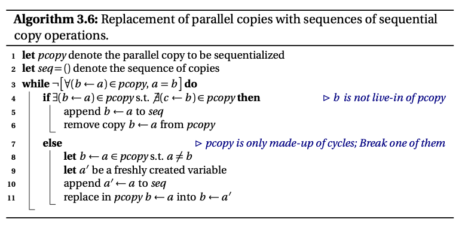

# 代码优化

## 一、中端优化

本部分优化教程适用于以SSA形式语言作为中端的编译器，例如课程组推荐的中端语言llvm。我们将从了解什么是SSA开始，到构建SSA，再到后面以SSA为基础的各种优化。

### （1）初识 SSA

在本小节中你将会了解：

- SSA的基本概念
- 非SSA转化为SSA的基本方法
- $\phi$ 运算与它的一些性质

#### 1. 什么是 SSA

SSA 的全写，即 Static Single-Assignment（静态**单赋值**）。静态单赋值的含义为**每个变量在程序中只被赋值一次**。如下列程序便不是 SSA 程序：

```c
x = 1;	// 语句1
y = 2;	// 语句2
x = y;	// 语句3
```

`=` 作为赋值操作，左边的变量会赋上右边的值。上述代码中的语句 1 为 `x` 赋值 1，语句 3 为 `x` 赋值 `y`，这段程序对 `x` 进行了两次赋值，即违反了 SSA 的定义。显然，我们删除语句 1 或语句 3，就可以让这段程序成为一段 SSA 代码。

在一段正常的 c 代码中，很容易出现不满足 SSA 条件的代码段，如：

```c
x = 1;		// 语句1
y = x + 1;	// 语句2
x = 2;		// 语句3
z = x + 1;	// 语句4
```

上述的代码中 `x` 变量被赋值了两次（语句 1 和语句 3），这会使得很多优化很难进行。如果我们只看语句 2 和语句 4，我们很容易会认为 `y` 和 `z` 值是一样的，均为`x + 1`。但是由于 `x` 中途被重赋值了，导致这个想法是错误的。如果我们能把程序改写成 SSA 形式，如下：

```c
x = 1;			// 语句1
y = x + 1;		// 语句2
x_2 = 2;		// 语句3
z = x_2 + 1;	// 语句4
```

这里我们用了一个新变量 `x_2` 来替代 `x` 的重赋值操作，同时将所有后续用到 `x` 的地方均换成 `x_2`。这样的话，我们就会明显的看出 `y` 和 `z` 的值大概率是不一样的，使得优化过程不会因此出错。

上述的例子展示了一个将非 SSA 程序转换成 SSA 程序的方法。但实际的情况可能比上面的程序复杂的多，如：

```
x = input()
if(x == 42)
	y = 1;
else
	y = x + 2;
print(y)
```

上面的伪代码描述了一个存在分支的情况。这个例子不属于 SSA，因为程序中的 `y` 变量被赋值了两次，违背了 SSA 的定义（尽管这两条语句不可能都被执行）。

如果仍采用上述的命名方法，产生 `y_2` 来替代第二次命名，那么最后的 `print(y)` 应该用 `y` 还是 `y_2` 呢？我们直观的一个想法就是，如果有一种运算能够智能的判断选择 `y` 还是 `y_2` 就好了。因此我们需要引入一种特殊的运算，称为 $\phi$ 运算。

#### 2. phi 运算

还是用上面的例子，我们画出上述程序执行的流程图（后续我们会将其叫做 CFG 图）：


该程序目前无法转为 SSA 的关键点就在于，`print(y)` 的时候，我们无法预先知道 `y` 会取左右两边哪个值。由此我们定义 $\phi$ 运算，如果我们是从左边的基本块来的，就用左边的值；如果我们是从右边的基本块来的，就用右边的值。我们将这种**根据来源基本块来决定给这个变量赋什么值**的操作定义为 $\phi$ 运算。

添加 $\phi$ 运算后的流程图如下：


图中给左右基本块编号为A，B。$\phi$ 运算中的 `A : y1` 表示如果我们是 A 块来到这的，那么我们给 `y3` 赋值 `y1`；同理 `B : y2` 则表示如果我们是 B 块来到这的，那么我们给 `y3` 赋值 `y2`。在后面的大部分情况中，出于简洁，我会简化 $\phi$ 函数的书写形式（去除掉基本块标号以及冒号，来源基本块和对应取值按从左到右的顺序）。还有一点需要注意，$\phi$ 运算要放在基本块的首部，也就是说 SSA 化后的基本块的语句应该是先有一批 $\phi$ 语句，随后跟着一堆非 $\phi$ 语句的格式。

由此我们便实现了含有分支数据流的 SSA 转化。事实上，我们针对 SSA 的大部分讨论将围绕 $\phi$ 运算展开。

#### 3. 多条 SSA

上个例子是最基本的 $\phi$ 函数使用的例子，实际情况仍然要比上述复杂的多（$\phi$ 在下面代码块中用phi替代了）：

```c
y_3 = phi(y_1, y_2)		// 语句1
y_5 = phi(y_3, y_4)		// 语句2
```

在上述代码中，上述语句2中的 `y_3` 应该取语句1运算前的值。一个直观的理解是每个 $\phi$ 语句是独立且平等的，这里的顺序只是一种方便记录的形式。每条 $\phi$ 语句都对应了一组数据流信息，而在进入这个基本块之前，这些数据流是不互相影响的，因此在一个基本块的 $\phi$ 语句也应该保持这种独立性，同时执行，或者说是**并行执行**。

因此一定要记住多条 $\phi$ 语句逻辑上要并行执行。至于我们怎么用串行模拟实现这种并行性，是我们之后需要讨论的。

#### 4. 小结

至此，你已经了解了 SSA 的基本知识。在后续的指导中，我们将逐渐深入讲解构建 SSA 和有关 SSA 的相关优化。有兴趣的同学可以按照以上提出的概念，自己先尝试将程序转成 SSA 形式，当然，后续我们也将讲解构建 SSA 的算法——mem2reg。

### （2）mem2reg

> 本部分教程参考*SSA-based Compiler Design*，将其关键内容整合成指导书，如有困惑推荐参考原书

这一章我们将介绍如何将一个非 SSA 的形式转化到含有 phi 函数的 SSA 形式。首先看下面的一个例子（仅作参考）：

```
// 源语言
int main() {
    int x, cond = 1;
    if (cond > 0){
        x = 1;
    }
    else{
        x = -1;
    }
    return x;
}
```

```
// 未经mem2reg的llvm
define i32 @main() {
    %1 = alloca i32
    %2 = alloca i32
    store i32 1, i32* %1
    %3 = load i32, i32* %1
    %4 = icmp sgt i32 %3, 0
    br i1 %4, label %5, label %8

5:
    store i32 1, i32* %2
    br label %6

6:
    %7 = load i32, i32* %2
    ret i32 %7

8:
    %9 = sub i32 0, 1
    store i32 %9, i32* %2
    br label %6
}
```

```
// 经过mem2reg的llvm
define i32 @main() {
    %1 = icmp sgt i32 1, 0
    br i1 %1, label %2, label %5

2:
    br label %3

3:
    %4 = phi i32 [ 1, %2 ], [ %6, %5 ]
    ret i32 %4

5:
    %6 = sub i32 0, 1
    br label %3
}
```

回忆上次的内容，我们在介绍 SSA 时提及的两个主要的方法，一个是改名，一个是引入 phi 函数。我们这里也将主要按照这样的方法对 SSA 形式进行构建。SSA 构建的标准算法包含两个过程：插入 $\phi$ 指令和变量重命名。

#### 1. 插入 phi 指令

在这一个步骤里，我们会把构建 SSA 所需要插入的 phi 指令都一口气先插到里面。当我们遇到不同基本块汇集（converge）到同一个基本块的时候，便需要将 phi 指令插入到基本块中。看下面的例子：


我们将这种展示程序流程的图叫做控制流程图（**C**ontrol **F**low **G**raph），简记为**CFG**。上图中，B, C 基本块汇聚到 D，这导致我们无法确定 y 此时的取值来自于 B 还是 C，只好插入 phi 函数实现 SSA。一个直观的想法就是所有这种汇聚的基本块中都需要插入 phi 函数。用更加专业的语言来定义一下汇聚这个概念：

- 假设基本块 n1 和基本块 n2 是 CFG 中两个独立的节点，n3 为另一个基本块节点
- CFG 中存在两条路径 n1->n3，n2->n3
- 这两条路径有且仅有 n3 这一个交点
- 那么我们定义 n3 是 n1 和 n2 的**join node**

定义完 join node 的概念后，我们便可以粗略的理解为：若 `n3 = join node(n1, n2)`，且 n1、n2 定义了同一个变量 v，那么我们要在 n3 中插入一个针对变量 v 的 phi 指令。但实际情况可能复杂的多，可能存在 n3 与其他基本块又汇聚回 n1 之类的情况，因此单一的 join node 概念肯定是不够的，我们拓广一下，提出 join sets:

- 设 S 为一个基本块集合
- 当 n 为 S 中至少两个基本块 n1, n2 的 join node 时，我们称 n 为 S 的 join node（注意此时 S 是一个集合）
- 我们将 S 的所有 join node 汇总起来，称为 **join set**，记作 J(S)

到这里，我们提出了一些新的概念来辅助我们找到将 phi 函数插到哪里。大家可能已经被绕晕了，我用上面图中的例子再具体化一下：

-  $D = join\ node(B, C)$ 
-  令 $S_1 = \{B, C\}$ , 则 $D∈J(S_1)$ ，且 $J(S_1) = \{D\}$ 
-  令 $S_2 = \{r,A,B,C,D,E\}$，则 $J(S_2)=\{A,D,E\}$  

在上面的例子中，变量 y 在 B,C 中被定义(def)，然后我们发现 $J(\{B,C\})=\{D\}$,因此在D中要构建phi指令。那么抽象出来就是对于一个变量v，我们先找到它的定义块集合 $Def_v$ ，简记为 $D_v$ ，然后再计算 $J(D_v)$ ，得到的即为我们应该插入phi指令的基本块集合。注意到，phi指令本身，也是对变量v的定义，但由于 $J(D_v∪J(D_v))=J(D_v)$ ，所以我们最终需要插入phi指令的基本块集合**还是 $J(D_v)$** 。

似乎问题到这里已经解决了，我们只需要遍历每个变量，计算出 $J(D_v)$ ，然后插入phi指令就好了，但是实际上求 $J(D_v)$ 的过程非常复杂。计算机科学家结合了图论中的一些概念，将问题转化的更好求解。下面介绍一下相关概念：

- **支配**(dominate)：如果CFG中从起始节点到基本块y的所有路径都经过了基本块x，我们说**x支配y**
- **严格支配**(strict dominate)：显然每个基本块都支配它自己。如果x支配y，且x不等于y，那么**x严格支配y**
- **直接支配者**（immediate dominator, idom）：严格支配n，且不严格支配任何严格支配 n 的节点的节点(直观理解就是所有严格支配n的节点中离n最近的那一个)，我们称其为n的直接支配者

下面是一个CFG：


我们可以举一些例子阐述一下上述的概念：

- 1严格支配3：因为程序如果要运行到3号基本块，必须要经过1号基本块（支配），且1!= 3（严格支配）。
- 3不严格支配7：因为程序如果要运行到7号基本块，可以不经过3，可以从4->5->7的线路走
- 7的直接支配者是2：依照上述概念，有1，2严格支配7，但显然2更近。严谨地说，1虽然严格支配7，但1还严格支配2（7的严格支配者），因此不符合上述概念，不是7的直接支配者。

需要注意的是，**每个节点的直接支配者有且只有一个**（除去entry节点）。

**支配边界**（**D**ominance **F**rontier）：节点 n 的支配边界是 CFG 中刚好**不**被 n 支配到的节点集合. 形式化一点的定义是： $DF(n)=\{x∣n支配x的前驱节点，n不严格支配x\}$ .

我们还是举个例子辅助理解：CFG图中沿着节点4向下走，5是被4支配的（如果程序要进行到节点5一定经过4），而接着到7节点的时候，我们发现4不再支配7了。由此我们便说4的支配边界是7。

类似J操作，我们对集合也可以定义DF操作， $DF(S)=\bigcup_{s{\in}S}DF(s)$  。DF还可以进一步迭代，即 
$$
DF_1(S)=DF(S)\\
DF_{i+1}(S)=DF_{i}(S)\\
DF^{+}(S)=DF_{i->\infty}
$$
还记得我们想要求的 $J(Def)$ 嘛？事实上:
$$
DF^{+}(S)=J(S\ \cup\ entry)
$$
这里的entry是程序的入口基本块。在SSA原文默认的程序中，我们需要在entry基本块中定义所有使用的变量，因此在没有entry基本块的基本块集合中，会有可能出现变量未被定义的情况。而在我们课程组推荐的llvm架构中，没有这样纯定义变量的entry块，因此可以大致理解为 $DF^{+}(S)=J(S)$ 。

那么任务就很明确了，对于每个变量v，求出 $DF^{+}(Def_v)$ 就知道了需要插入phi函数的位置。 

首先，我们先计算出CFG图。

> 这个根据同学们自己的中端架构来实现，其实就是根据基本块跳转指令来记录每一个基本块的next和prev基本块们就可以

接下来，根据CFG图计算支配关系。

> 推荐的一个方法是迭代计算。按照"某基本块的dom <- 某基本块所有前驱的dom的交集加上自己本身" 的策略进行更新，直到该基本块的dom集合不发生变化

在得到基础的支配关系后，直接支配关系和严格支配关系可以直接按照定义计算出来。

> 按照定义即可

接下来，计算最重要的支配边界，这里给一个计算CFG中每个节点的支配边界的伪代码：


上个步骤我们计算出了 $DF(S)$ ，下面我们提供一个参考插入phi函数的伪代码，我们的迭代支配边界也将在这个过程被计算出来：


> 上述伪代码的思路很直接。对于某个变量v，首先W即 $Def_v$ ，对于其中的每个X，找到X的支配边界，由于它的支配边界不由X支配，即有可能来自于其他基本块，因此要插入phi指令（即如果从X过去，变量v就用X中定义的值）

在程序中插入 phi 函数后，程序中地每个变量依然会有多个定义，但程序中的每个定义都可以确定地到达对它的使用，在程序的任意一个位置，一定能够唯一地找到一个已定义变量的定义点，不会出现“这个变量可能在这里定义，也可能在那里定义”的情况（这种情况变成了 phi 函数定义了该变量，kill 了原有的多个定义）。

#### 2. 变量重命名

 为了使程序变为 SSA 形式，我们还需要对变量进行重命名。在程序中插入 phi 函数使得每一个变量的存活区间（live-range）被切割成了几片，变量重命名要做的就是给每个单独的存活区间一个新的变量名。

在上文计算支配关系的时候，基本块之间的直接支配关系可以构成如下图的支配树（dom tree）:


在支配树上进行 DFS，DFS 的过程中，计算并更新每个变量 v 当前的定义 v.reachingDef，并创建新的变量。算法如下：


### （3）死代码删除

程序包含的一些代码可能并不会被运行或者不会对结果产生影响，那么我们称这种代码为死代码。我们将不会被运行到的称为**不可达代码**，将不会对结果产生影响的代码成为**无用代码**。删除无用或不可达代码可以缩减IR代码，可使程序更小、编译更快、执行也更快。

以如下的代码为例：

```
int main() {
	int x = 24;
	int y = 25; /* 无用代码 */
	x = x + 2;
	y = x + 1;
	return 0;
	b = 24; /* 不可达代码 */
	return 0;
}
```

下面给出一个优化前后对比的样例：

```
// 仅经过Mem2reg
define i32 @main() {
0:
	%1 = add i32 24, 2
	%2 = add i32 %1, 1
	ret i32 0
}
```

```
// 经过mem2reg+DCE
define i32 @main() {
0:
	ret i32 0
}
```

基于SSA的形式，我们很容易做死代码删除。整体思路为沿着def-use链将有用的代码全部找出来标记，这样没有被标记过的代码就是死代码。但是要注意的是我们删除代码的同时会改变控制流图等一系列结构，因此我们要在做删除的同时谨慎维护原有的数据结构。

#### 1. 实现

我们提供的一个可行的思路如下：

##### 删除无用函数

这一部分主要是遍历所有函数，删除没有被用到的函数。函数之间的调用关系可以通过向函数类添加一些属性来维护，例如每个函数维护自己调用过的函数与自己被哪些函数调用等。

##### 删除死代码

这一部分需要遍历有用函数中的每条指令，并沿着def-use链构建有用指令的**闭包**。最基本的一些有用指令包括br指令，ret指令，调用库函数的call指令等。

寻找闭包的过程其实是一个递归：先将基本的有用指令进行标记，随后标记每条有用指令用到的value，并接着递归寻找其用到的value，从而构建一个有用指令的闭包。该思路仅供参考，由于SSA中def-use提供了很丰富的指令之间的逻辑关系，因此可能对于不同的架构有不同的最优实现方案。

##### 维护数据结构

删除指令的时候，我们要注意维护之前构建的一些数据结构，如指令之间的def-use关系，basicblock一些相关的属性等等，根据不同的架构进行调整。

理论上，我们删除了除有用指令外的所有指令，易发现无用代码和不可达代码都已经被删除了。

#### 2. 拓展

我们这里介绍的只是较为基础版的死代码删除。一些可行的拓展方案如下：

- 进行**内存分析**，删除一些无用的store，load指令：例如有时我们会在load之前多次对同一个地址进行store，那么显然只有最后一个store是有效的
- 合并冗余的分支指令

另外在进行后续的常量传播等优化后，可能程序会暴露出新的可以做死代码删除的机会，因此可以合理安排优化的顺序与次数，运行多次死代码删除。

### （4）GVN&GCM

GVN(Global Variable Numbering) 全局值编号：为全局的变量进行编号，实现全局的消除公共表达式。

GCM(Global Code Motion) 全局代码移动：根据Value之间的依赖关系，将代码的位置重新安排，从而使得一些不必要（不会影响结果）的代码尽可能少执行。

附论文链接：https://c9x.me/compile/bib/click-gvn.pdf

样例如下：

```
// 源程序
const int N = 10;
int a[10] = {0,1,2,3,4,5,6,7,8,9};
int main()
{
    int i = 2,j = 5;
    const int a1 = 1, a2 = 2;
    i = (-(i * j) + 0 + a[1] * 1 - 1/2) * 5;
    j = 7*5923%56*57 + (a1+a2-(89/2*36-53) /1*6-2*(45*56/85-56+35*56/4-9));
    int k = +-+6;
    i = 0;
    while (i <= 100) {
		a[0] = a[0] + k * k;
		a[1] = a[1] + k * k;
		a[2] = a[2] + k * k;
		a[3] = a[3] + k * k;
		a[4] = a[4] + k * k;
		a[5] = a[5] + k * k;
		a[6] = a[6] + k * k;
		a[7] = a[7] + k * k;
		a[8] = a[8] + k * k;
		a[9] = a[9] + k * k;
		i = i + 1;
	}
	i = 0;
	while (i < 10) {
		printf("%d, ", a[i]);
		i = i + 1;
	}
	printf("\n%d, %d, %d\n", i, j, k);
    return 0;
}
```

```
// 仅经过mem2reg
@g_a = dso_local global [10 x i32] [i32 0, i32 1, i32 2, i32 3, i32 4, i32 5, i32 6, i32 7, i32 8, i32 9]
@g_N = dso_local global i32 10
define dso_local i32 @main() {
b1:
	%v10 = mul i32 2, 5
	%v11 = sub i32 0, %v10
	%v12 = add i32 %v11, 0
	%v13 = getelementptr inbounds [10 x i32], [10 x i32]* @g_a, i32 0, i32 1
	%v14 = load i32, i32* %v13
	%v15 = mul i32 %v14, 1
	%v16 = add i32 %v12, %v15
	%v17 = sdiv i32 1, 2
	%v18 = sub i32 %v16, %v17
	%v19 = mul i32 %v18, 5
	%v21 = mul i32 7, 5923
	%v22 = srem i32 %v21, 56
	%v23 = mul i32 %v22, 57
	%v24 = add i32 1, 2
	%v25 = sdiv i32 89, 2
	%v26 = mul i32 %v25, 36
	%v27 = sub i32 %v26, 53
	%v28 = sdiv i32 %v27, 1
	%v29 = mul i32 %v28, 6
	%v30 = sub i32 %v24, %v29
	%v31 = mul i32 45, 56
	%v32 = sdiv i32 %v31, 85
	%v33 = sub i32 %v32, 56
	%v34 = mul i32 35, 56
	%v35 = sdiv i32 %v34, 4
	%v36 = add i32 %v33, %v35
	%v37 = sub i32 %v36, 9
	%v38 = mul i32 2, %v37
	%v39 = sub i32 %v30, %v38
	%v40 = add i32 %v23, %v39
	%v42 = sub i32 0, 6
	br label %b2
b2:
	%v155 = phi i32 [ 0, %b1 ], [ %v131, %b3 ]
	%v48 = icmp sle i32 %v155, 100
	br i1 %v48, label %b3, label %b4
b3:
	%v50 = getelementptr inbounds [10 x i32], [10 x i32]* @g_a, i32 0, i32 0
	%v51 = load i32, i32* %v50
	%v54 = mul i32 %v42, %v42
	%v55 = add i32 %v51, %v54
	%v56 = getelementptr inbounds [10 x i32], [10 x i32]* @g_a, i32 0, i32 0
	store i32 %v55, i32* %v56
	%v58 = getelementptr inbounds [10 x i32], [10 x i32]* @g_a, i32 0, i32 1
	%v59 = load i32, i32* %v58
	%v62 = mul i32 %v42, %v42
	%v63 = add i32 %v59, %v62
	%v64 = getelementptr inbounds [10 x i32], [10 x i32]* @g_a, i32 0, i32 1
	store i32 %v63, i32* %v64
	%v66 = getelementptr inbounds [10 x i32], [10 x i32]* @g_a, i32 0, i32 2
	%v67 = load i32, i32* %v66
	%v70 = mul i32 %v42, %v42
	%v71 = add i32 %v67, %v70
	%v72 = getelementptr inbounds [10 x i32], [10 x i32]* @g_a, i32 0, i32 2
	store i32 %v71, i32* %v72
	%v74 = getelementptr inbounds [10 x i32], [10 x i32]* @g_a, i32 0, i32 3
	%v75 = load i32, i32* %v74
	%v78 = mul i32 %v42, %v42
	%v79 = add i32 %v75, %v78
	%v80 = getelementptr inbounds [10 x i32], [10 x i32]* @g_a, i32 0, i32 3
	store i32 %v79, i32* %v80
	%v82 = getelementptr inbounds [10 x i32], [10 x i32]* @g_a, i32 0, i32 4
	%v83 = load i32, i32* %v82
	%v86 = mul i32 %v42, %v42
	%v87 = add i32 %v83, %v86
	%v88 = getelementptr inbounds [10 x i32], [10 x i32]* @g_a, i32 0, i32 4
	store i32 %v87, i32* %v88
	%v90 = getelementptr inbounds [10 x i32], [10 x i32]* @g_a, i32 0, i32 5
	%v91 = load i32, i32* %v90
	%v94 = mul i32 %v42, %v42
	%v95 = add i32 %v91, %v94
	%v96 = getelementptr inbounds [10 x i32], [10 x i32]* @g_a, i32 0, i32 5
	store i32 %v95, i32* %v96
	%v98 = getelementptr inbounds [10 x i32], [10 x i32]* @g_a, i32 0, i32 6
	%v99 = load i32, i32* %v98
	%v102 = mul i32 %v42, %v42
	%v103 = add i32 %v99, %v102
	%v104 = getelementptr inbounds [10 x i32], [10 x i32]* @g_a, i32 0, i32 6
	store i32 %v103, i32* %v104
	%v106 = getelementptr inbounds [10 x i32], [10 x i32]* @g_a, i32 0, i32 7
	%v107 = load i32, i32* %v106
	%v110 = mul i32 %v42, %v42
	%v111 = add i32 %v107, %v110
	%v112 = getelementptr inbounds [10 x i32], [10 x i32]* @g_a, i32 0, i32 7
	store i32 %v111, i32* %v112
	%v114 = getelementptr inbounds [10 x i32], [10 x i32]* @g_a, i32 0, i32 8
	%v115 = load i32, i32* %v114
	%v118 = mul i32 %v42, %v42
	%v119 = add i32 %v115, %v118
	%v120 = getelementptr inbounds [10 x i32], [10 x i32]* @g_a, i32 0, i32 8
	store i32 %v119, i32* %v120
	%v122 = getelementptr inbounds [10 x i32], [10 x i32]* @g_a, i32 0, i32 9
	%v123 = load i32, i32* %v122
	%v126 = mul i32 %v42, %v42
	%v127 = add i32 %v123, %v126
	%v128 = getelementptr inbounds [10 x i32], [10 x i32]* @g_a, i32 0, i32 9
	store i32 %v127, i32* %v128
	%v131 = add i32 %v155, 1
	br label %b2
b4:
	br label %b5
b5:
	%v154 = phi i32 [ 0, %b4 ], [ %v144, %b6 ]
	%v137 = icmp slt i32 %v154, 10
	br i1 %v137, label %b6, label %b7
b6:
	%v140 = getelementptr inbounds [10 x i32], [10 x i32]* @g_a, i32 0, i32 %v154
	%v141 = load i32, i32* %v140
	call void @putint(i32 %v141)
	%v144 = add i32 %v154, 1
	br label %b5
b7:
	call void @putint(i32 %v154)
	call void @putint(i32 %v40)
	call void @putint(i32 %v42)
	ret i32 0
}
```

```
// Mem2reg+GVNGCM
@g_a = dso_local global [10 x i32] [i32 0, i32 1, i32 2, i32 3, i32 4, i32 5, i32 6, i32 7, i32 8, i32 9]
define dso_local i32 @main() {
b1:
	%v122 = getelementptr inbounds [10 x i32], [10 x i32]* @g_a, i32 0, i32 9
	%v114 = getelementptr inbounds [10 x i32], [10 x i32]* @g_a, i32 0, i32 8
	%v106 = getelementptr inbounds [10 x i32], [10 x i32]* @g_a, i32 0, i32 7
	%v98 = getelementptr inbounds [10 x i32], [10 x i32]* @g_a, i32 0, i32 6
	%v90 = getelementptr inbounds [10 x i32], [10 x i32]* @g_a, i32 0, i32 5
	%v82 = getelementptr inbounds [10 x i32], [10 x i32]* @g_a, i32 0, i32 4
	%v74 = getelementptr inbounds [10 x i32], [10 x i32]* @g_a, i32 0, i32 3
	%v66 = getelementptr inbounds [10 x i32], [10 x i32]* @g_a, i32 0, i32 2
	%v58 = getelementptr inbounds [10 x i32], [10 x i32]* @g_a, i32 0, i32 1
	%v50 = getelementptr inbounds [10 x i32], [10 x i32]* @g_a, i32 0, i32 0
	br label %b2
b2:
	%v155 = phi i32 [ 0, %b1 ], [ %v131, %b3 ]
	%v48 = icmp sle i32 %v155, 100
	br i1 %v48, label %b3, label %b4
b3:
	%v51 = load i32, i32* %v50
	%v55 = add i32 %v51, 36
	store i32 %v55, i32* %v50
	%v59 = load i32, i32* %v58
	%v63 = add i32 %v59, 36
	store i32 %v63, i32* %v58
	%v67 = load i32, i32* %v66
	%v71 = add i32 %v67, 36
	store i32 %v71, i32* %v66
	%v75 = load i32, i32* %v74
	%v79 = add i32 %v75, 36
	store i32 %v79, i32* %v74
	%v83 = load i32, i32* %v82
	%v87 = add i32 %v83, 36
	store i32 %v87, i32* %v82
	%v91 = load i32, i32* %v90
	%v95 = add i32 %v91, 36
	store i32 %v95, i32* %v90
	%v99 = load i32, i32* %v98
	%v103 = add i32 %v99, 36
	store i32 %v103, i32* %v98
	%v107 = load i32, i32* %v106
	%v111 = add i32 %v107, 36
	store i32 %v111, i32* %v106
	%v115 = load i32, i32* %v114
	%v119 = add i32 %v115, 36
	store i32 %v119, i32* %v114
	%v123 = load i32, i32* %v122
	%v127 = add i32 %v123, 36
	store i32 %v127, i32* %v122
	%v131 = add i32 %v155, 1
	br label %b2
b4:
	br label %b5
b5:
	%v154 = phi i32 [ 0, %b4 ], [ %v144, %b6 ]
	%v137 = icmp slt i32 %v154, 10
	br i1 %v137, label %b6, label %b7
b6:
	%v140 = getelementptr inbounds [10 x i32], [10 x i32]* @g_a, i32 0, i32 %v154
	%v141 = load i32, i32* %v140
	call void @putint(i32 %v141)
	%v144 = add i32 %v154, 1
	br label %b5
b7:
	call void @putint(i32 %v154)
	call void @putint(i32 -8894)
	call void @putint(i32 -6)
	ret i32 0
}
```

#### 1. GVN

GVN 寻找具有相同操作和相同输入的代数恒等式或指令，并为他们赋值为相同的编号。 GVN 的过程中也可以做折叠常量。我们通过查找哈希表来判断两条指令是否相同，因此GVN 在很大程度上依赖于SSA形式。 GVN 用一条指令替换多组等价指令，但是由于是全局性的编号，可能会导致代码结果不正确，所以GVN往往都**与GCM配套使用**，在GCM的过程中根据value之间的依赖关系重新调整指令顺序，保证GVN计算结果的正确性。

##### LVN

在正式介绍GVN前，我们先了解一下LVN(Local Variable Numbering) ，也就是局部值编号，效果基本等同于教材上的公共子表达式消除。以下述的程序举例：

```
... define a, b
c <- a + b
d <- c - b
e <- a + b
f <- e - b
```

在上述的代码中，我们注意到c和e的操作数一致，操作符一致。我们可以把上述代码中的c和e取同一个值，不妨将所有的e换成c，即优化为：

```
... define a, b
c <- a + b
d <- c - b
f <- c - b
```

上述的优化又暴露了新的优化机会：d和f可以取相同的值，由此可以删除f的指令并将后续所有用到f的地方换成d。

```
... define a, b
c <- a + b
d <- c - b
```

按照上述的思想，我们构建了LVN算法。LVN算法的流程很简单：

- 对于每个basicblock初始化一个哈希表

- 对每条指令，获取它的操作数和操作符，根据操作数和操作符计算哈希值

> 这一步请同学自行设计放入的结构。只要能保证相同的指令在哈希表里也相同（注意有的运算符合交换律，要将不同顺序的情况也放入哈希表）

- 如果哈希表中已经存在该值，那么我们直接将basicblock里后续用到这个value的地方全部换成哈希表中存的value
- 否则将哈希值及对应的value存入哈希表

##### 常量折叠

注意到LVN的过程中，我们可以顺便做常量折叠，这不仅节省了一个pass的时间，同时常量折叠也会暴露更多的LVN优化机会。

常数表达式计算（constant-expression evaluation），或称常数折叠（constant folding），指的是在编译时计算其操作数已知是常数的表达式。在多数情况下这是一种相对容易的转换。最基础的一个常数折叠操作是：在遍历指令的过程中，判别指令的所有操作数是否为常数值，并用计算结果替代该表达式。

回到 LVN 框架，如果一个运算的所有运算对象都具有已知的常数值，那么 LVN 可以在编译时执行该运算并将结果直接合并到生成的代码中。LVN 可以在哈希表中存储有关常数的信息，包括其值。如果 LVN 发现一个常量表达式，它可以将表达式替换为对相应结果的立即数加载操作。

更复杂的一些折叠操作涉及到代数恒等式：

- a + 0 = a
- a - 0 = a
- a * 0 = 0
- 2 * a = a + a
- a * 1 = a
- a / 1 = a
- a / a = 1

还可以利用二元运算的结合律进行更复杂的折叠：

- a + (b - a) = b
- a - (a - b) = b
- ...

这一部分可以尽情发挥大家的想象力，但注意一定要在保证准确率的前提下去做复杂的折叠优化。

##### GVN

跟 LVN 类似，GVN 的本质是基于哈希的操作，它尝试用一条指令处理一组重复，或者说冗余的指令（它们计算相同的值），根据具体情况不同，将其替换或者作为新值加入哈希表中。类似 LVN，GVN 的架构也是有利于常量折叠的，像其他表达式一样，GVN 会对常量表达式进行值编号。在这里，我们通过哈希表来查找具有相同操作和相同输入的两个指令。

但与LVN不同的关键点在于，GVN是一个针对全局的哈希表。但显然全局的值标号会产生bug，这里我们会在GCM时进行纠正。

#### 2. GCM

全局代码移动算法的功能是调度那些“浮动”的指令，把它们归位到一个个基本块中。这个过程必须保留已有的控制依赖和数据依赖。在这个大前提下，算法可以自由发挥，我们的目标就是尽可能把代码移动到循环外面，尽可能让代码的执行路径变少。它的执行步骤大致如下所示：

- 计算支配树与支配关系
- 利用循环分析计算循环深度
- 调度所有指令

前两个步骤都是为最后一个步骤服务的，调度指令分为几个流程：find_Pinned_Insts，schedule_Early，schedule_Late，select_block

##### find_Pinned_Insts

有些指令是无法被灵活调度的，如phi，br/jump，ret等指令，这些指令我们叫做pinnedInst。pinnedInst受到控制依赖的牵制，无法被调度到其他基本块，也就是说这些指令和它们的基本块是绑定的。这一部分，我们需要先遍历指令将pinnedInst进行标记。

##### schedule_Early

顾名思义，这一步骤我们会尽可能的把指令前移，**确定每个指令能被调度到的最早的基本块**，同时不影响指令间的依赖关系。当我们把指令向前提时，限制它前移的是它的输入，即每条指令最早要在它的所有输入定义后的位置。伪代码如下：


##### schedule_Late

同理，这部分我们会尽可能的把指令后移，**确定每个指令能被调度到的最晚的基本块**。每个指令也会被使用它们的指令限制，限制其不能无限向后移。伪代码如下：


##### select_block

在确定每个指令可以被灵活调度的空间后，我们将进行最关键的一步，为指令选择它最终的基本块。这里选择的依据是循环深度尽可能浅且尽可能的靠前。经过这样的调度，循环中不发生变化的指令会被移出循环，更多优化的机会暴露出来。


由此，我们便在不改变变量依赖的前提下，重新调度了指令。

前面提到的优化都是基于中端的优化。不同于中端优化，后端优化和体系结构的关联性很强。在优化的过程中，不仅要考虑指令的数据流，可能还要考虑CPU的流水线等等方面，而我们最终生成的mips程序是跑在Mars模拟器当中的，所以不需要考虑cpu的执行情况，但是对于mips架构的理解对减少目标代码的执行数一定有很大的帮助。所以在学习后端的优化技术之前，我们希望同学们能够通过阅读mips架构的英文指令集来熟悉体系结构，这样在实现后端优化的过程中一定能事半功倍。

## 二、后端优化

不同于中端优化，后端优化和体系结构的关联性很强。在优化的过程中，不仅要考虑指令的数据流，可能还要考虑CPU的流水线等等方面，而我们最终生成的mips程序是跑在Mars模拟器当中的，所以不需要考虑cpu的执行情况，但是对于mips架构的理解对减少目标代码的执行数一定有很大的帮助。所以在学习后端的优化技术之前，我们希望同学们能够通过阅读mips架构的英文指令集来熟悉体系结构，这样在实现后端优化的过程中一定能事半功倍。

### （1）后端消PHI

**这部分内容需要你的中间代码是SSA形式的，如果没有使用SSA形式的中间代码可以自行忽略这部分的内容**

SSA形式的中间代码本身就携带了大量信息，可以方便的进行很多中端优化，但是在代码生成的时候PHI指令实际上是无法被常规的汇编指令表示的，所以在进行代码生成之前需要将SSA形式的代码转换为汇编指令集能够接受的代码。

首先介绍一下**关键边（critical edges）**的概念，关键边是从一个有多个后继的节点指向有多个前驱的节点的边。消PHI最简单的一个思路是在源基本块跳转之前将PHI指令拆成多条move指令，但是如果程序中存在关键边，以下面的llvm代码为例

```
...
BB1:
%1 = phi i32 [ %2, %BB2 ], [ %3, %BB3 ]
%2 = phi i32 [%1, %BB2], [%3, %BB3] 
br label %BB4
BB2:
....
br  i1 %4, label %BB4 label %BB1
BB3:
...
br  i1 %5, label %BB4 label %BB1
BB4:
%6 = add i32 %1, %1
...
```

显然从BB2到BB1之间存在一条关键边，假设直接在BB3的尾部添加move指令，那么跳转到BB4时，move指令也会被执行，这个时候%1变量的值会被改变，而BB4对%1有引用，可能会造成错误，所以如果要在跳转前将PHI变成多条move指令需要消除关键边，一种显然的做法是在BB3和BB1之间再增加一个基本块BB5，BB3跳转到BB5之后再对BB1需要的PHI指令添加move指令，再从BB5跳转到BB1，需要注意的是，由于一个基本块的PHI指令有并行性，例如从BB2跳转到BB1中，%2正确的赋值应该是原来%1的值，而不是跳转之后赋值给%1的原来%2的值，所以这里的move指令用PC(parallel copy)指令代替。下面给出《the SSA book》当中一种参考的算法


这个时候所有的PHI指令都被PC指令替代，但是mips体系结构里并没有类似PC的指令，所以我们需要生成一个有并行效果的move序列。这里我们介绍一种图算法，将变量的值视作图的节点，每一条PC指令视作图的边，算法循环的从PC集合当中遍历，如果对于一个$b \gets a$指令，不存在$c \gets b$指令，那说明b变量的赋值不会影响到并行性，直接将`move b, a`加入move序列当中，并将$b \gets a$从PC集合中删除，如果存在$c \gets b$指令，则添加一个临时变量$a^{'}$，将`move a', a`加入move序列当中，用$b \gets a'$替换$b \gets a$指令，这样加入一个中间变量之后$b$的赋值就不会影响$c$的赋值。具体的算法如下：



至此，我们已经完成了PHI指令的消除，需要注意的是，这是最简单的一种消PHI的方法，会产生大量move指令和基本块，如果不进行后续的优化甚至可能取得不如非SSA中间代码的性能，幸运的是，我们可以通过在寄存器阶段合并move指令、窥孔优化以及基本块合并等多种方法优化指令序列。《the SSA book》当中介绍了更加有效的消PHI方法，如果同学们有兴趣可以自行选择阅读。

### （2）指令选择

指令选择是生成目标代码的一个重要的步骤，关乎后端代码的整体质量，指令选择的目标是尽量用小的指令代价覆盖更多的代码，这里的代价可能是执行时间、指令条数、CPI（执行一条指令所需要的时钟周期数）等等，在我们这里主要指的是指令执行的FinalCycle。

#### 1. Mars伪指令的限制

为了更方便的实现更多功能，以及更加方便翻译高级语言，Mars给我们提供了充分的伪指令使用，例如
`subi $t1, $t2, 100`、`move $1, $2`、`ble $t1, $t2, label` 等，能够缩短指令的条数，增加代码的可读性。但是由于Mars的局限性，以及体系结构的特性，很多时候伪指令虽然表面上降低了指令的条数，但是实际上反而会使FinalCycle增加，在非循环语句当中，这样的问题当然可以忽略，而在循环次数很多的循环体当中，哪怕每个语句多翻译了一条代码都会严重影响性能，而subi等语句其实是十分常见的计算语句，在循环当中也可能高频出现。另一方面，在进行图着色寄存器分配时，伪指令可能会隐蔽地更改寄存器的值，导致数据流分析错误，可能会产生一些很难发现的bug。所以不使用Mars低效的伪指令，转而自己封装一套翻译机制是提升性能的有效方法。

#### 2. 应用举例

我们给出一个Mars伪指令翻译不合理的例子，而更多伪指令不合理的地方，大家可以自行通过试验发现。

以llvm作中端代码为例，中端向后端发送一条`%3 = sub i32 %1, 1000`指令，后端可以将其翻译为伪代码指令`subi $t1, $t2, 1000`或基础指令`addi $9, $10, -1000`，在Mars当中汇编可以发现


这条`subi $t1, $t2, 1000`指令，会被mars翻译成`addi $1, $0, 0x3e8`和`sub $9, $10, $1`两条指令，而通过`addi $9, $10, -1000`一条指令即可完成。

### （3）图着色寄存器分配

在之前的阶段当中我们都假定了有无限个寄存器作为临时变量，而实际上，寄存器是十分珍贵的计算资源，有着最为迅速的读写速度。编译课程的目标架构mips只有32个通用寄存器，显然无法满足"无限"寄存器的要求，所以如何进行寄存器分配是编译优化当中一个重要的问题。但是已有的数学证明已经指出寄存器分配是一个NP完全问题，所以一个好的寄存器分配策略应该能在较短的时间给出近似最佳的结果。课程组以虎书为蓝本，介绍一种近似线性时间的寄存器分配策略。

#### 1. 构造（build）

本阶段的主要任务是通过数据流分析方法，计算在每条指令执行时同时活跃的临时变量，该集合的每一对临时变量两两形成一条边加入冲突图中，

构造阶段的主要工作是进行数据流分析，数据流分析我们建议分为两个阶段，首先是进行基本块的数据流分析，分析的数据流方程如下（两个阶段的数据流分析均使用同一个方程）
$$
in[m] = use[m]\cup(out[n] - def[n])\newline
out[n] = \mathop{\cup}_{s \in succ[n]}in[s]
$$
第二阶段是进行指令间的数据流分析，得到冲突图，指令冲突的条件是在变量定义处所有出口活跃的变量和定义的变量是互相冲突的，以及同一条指令的出口变量互相之间是冲突的，例如下面的代码

```assembly
...
add $2, $2, $3               #1
sw $4, 0($5)                 #2
..
```

显然`$4, $5`都是#1指令的出口寄存器，那么`$2、$4、$5`将会互相作为邻接点加入冲突图中

第一阶段进行基本块之间的数据流分析是为了在进行指令之间的数据流分析获得一个开始的数据流信息，例如以下的代码

```assembly
block1:
add $2, $2, $3
j block2
...
...
...
block2:
add $4, $5, $6
```

显然`$5, $6`是出口活跃的，所以在进行第二阶段`block1`的数据流分析开始时，就需要把`$5, $6`加入活跃变量集合中

#### 2. 简化（simplify）

进行启发式图着色，删除度数小于K（通用寄存器个数，mips中是32个）的节点，简化冲突图，产生更多图着色机会。具体的做法是对于一个节点m，如果它的度数小于K，那么将它从冲突图当中删除，并且将其压入栈中，以便进行后续的着色。这样进行启发式删除之后，都会减少其他结点的度数，从而产生更多的简化的机会，并且也为之后的合并提供更多机会，这要求在这个阶段不会简化非冻结指令。

#### 3. 合并（coalesce）

进行保守的合并，减少最终代码的move指令。对于move指令（例如`move $2, $3`），源操作数和目的操作数实际上相同，这种情况下可以将两个节点合并，减少一条move指令的代价，但是，合并两个结点之后，两个节点的活跃范围会增加，其邻接结点的集合实际上是原来两个集合的并集，这种情况下可能会导致一些能够着色的节点变为被溢出的结点，这样就得不偿失了，因此我们给出的一种策略是在合并的时候进行判断，保证合并之后高度数（度数>=K）的结点不会增加。通过简化之后，冲突图很多节点的度数已经降低，所以这个时候合并的机会可能多于原有的冲突图。

合并的效果通常决定了整个图着色算法的质量，另外由于在进行指令选择之前需要消PHI，会在这个时候产生很多冗余的move指令，通过图着色的时候进行合并能够极大的减少冗余的move指令，根据经验来看，这对程序性能的提升非常大。

#### 4. 冻结（freeze）

在进行简化和合并之后，有一些变量无法进行合并，并且可以进行简化，这个时候需要将其标记为传送冻结的结点，重新开始简化阶段。

#### 5. 溢出（spill）

简化和合并完成之后，冲突图中只剩下高度数（度数>=K）的节点，这个时候我们需要在图中选择一个高度数的结点，将它存入内存当中，然后将它压入栈中。这个时候其他结点的度数降低，可以继续进行简化。

#### 6. 选择（select）

对虚拟寄存器指派颜色，即分配真实的寄存器。具体做法是以一个空图开始，从栈中弹出一个节点，加入到冲突图中，并且为他指派一种颜色，该节点必须是可着色的，可着色的条件是其邻接结点使用的颜色小于真实的寄存器数K，对于简化阶段入栈的变量显然一定能够着色，对于溢出阶段入栈的变量，通过合并之后，邻接点中有一些变量的颜色相同，最后邻接点的颜色小于K种，能够进行着色，可以将其加入冲突图中，否则将其加入无法进行着色的集合中。

#### 7. 重新开始（restart）

如果无法进行着色的集合不为空，那么则需要改写程序，为这些变量在内存当中分配空间，并且在每次使用需要将其从内存当中取出，每次修改需要存进内存当中，这种情况下，溢出的临时变量会转变为几个活跃范围很小的新的临时变量，这个时候需要重新进行活跃分析、寄存器分配，直到没有溢出和简化为止（通常只需要迭代一两次）。

至此我们已经完成了图着色寄存器分配的介绍，但是图着色寄存器分配具体的实现是一个非常复杂的过程，《现代编译原理：c语言描述》当中有非常详细的介绍，在理解每个阶段的原理之后同学们可以参考书中的算法进行具体实现。

### （4）乘除法优化

对于处理器来说，执行乘除法的代价要远大于执行其他指令，而执行除法的代价又远大于乘法的代价，所以我们理想的情况是通过算术运算将除常数转化为乘法和移位指令，将乘常数转化为移位和其他指令。我们只针对mips架构提出一种可行的除法优化方案，更加详细的实现以及具体的数学原理可以参考**Division by Invariant Integers using Multiplication&**

#### 1. 乘法优化

乘法优化比较简单，一般只需要判端常数是否是2的整数次幂即可，例如`x * 1024` 可以优化为`x << 10`，另外由于我们给出的rank计算标准是乘法的代价为加法的5倍，那么`x * 3`实际上可以考虑优化为`x + x + x`。一些特殊的常数也可以考虑优化例如`x * 10 `可以考虑优化为`x << 3 + x + x`。

#### 2. 除法优化

除法优化的思路是将除法指令转化为乘法指令和移位指令，即如下公式：
$$
quotient = \frac{dividend}{divisor} = (dividend * multiplier) >> shift
$$
该公式先乘一个较大的常数，然后用右移*shift*位得到最终的答案，使用该式子计算除法的核心是如何得到*multiplier*，另外由于mips架构是32位的，还必须要考虑溢出的问题。mips在执行乘法的时候会将结果保存到hi和lo寄存器当中，在被除数乘*multiplier*之后，很容易就会超过32位，这个就会出现一部分答案在hi寄存器中，一部分答案在lo寄存器当中，所以我们需要使*multiplier*尽量大（超过$2^{32}$），能够使答案的部分在hi寄存器当中。所以最终的公式可以写为如下形式
$$
quotient = \lfloor \frac{n}{d}\rfloor = \lfloor\frac{m * n}{2^{N + l}} \rfloor
$$
其中N是机器码长度32，最终获得答案的公式为$SRL(MULUH(m,n), shift)$，$MULUH$表示乘法之后取HI寄存器。

论文当中提出了一种*mutiplier*和*shift*的获得方法，具体证明可以同学们可以查阅论文


不等式当中的N是机器码的长度，在mips当中为32，该式子的意思是需要找到一个*m*使得*m\*d*之后大于$2^{N + l}$并且小于$2 ^{N + l} + 2^l$这样在右移$l$位之后可以得到最终的答案。

### （5）基本块合并和窥孔优化

llvm中端代码的基本块要求必须有入口和出口，即在基本块尾部必须有br或者return语句，除了第一个基本块，其他基本块需要有br语句指向它。与llvm不同，mips汇编代码会默认执行继续执行下一个基本块的指令，并且在现实的CPU中，跳转指令由于需要访问内存、从内存当中取指令，所以执行的代价比普通的计算指令要高，这在我们竞速rank的计算方式当中也有体现。另外，消PHI部分为了去除关键边，增加了很多中间基本块以及跳转指令，所以，我们在生成汇编代码的过程中，对基本块进行优化能很有效的提高程序执行的性能。

#### 1. 基本块合并

首先在翻译llvm代码时，对于跳转到相邻的基本块的情况，可以直接进行合并，例如下面的代码

```llvm
bb1:
...   #code1
br %bb2
bb2:
...
```

在翻译的时候可以直接省去跳转指令的翻译，两个基本块实际上合并成为了一个基本块。（需要注意的是如果bb2还有其他的前驱块，bb2的标签需要继续保持)。

另一方面，对于只有一个出口的基本块显然可以进行迭代合并，从一个没有后继的基本块开始迭代，判断它是否只有一个前驱基本块，一直迭代到无法合并为止。

例如如下的代码

```assembly
bb1:
... 	#code1
j bb2
...
bb2:
...    #code2
j bb3
...
bb3:
...    #code3
```

从bb3开始迭代，可以合并到他的前驱基本块bb2中显然可以合并为

```assembly
bb1:
...   #code1 + code2 + code3
...
```

#### 2. 基本块排序

同样的一组基本块，如果序列的顺序不同完全可能带来不一样的执行效果，例如如下的c代码

```c
int sum;
int num = getint();
for (int i = 0; i < num; i = i + 1) {
  sum = sum + i;
}
```

被翻译为如下的llvm代码

```llvm
  %1 = alloca i32, align 4
  %2 = alloca i32, align 4
  %3 = alloca i32, align 4
  %4 = alloca i32, align 4
  store i32 0, i32* %1, align 4
  store i32 0, i32* %2, align 4
  %5 = call i32 @getint()
  store i32 %5, i32* %3, align 4
  store i32 0, i32* %4, align 4
  br label %6

6:                                                ; preds = %14, %0
  %7 = load i32, i32* %4, align 4
  %8 = load i32, i32* %3, align 4
  %9 = icmp slt i32 %7, %8
  br i1 %9, label %10, label %17

17:                                               ; preds = %6
  %18 = load i32, i32* %2, align 4
  ret i32 %18

10:                                               ; preds = %6
  %11 = load i32, i32* %2, align 4
  %12 = load i32, i32* %4, align 4
  %13 = add nsw i32 %11, %12
  store i32 %13, i32* %2, align 4
  br label %14

14:                                               ; preds = %10
  %15 = load i32, i32* %4, align 4
  %16 = add nsw i32 %15, 1
  store i32 %16, i32* %4, align 4
  br label %6, !llvm.loop !8
```

基本块6是循环判断基本块，下一个基本块是17，翻译成mips代码之后，6和17之间可以省略跳转语句，但是根据源代码可以得知，循环判断的基本块大概率会跳转到循环体当中，这个时候就可以改变基本块17和基本块10的位置，可以减少jump指令的数量。

另一方面，一个循环可以被变为do while形式的循环，即先判断是否执行循环，然后进入循环体，在循环结束的时候再次判断是否执行循环，例如下面的代码

```assembly
bb1:
addi $1, $1, 1
beq $1, $2, bb3
j bb2
....
bb2:
...    #code1
j bb1
bb3:
....
```

可以改成如下的do while 形式，jump类指令的执行数量可以减少一半

```assembly
bb1:
...     #code1
addi $1, $1, 1
bne $1, $2, bb1
bb3:
...
```

同学们在实现的时候可以根据自己的中间代码特性以及实际的基本块顺序灵活的选择基本块序列。
