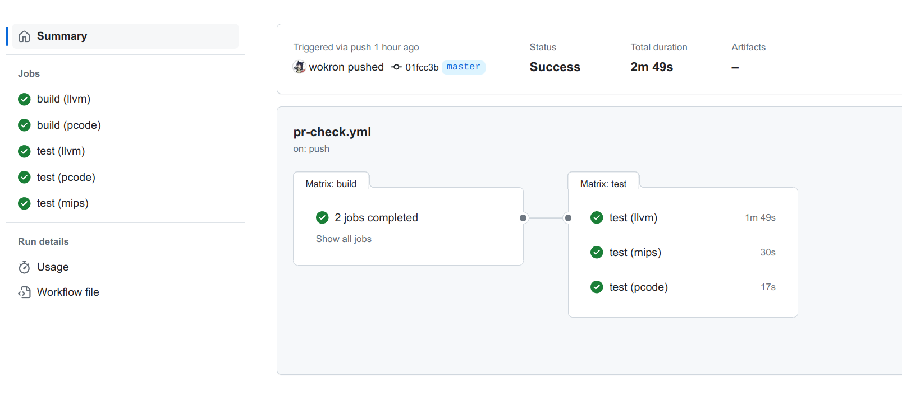

# 附录 - 项目测试

项目的规模越大，越难以通过直接观察发现隐藏的代码缺陷。在实验中，各位同学需要实现的是一个万行级别的编译器项目。在这一情景下若不对自己的开发过程进行规范，及时进行项目测试，必然会严重影响代码质量，进而影响各位同学的实验进展。

因此在本附录中，我们将结合 tolangc 项目，提供一个较为简单，但具体可行的项目测试示例，以供同学们参考。

## 一、单元测试

### （1）单元测试的结构

单元测试样例用于对程序中的最小功能模块进行测试，能够验证功能模块内部的正确性。一般来说，一个单元测试对应一个类或一个函数。对于编译器这一架构得到了充分研究的程序类型，一般来说我们可以选择为各个编译阶段设计对应的单元测试。例如在 tolangc 中，我们为 `Lexer`、`Parser`、`Visitor` 等等分别编写了单元测试。

一个单元测试样例是对某一功能进行的一次测试。不同的样例之间应当**尽可能相互独立、互不影响**。这也意味着单元测试的执行顺序不应当影响测试的结果。

需要注意的是，一些单元测试框架可能会提供设定样例执行顺序的功能，例如在某一样例成功之后执行等等。但是此处的执行顺序实际上反映的是功能模块之间的依赖关系，意为 “由于 A 模块依赖于 B 模块，所以如果 B 模块的测试出错，那么 A 模块的测试便没有意义”，而并不意味着单元测试之间可以相互关联。

由于上述特点，单元测试实际上应当看作**一一个不同的可执行程序**。但和整个项目所组成的程序不同，单个功能模块往往无法单独运行，且不像程序那样有着明确的输出。这就需要我们为单元测试构建测试所需的环境，并对模块的运行结果进行检验。这组成了单元测试所需要遵循的三个阶段：**构造**、**操作**和**检验**。

> CMake 中提供的 “测试” 实际上就是这样的可执行程序。

构造指设定模块的运行环境，例如参数、依赖的对象、数据库中数据等等。构造在每个单元测试中都要进行，绝不能依赖其他单元测试的运行结果。运行环境当中需要重点关注的是可以被所有单元测试访问的单例和全局变量，以及可以实现数据持久化的文件和数据库。如果存在单元测试之间相互影响的风险，则需要在单元测试结束后进行重置操作。

操作指功能模块的运行。当构造完成运行环境之后，我们希望功能模块能够按照预期方式正确运行。

最后，检验指将功能模块的运行结果和预期结果进行比对。一般来说，测试框架会提供一系列用于比较结果的接口。具体的接口则视框架而定。这一部分的关键实际在于如何获取功能模块的运行结果。如果运行结果相对简单，如某个数值、单个数组等等，那么检验过程便相对简单。但如果运行结果的数据结构较为复杂，或运行结果位置分散，那么检验起来便较为困难。这时可以选择定义相应的信息提取函数，例如定义 `to_string` 函数将复杂数据结构转换为字符串。在 tolangc 中，对于语法树我们便采用了这样的处理方式。

### （2）Mock

如果我们发现难以编写某个类或函数的单元测试代码，那可能意味着我们的类或函数需要进行进一步的拆分。难以测试可能是**代码中的副作用**或**具体类之间的耦合**导致的。对于类之间的耦合，我们需要遵循依赖倒置原则，用抽象的接口替代具体的实现。

例如，在实现 `Lexer` 时，我们没有将 `ifstream` 作为参数，而是将其父类 `istream` 作为参数。尽管对于 tolangc 来说，源代码总是从文件中读入的。

```cpp
class Lexer {
    Lexer(std::istream &in) : _input(in) {}
    // ...
}
```

这样做将使 Lexer 类更加可测试。若对 Lexer 类进行测试，我们不必创建真正的源文件。因为 `istream` 存在子类 `istringstream`。该类创建时需传入一字符串，而当从流中读取时，读到的便是传入的字符串的内容。

由于被测试的类所依赖的是抽象的接口，所以在满足接口行为的前提下，我们可以仿造模块的输入，或让模型输出到模拟的接口当中。

对于程序中的各个模块，我们均可以采用此种方法。例如对 `Paser` 类的测试。当然，由于 tolangc 的规模较小，所以我们并没有对 `Lexer` 类进行模拟。但我们可以将其一个例子。

为了对 `Parser` 进行测试，我们需要将原本的 `Lexer` 转变为抽象的接口。为了方便，我们这里保持 `Lexer` 的名称不变，但将其定义为抽象类。

```cpp
class Lexer {
public:
    virtual void next(Token &token) = 0;
}
```

此时，我们将原本的 `Lexer` 实现搬移到另一个类 `LexerImpl` 中。该类是 `Lexer` 的子类。

```cpp
class LexerImpl : public Lexer {
public:
    void next(Token &token) override;
    // ...
}
```

最后，我们将原本创建 `Lexer` 对象的语句修改为创建 `LexerImpl`。经过重构之后，`Lexer` 的接口和实现完成了分离。

为了测试，我们再定义模拟类 `MockLexer`。该类的行为应当和 `LexerImpl` 相同，当调用 `next` 函数时，返回新的 `Token`。当读到 `Token` 序列的末尾时，此后对 `next` 的调用返回的类型为 `TK_EOF`。

唯一的不同是，`MockLexer` 返回的序列将由我们给定。这意味着构造 `MockLexer` 时不应再传入 `istream`，而是一个单词序列 `std::vector<Token>`。

```cpp
class MockLexer : public Lexer {
public:
    void next(Token &token) override;

    MockLexer(std::vector<Token>& tokens) : _tokens(tokens) {}
    // ...
}
```

`MockLexer` 中 `next` 函数的实现较为简单，这里就不再详细介绍。

定义 `MockLexer` 之后，我们便可以修改 tolangc 中 `Parser` 的测试代码。

```cpp
// test_parser.cpp

// ...

TEST_CASE("testing lexer") {
    std::vector<Token> input = {
        Token(Token::TK_FN, "fn", 1),      Token(Token::TK_IDENT, "nonParam", 1),
        Token(Token::TK_LPARENT, "(", 1),  Token(Token::TK_RPARENT, ")", 1),
        // ...
    };
    MockLexer lexer(input);
    Parser parser(lexer);

    auto ast = parser.parse();

    std::ostringstream oss;
    root->print(oss);
    CHECK(oss.str() == EXPECTED);
}
```

## 二、集成测试

尽管单元测试保证了功能模块内部的正确性，但模块之间不合理的配合也会导致功能的错误。这时集成测试就十分必要。对于编译器这样有着明确输入输出的程序，编写源代码作为测试样例是十分有效的方法。

> “将源代码作为测试样例” 也适用于广义的编译器，如排版系统，文本渲染器等。

当然，如果每次测试都需要手动进行编译，那就太不方便了。合理的做法是为集成测试编写自动化脚本。接下来我们介绍一下 tolangc 中的集成测试脚本。

### （1）测试样例与测试程序

我们规定一个测试样例由源文件、输入文件和输出文件三部分组成。源文件使用 `.tol` 后缀，输入文件使用 `.input` 后缀，输出文件使用 `.output` 后缀。三个文件需要位于同一目录中。输出文件中包含程序对给定的输入应当返回的输出。由于 llvm、mips 或 pcode 对浮点数的显示有所不同，所以在评测正确性时我们统一将结果转换为浮点数再进行比较。

我们用 python 编写评测脚本 `./script/test.py`。该脚本有如下参数：

1. 测试阶段：选择对 llvm、mips 或 pcode 的输出结果进行测试
2. 样例文件：选择指定的样例文件进行测试，需要给出 `*.tol` 源文件的路径
3. 样例目录：选择指定目录中的样例文件进行测试，需要给出测试样例所在的目录

```console
$ python ./scripts/test.py -h                                     
usage: test.py [-h] -s {llvm,mips,pcode} [-d DIR] [-f FILE]

Integration test script for tolangc

options:
  -h, --help            show this help message and exit
  -s {llvm,mips,pcode}, --stage {llvm,mips,pcode}
                        stage to test
  -d DIR, --dir DIR     directory of test cases
  -f FILE, --file FILE  test case to run
```

### （2）集成测试过程

集成测试的主体逻辑由 python 写成。首先，我们根据命令行参数获取进行测试的阶段和测试样例。之后对于每一个评测阶段，我们进行如下操作：

1. 按照测试阶段编译 tolangc
2. 使用各测试样例对编译得到的 tolangc 进行测试

而对于第二步，我们遵循了和单元测试一致的结构，即**构造**、**操作**和**检验**。我们可以查看脚本中的 `general_test` 函数。该函数传入的 `preprocess_fn`、`run_fn` 和 `compare_fn` 分别代表了这三个阶段。

```py
def general_test(test_files: list[pathlib.Path], preprocess_fn, run_fn, compare_fn):
    for test_file in test_files:
        # ...

        preprocess_result = preprocess_fn(test_file)
        run_result = run_fn(
            preprocess_result, input_file if input_file.exists() else None
        )
        is_success = compare_fn(run_result, output_file)

        # ...
```

对于编译操作和运行操作，由于需要进行大量的命令行操作，所以我们选择使用 shell 脚本编写，并通过 python 的 `subprocess.run` 方法进行调用。

```py
def build(backend: Literal["llvm", "pcode"]):
    # ...
    subprocess.run(
        ["bash", "./scripts/build.sh", backend],
        stdout=subprocess.DEVNULL,
        check=True,
        env=dict(os.environ) | {"BUILD_DIR": TEST_CACHE_DIR / "build" / backend},
    )
    # ...
```

最后，我们将评测的结果存储在 `TestStat` 中，并在测试结束后输出。

## 三、流水线

尽管我们通过脚本自动化了项目的测试过程。但脚本的执行依旧需要我们手动触发。像测试、发布、部署这样的操作，本应当随着项目的演进而随时进行。为了实现这一点，我们在 tolangc 中使用 Github Action 配置了一组 CI 流水线，每当向 PR 或 master 分支中推送提交时，便会运行该流水线，自动对代码进行测试。

我们的流水线配置位于 `.github/workflows` 中。类似于一个在满足条件时自动触发的脚本。配置文件中较为关键的包括如下几个部分。

首先是触发流水线的条件。对应配置中的 `on` 字段。在我们的例子中，触发流水线的条件是更新目标为 master 的 PR 以及向 mater 分支推送。每当仓库中出现此类事件，便会触发该流水线的执行。

```yml
# pr-check.yml
on:
  push:
    branches: [ "master" ]
  pull_request:
    branches: [ "master" ]
```

接下来是 `jobs` 字段，用于定义流水线中运行的任务。在这里我们定义了两个任务 `build` 和 `test`。前者用于验证构建过程的正确性并进行单元测试，后者则用于运行集成测试。任务之间可以设定依赖关系，例如这里我们使 `test` 任务依赖于 `build`。这样若 `build` 任务出现了问题，便不会再运行 `test` 任务。

```yml
jobs:
  build:
    # ...

  test:
    needs: build
    # ...
```

在任务内部，我们需要设定任务的运行环境 `runs-on`，每一步的执行操作 `steps`，也可以设置任务的运行策略 `strategy`。

运行环境指任务运行所处的操作系统环境。在这里是 `ubuntu-latest`。

```yml
  build:
    runs-on: ubuntu-latest
```

在运行环境中，我们可以像脚本一样运行一系列命令，或是使用其他人编写好的 Action 应用执行某些操作。例如在 `build` 任务中，我们执行了 `bash ...` 和 `ctest ...` 两条命令。

```yml
jobs:
  build:
    # ...

    steps:
    - uses: actions/checkout@v4

    - name: Build
      env:
        BUILD_TYPE: ${{env.BUILD_TYPE}}
      run: bash ./scripts/build.sh ${{matrix.backend}}

    - name: Unit test
      working-directory: ${{github.workspace}}/build
      run: ctest -C ${{env.BUILD_TYPE}}
```

Action 是其他人封装好的操作。例如在配置中我们使用了 `KyleMayes/install-llvm-action@v2` 用于在运行环境中安装 llvm。

```yml
    - name: Install llvm
      if: matrix.stage == 'llvm'
      uses: KyleMayes/install-llvm-action@v2
      with:
        version: "16.0"
```

通过设置 `matrix` 策略，我们可以并行执行一系列不同相近但配置有所不同的任务。例如在 tolangc 中我们有着 llvm 和 pcode 两个后端。通过 matrix 我们可以同时对这两种后端进行测试。如下图，在 Build 步骤中，我们使用了 `matrix` 中定义的 `matrix.backend`。根据当前 `backend` 的取值不同采用不同的构建方式。

```yml
jobs:
  build:
    strategy:
      matrix:
        backend: [ "llvm", "pcode" ]

    # ...

    - name: Build
      env:
        BUILD_TYPE: ${{env.BUILD_TYPE}}
      run: bash ./scripts/build.sh ${{matrix.backend}}
```

配置完成之后，当满足流水线的触发条件时，流水线便会自行运行，实现项目的自动化测试。



当然流水线所能做到的不止自动化测试，还可以实现版本发布或自动化部署等功能。由于与本教程的主题并不相关，因此不做介绍。各位同学可以自行探索。
