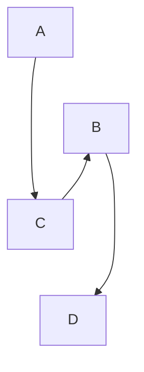

# mips生成部分代码说明

本仓库中mips生成部分以llvm中间代码为输入，以mips汇编代码为输出。翻译过程由 llvm中间代码的数据结构 和 mips 生成方式 决定。本仓库中的实现思想和具体代码都只能作为编译技术实验课程的教学参考，助教不能保证代码的完全正确，也不能保证实现了设计上的最优，请同学们谨慎参考。

教程后半部分列出了本仓库中可能会出现问题的地方和助教认为可以进一步优化的设想。本仓库中未实现中端和后端代码的优化，但是预留了便于实现优化的设计和可以添加优化位置的接口。代码优化方式多样，理论课上老师会介绍几种常见的优化方法，我们的[代码优化教程]()中也会列举一些优化算法。同学们可以参考课程内容自行实现，也可以根据自己的理解设计新的有效优化方法，用于竞速排序和实验课期末考试。

## 结构设计

将一种四元式-llvm翻译成另一种四元式-mips本身是没有什么难度的。mips代码生成的要点是内存管理和寄存器的处理，即怎样将llvm虚拟寄存器对应到mips内存中上。

整体文件结构：

```
+---include
|   \---mips
|           mips_forward.h 	//前向声明
|           mips_inst.h		//mips指令和全局定义：RCode, ICode, JCode；FloatData, WordData
|           mips_manager.h 	//全局管理器
|           mips_reg.h		//寄存器定义：TmpReg, FloatReg, ValueReg
|           translator.h	//代码翻译逻辑
+---src
|   \---mips
|           mips_manager.cpp
|           mips_printer.cpp //汇编代码打印
|           translator.cpp
\---tests
        test_mips.cpp		 //mips生成测试
```

### 数据组织

mips汇编的内存管理包括：.data全局数据段、.code代码段、堆栈段和寄存器管理。在教程的[目标代码生成]()章节中，有关于整数数据的组织方式讲解。

tolangc文法和课设文法的主要区别是tolangc全部使用浮点数类型的数据参与计算，几乎不适用整数类型数据。mips中的全局浮点数数据段关键字是.float；浮点数使用协寄存器\$f0 - $f32 存储；浮点数指令中要标注单精度还是双精度（.s 和 .d）；浮点数指令中不会含有立即数（立即数存储在全局数据段，需要时通过load的方式读出）。

浮点数有关指令可以通过MARS帮助文档查询。浮点数四则运算、数据存取等与整数操作类似；浮点数不能求余；浮点数比较指令（c.eq.s，c.le.s等）的结果会影响协寄存器的标志位中，可以通过 bc1f 或 bc1t 指令查看标志位的值；目前没有浮点数的比较跳转指令，需要自行组合基本指令完成该功能。

### 寄存器相关

MIPS 中 CPU 对数据的操作是基于寄存器的操作。内存中的数据内容需要先读取 load 到寄存器中才能使用。内存分为.data段中的静态内存，以及栈和堆中动态增长的内存。根据数据存储位置的不同，我们将代码生成方法分为**栈式**和**寄存器池**方式。

#### 栈式结构翻译

栈式翻译就是实现一个针对llvm中间代码、由mips语言实现的栈式虚拟机，与[pcode栈式虚拟机]()的工作流程类似：将内存的数据区视为一个栈，将运行期数据存放到内存栈中，保证当前执行指令的每个操作数都位于栈顶；操作数出栈后计算，计算结果压栈。寄存器不能用于保存运算结果。

以下是一个栈式翻译的例子：

```llvm
; a = a-4;
 %2 = load i32, i32 * %1
 %3 = sub i32 %2, 4
 store i32 %3, i32 * %1
```

```mips
# %2 = load i32, i32 * %1
# 加载指针%1所指数据内容
lw $t0, xxx($fp) #xxx是指针%1所指位置相对$fp的偏移量，假设可以直接获得
# 取出的数据入栈
sw $t0, 0($sp)
subi $sp, $sp，4

# %3 = sub i32 %2, 4
# 栈顶压入常数2
li $t0, 2
sw $t0, 0($sp)
subi $sp, $sp，4
# 从栈顶取操作数
lw $t0, 8($sp)
lw $t1, 4($sp)
addi $sp, $sp, 8
# 计算
sub $t2, $t0, $t1
# 计算结果入栈
sw $t2, 0($sp)
subi %sp, %sp，4

# store i32 %3, i32 * %1
lw $t0, 4($sp)
addi $sp, $sp, 4
sw $t0, xxx($fp)
```

栈式翻译中大量的运算都是针对栈顶的入栈、退栈、计算来完成的。理论上整个翻译只需要使用四个固定的寄存器，实现简单；但针对内存的频繁出入栈操作会使目标程序开销很大。

#### 寄存器池

寄存器池的实现使运行期数据能够存储在寄存器中。在实验教程[目标代码生成-寄存器分配]()中也有简单介绍。以下是有寄存器池情况下的代码翻译：

```llvm
; a = a-4;
 %2 = load i32, i32 * %1
 %3 = sub i32 %2, 4
 store i32 %3, i32 * %1
```

```mips
lw $t0, xxx($fp)
sub $t1, $t0, 4
store $t1, xxx($fp)
```

这种实现方式的重点是要找到与虚拟寄存器关联的 mips 寄存器。因此在翻译过程中要建立可用寄存器池，以及已用寄存器的全局符号表，维护寄存器与指令关联关系的上下文信息，包括关联关系的建立和释放。比如，load 句翻译中将 \$t0 与 %2 相关联，load 句翻译中将 \$t1 与 %2 相关联；sub语句后 $t0 不再使用，可以取消 \$t0 与 %2 的关联。

本仓库中采用了寄存器池的方法，寄存器的分配、虚拟寄存器和mips寄存器的符号表通过全局管理器操作。

#### 寄存器池实现

本仓库在 mips_manager 中实现了寄存器池。该寄存器池的主要功能 和 tolangc中的对应方法有：

| 功能                                                         |                                                     |
| ------------------------------------------------------------ | --------------------------------------------------- |
| 按申请顺序循环轮流分配寄存器，达到性能平衡。                 | getFreeTmp, getFreeFloat, getFree                   |
| 管理寄存器和 llvm 语法结构之间的关联关系，按照语法翻译需要给出绑定、索引和释放方法，做好寄存器的发放和回收。 | occupy, release, <br />allocReg, getReg, tryRelease |
| 在寄存器不够分配时给出将寄存器数据转移到内存中解决方案。     | push, load, <br />loadConst                         |

对于 分配寄存器的回收，理论上我们应该释放所有不再使用的虚拟寄存器的关联关系；或者近期/该基本块内不再被使用的寄存器。由于tolangc的LLVM生成是SSA形式，且没有完成任何优化，因此mips生成中释放了所有作为操作数的虚拟寄存器。

对于 寄存器数据转移到内存 和 内存数据加载到寄存器 中，tolangc 的解决方法中，将指向栈空间的指针也作为寄存器的一种。寄存器不够用时，将最远使用的寄存器数据推到栈上，并将原本 llvm 语法结构与寄存器的关联修改为与栈指针的关联。tolangc 将栈上的指针表示为与栈底的偏移量：class OffsetReg : public MipsReg。

因此，与mips栈指针关联的语法结构有两种：

1. LLVM指针，包括 alloc 指令和 getelementptr 指令
2. 尚未作为操作数使用，但是因为mips寄存器不够因此被推到栈上的LLVM虚拟寄存器

#### \$fp 和 $sp 与函数调用

通用的汇编程序中，帧寄存器\$fp存储函数帧的指针，即进入函数时的栈底的位置；栈寄存器 \$sp 存储当前栈顶位置（指向栈中下一个存放数据的位置，即当前位置不存放有效数据）。在这两个寄存器的配合下，我们可以对不同函数的栈空间进行统一管理。

一般的函数调用规范是，由调用者在栈中保存当前函数的返回值和帧指针、存放参数；被调用者用帧指针$fp保存进入函数时的栈位置，以在退出函数的时候退栈：

```mips
# function MAIN:
sw $ra, 0($sp)
subu $sp, $sp, 4
sw $fp, 0($sp)
subu $sp, $sp, 4

# PUSH:push 1
li $t1, 1
sw $t1, 0($sp) # store the first parameter
subu $sp, $sp, 4

# CALL:call f
jal f

# function f:
addiu $fp, $sp, 4 # set $fp according to the number of parameters N ($fp = $sp + 4*N)
lw $t1, 0($fp) # get the first parameter

# RETURN 
move $sp, $fp # reset stack
jr $ra

# function MAIN:
# load $ra of caller
addiu $sp, $sp, 4
lw $fp, 0($sp)
addiu $sp, $sp, 4
lw $ra, 0($sp)

# get return value
move $t4, $v0
```

函数调用的详细指导见[目标代码生成教程]()。

当然这种操作范式并不绝对，\$ra, $fp也可以由被调用者存储，只要你的操作统一逻辑自洽即可。

在 tolangc 的实现中，\$fp 被省略了。因为语法单元的存储位置是指针关于栈底的偏移量，因此在mips_manager为函数记录了栈顶位置的情况下，是否实际移动 \$sp 并不重要。因此tolangc使用$sp记录栈底位置，省略了\$sp的的移动和\$fp。

## 可进一步改进

tolangc给出的实现方法是助教给出的一种可能的解决方案。这不是一种最简洁的实现，也不是一种效率最高的实现，当然也不会对所有的中端后端优化友好。我们的实现中也有许多未解决的漏洞，请同学们谨慎借鉴。

### 标签命名

tolangc使用的mips标签生成方法是，按索引到的顺序，命名为 当前函数名+'_'+序号。存在的问题是，无法区分函数 main_1 和 main函数下的第一个标签 main_1。如何解决标签和函数名的重名问题，需要你们独特的字符生成设计。

### 中后端融合优化

由于语法特性和指令形式的不同意，从LLVM逐句翻译到mips的逐句翻译有时反而会增加目标代码的复杂度。比如浮点数的比较：

```mips
// tolangc
if i >= n to done;
tag do;

; llvm
%result = fcmp oge float %i, %n
br i1 %result, label %done, label %do

# mips
# %result = fcmp oge float %i, %n
c.lt.s $f1, $f12
bc1f result_ge
nop
addiu $t0, $zero, 0
j next
nop
result_ge:
addiu $t0, $zero, 1

next:
# br i1 %result, label %done, label %do
bnez $t0, done
nop
j do
nop

```

我们可以看到，如果综合 llvm 翻译的语义，mips代码其实可以简化为：

```mips
c.lt.s $f1, $f12
bc1f done
nop
j do
nop
```

如何将中端翻译和后端翻译综合考虑，打破逐句翻译的冗余性，是同学们在目标代码生成的时候可以多加考虑的。

### 寄存器的分配和回收

如上文所说，对于 分配寄存器的回收，理论上我们应该释放所有不再使用的虚拟寄存器的关联关系；或者近期/该基本块内不再被使用的寄存器。目前的tolangc回收方式在后续的优化实现中不尽理想。

在 MipsManager::tryRelease 中，我们保留了一个TODO任务，可以在此处添加你们的寄存器释放逻辑。

请大家注意中端优化后的跨块活跃变量处理。tolangc的代码生成是按照LLVM代码的自然顺序自前向后生成。tolangc对于块跨活跃寄存器的处理是把全部推回栈中。未考虑LLVM的基本块结构特征，也未考虑控制流的走向。如果基本块的流图如下所示：



即基本块出现的顺序为：A -> B -> C -> D，但是控制流为：A -> C -> B -> D。代码的自然顺序和控制流的不一致性告诉我们在做寄存器分配的时候要特别注意控制流的走向，做好活跃变量分析。